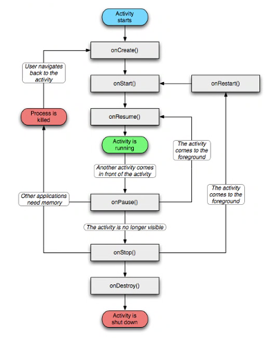
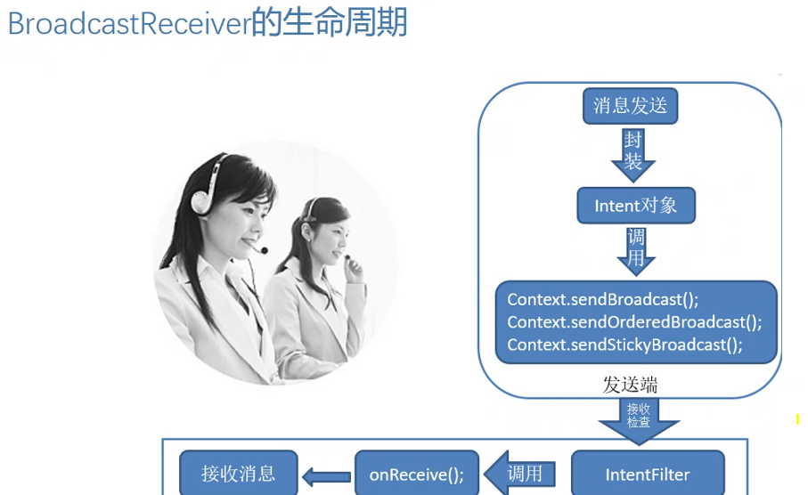

# Android 复习


### 1、项目目录w


2、src文件。

3、gen目录

是定义 该项目的资源索引文件

目录下面有R.java

默认有：attr,drawable，layout等

4、asset文件夹

目是资产目录，该文件夹下的文件不会被映射到
R.java中，访问的时候需要AssetManager类以字
节流的方式来读取。

5、res目录

资源目录，可以存放一些图标，界面文件和应
用中用到的文字信息。

6、drawable-*dpi文件夹:
将图标按分辨率的高低放入不同的目录,

7、layout文件夹:
用来存放界面信息。

8、menu文件夹:
是存放Android菜单的布局文件。

9、values文件夹:
存放储存值的文件
目录下有
strings.xml
styles.xml


10 、AndroidManifest.xml文件

Manifest（文件清单）

```xml
<?xml version="1.0" encoding="utf-8"?>
<manifest xmlns:android="http://schemas.android.com/apk/res/android"
    package="icu.shaoyayu.android.mobile.safe58">
	<uses-sdk android:minSdkVersion= ="8“
              android:targetSdkVersion= ="15" />

    <application
        android:allowBackup="true"
        android:icon="@mipmap/ic_launcher"
        android:label="@string/app_name"
        android:roundIcon="@mipmap/ic_launcher_round"
        android:supportsRtl="true"
        android:theme="@style/AppTheme">
        <activity android:name=".activity.Main2Activity"></activity>
        <activity android:name=".activity.MainActivity">
            <intent-filter>
                <!-- 入口程序 -->
                <action android:name="android.intent.action.MAIN" />

                <category android:name="android.intent.category.LAUNCHER" />
            </intent-filter>
        </activity>
    </application>

</manifest>
```


### 二、Android四大组件

1、活动(Activity)
2、服务( Service) 
3、内容提供者(Content provider)
4、广播接收者(Broadcast receivers)


**1、activity**

Activity是由Android系统进行维护的，它有自己的生命周期
Activity生命活动周期:即“产生、运行、销毁”
onCreate  创建
onStart 激活
onResume 恢复
onPause 暂停
onStop 退出
onDestroy 销毁
onRestart


**2、Android中的服务(Service) :** 
是类似Windows系统中Windows Service，它运行在后台， 是
不可见的，没有界面的，生命周期长的组件。

（媒体播放、蓝牙连接、文件下载等任务）


**3、 内容提供者(ContentProvider) :**
是Android系统提供的一种标准的共享数据的机制，应用程
序可通过ContentPrcvider访问其他应用程序的私有数据。

SQL lite 是一个Android内置的一个数据库，

Android系统有一个独特之处就是，数据库只能被它的创建
者所使用，也就是说数据是私有的，其他的应用是不能访
问的，但是如果一个应用要使用另一个应用的数据

例如图片等资源数据

(即:不同应用间数据共享)该怎么做呢?
Content Provider

Content Provider主要作用如下:
1、为存储和读取数据提供了统一的接口
2、 使用ContentProvider,应用程序可以实现数据共享
3、Android内置的许多数据都是使用ContentProvider形式，供开发者调用的(如视频、音频、图片、通讯录等)


**4、广播接收者(BroadcastReceiver)** 
是用来接收并响应广播消息的组件
唯一作用就是接收并响应消息
通过启动Activity或者Notification（闪动背景灯、振动设备、发出声音）通知用户接收到重要信息

应用：

一个应用程序可以有多个广播接收者，所有的广播接收者类都需要继承android.content. BroadcastReceiver类
当系统中发送出来-个意图后，系统会根据该意图的action自动去匹配系统中现有各个意图过滤Intent-filter，一 旦发现有匹配的广播收接者，则系统会自动调用该广播接收者的onReceive方法那么我们就可以在这个方法做事了。





**生命周期-进程周期**
-创建到结束的过程
进程类别
-前台进程，
-可见进程
-服务进程
-后台进程
-空进程

onCreate  创建
onStart 激活
onResume 恢复
onPause 暂停准备退出
onStop 退出
onDestroy 销毁
onRestart

**自定义View在Activity中的显示，**

步骤
新建类，并继承自View类
重写View中的绘制方法onDraw()
新建类，继承自Activity类
重写onCreate()，初始化自定义的View,然后将
用户界面设置成此View对象

**service的生命周期**

1、较长生命周期但没有用户界面的程序。
2、startService();
3、bindService();


**BroadcastReceiver的生命周期**

消息发送--（封装对象）-->> Intent对象--(调用)-->>

Context.sendBroadcast();
Context.sendOrderedBroadcast();
Context.sendStickyBroadcast();

----(发动端)--->>----接收检查-->>

IntentFilter---调用-->>




**ContentProvider的生命周期**

1、数据模型
2、URI  "content//:"
3、Android. permission. READ CONTACTS 


**Intent**
1、Intent是Android Activity之间传递数据的桥梁!
2、我们要从一个界面切换到另--个界面需要用到它!
3、应用间的相互调用也要用它


### 四、Android开发环境


ADT
ADT (Android Development Tools)
Android
Eclipse   SDK
Software Development Kit    Java SDK


ADT bundle、Eclipse和Android Studio

**调试过程**

1、手机通过数据线连接电脑
2、打开手机设置->开发者选项-> USB调试
注:有的手机开发者选项默认没有打开请根据自己手机品牌在网上搜索打开方法，有的手机上会提示是否允许USB调试点确定

3、安装驱动
安装成功后右键我的电脑到管理看设备管理器中有Android Device没，如果有就是安装成功了


其他手机助手（360等）提示装驱动。

属性Eclipse和Android studio打开Device


