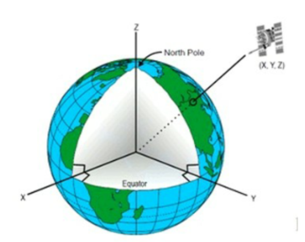

# GPS定位原理

### 1点位测定与定位分类

**全球卫星导航系统**

Global Navigation Satellite Systems (GNSS)

1. GPS(Global Positioning System)美国
2. GLONASS(Global NAvigation Satellite System)俄罗 斯
3. GALILEO(伽利略)欧盟
4.  Beidou( 北斗)中国

**公式**

距离=传播时间x光速

4段距离解决了纬度，经度，高程和时间四个耒知数,这就类似于测边交会问题的解决原理

#### 绝对定位

绝对定位(或单点定位)。即在地球协议坐标系统中，确定观测站相对地球质心的位置。这时可认为参考点与地球质心相重合。

#### 相对定位.

相对定位:确定同步跟踪相同的GPS信号的若干台接收机之间的相对位置的方法。可以消除许多相同或相近的误差,定位精度较高。

从不同定位原理来看,GPS定位包括

1. 伪距单点定位
2. 载波相位定位
3. 实时差分定位

##### 1.伪距测量及伪距单点定位

伪距测量就是测定卫星到接收机的距离，即由卫星发射的测距码信号到达GPS接收机的传播时间乘以光速所得的距离伪距法单点定位，就是利用GPS接收机在某-时刻测定与4颗以上GPS卫星的伪距，及从卫星导航电文中获得的卫星瞬时坐标，采用距离交会法求出天线在**WGS-84**坐标系中的三维坐标

##### 2.载波相位测量及载波相位定位

​	载波相位测量是测定GPS卫星载波信号到接收机天线之间的相位延迟。
​	GPS卫星载波上调制了测距码和导航电文，接收机接收到卫星信号后，先将载波上的测距码和卫星电文去掉，重新获得载波，称为重建载波。
​	GPS接收机将卫星重建载波与接收机内由振荡器产生的本振信号通过相位计比相，即可得到相位差

##### 3.实时差分定位

GPS实时差分定位的原理是在已有的精确地心坐标点上安放GPS接收机(称为基准站)，利用已知的地心坐标和星历计算GPS观测值的校正值，并通过无线电通信设备(称为数据链)将校正值发送给运动中的GPS接收机(称为流动站)。流动站利用校正值对自己的GPS观测值进行修正，
以消除上述误差，从而提高实时定位精度

### 2 GPS基本术语

#### 坐标系

##### **地心惯性坐标系( Earth Centered Inertial,简称ECI)**

该坐标系用于描述GPS卫星的位置信息。在这种坐标系中，原点为地球的质心，卫星围绕质心运动，并遵守牛顿运动定律。
ECI坐标系属于笛卡尔坐标系，故卫星的位置由(x, y,z)表示。

##### **地心地球固连坐标系( Earth Centered，Earth Fixed，简称ECEF )**

该坐标系用于描述地面接收器的位置信息。ECEF 最大的特点是它会随着地球旋转而旋转。
ECEF坐标系也属于笛卡尔坐标系，故接收器的位置也由(x,y,z) 表示。

##### **WGS - 84坐标系( World Geodetic System)** : 

是-种国际上采用的地心坐标系。GPS广^播星
历是以WGS- 84坐标系为根据的。

坐标原点为地球质心，其地心空间直角坐标系的Z轴指向国际时间局( BIH) 1984.0 定义的协议地极(CTP)方向，X轴指向BIH1984.0的协议子.午面和CTP赤道的交点，Y轴与Z轴、X轴垂直构成右手坐标系，称为1984年世界大地坐标系。这是一个国际协议地球参考系统(ITRS) ，是目前国际上统一采用的大地坐标系。

##### **Equatorial Plane为赤道平面**,

卫星轨道本身是一个椭圆轨道，它和赤道平面有一个夹角( Inclination )。 这个夹角叫轨道倾角。

假设观察者站在坐标原点观察左上角的卫星，则h代表仰角(Elevation angle)，z 代表天顶角(Zenith angle)，而正北方向离卫星投影点的顺时针角度A为方位角(Azimuth angle)。

##### **星历表(Ephemeris)** :

星历表本来是用来记录天体特定时刻的位置的。而在GNSS中，星历表则记录了卫星的一-些运行参数，它使得我们通过星历表就可以计算出任意时刻的导航卫星的位置和速度。

##### **历书( Almanac) :**

历书也包含了卫星的位置等相关信息，不过它是星历数据的简化集，其精度较低。所以，历书数据量较小，传输时间较短。

### 3 GPS信号与定位计算

#### GPS组成

空间段( Space Segment ,SS).

控制段(Control Segment,CS)

用户设备(User Segment,US)

##### **空间段(SS)**

 32颗卫星( Satellite,SV )6个轨道，55°倾角，轨道高度201 80km，11小时58分(恒星时)，
4颗以上信号覆盖

##### **用户段(US )**

功能

​		接收、跟踪、变换和测量GPS信号

​		计算经纬度、高度、速度及时间等信息

分类

​	按用途: 

​			导航型

​			测地型

授时型
			按载波频率

​			单频接收机- -- L1 ( 1575.43MHz )

​			双频接收机-- L1、L2(1227.60MHz)

#### **频段划分GPS频段?**

为什么我们关注GPS中的L1、L2、L5?

L1 (中心频率1575.42MHZ)
L2 (中心频率1227.60MHZ)
L5 (中心频率1176.45MHZ)

载波，分别为L1、L2、L5

测距码(Ranging Code，伪随机噪声，PRN)，即C/A码，P码。

导航电文(Navigation Data, D码) ,传输频率为50bits/s

**GPS信号-测距码**

C/A码又称为粗捕获码，它被调制在L1载波上，由于每颗卫星的C/A码都不一样，因此，我们经常用它们的PRN号来区分它们。C/A码是普通用户用以测定测站到卫星间的距离的一种主要的信号。P码又被称为精码，它被调制在L1和L2载波上。

### **GPS信号-导航电文**

导航电文包括自己的星历以及其他卫星的历书GPS卫星的星历是描述卫星运行及其轨道的参数，它的主要作用是利用GPS卫星系统进行导航定位时，计算卫星在空间的瞬时位置。

### GPS_卫星的导航电文

一、**导航电文(D码) :** Navigation Message 用于确定卫星瞬间位量的信息，可以分为三类:
1)卫星历书(AImanac, 精度:数km)
2)广播星历(Broadcast Ephemeris,精度: 1m)
3)精密星历(Precise Ephemeris,精度: 5- 20cm)

**1、组成:卫星星历、卫星工作状态、时间系统、卫星钟偏差校正参数、轨道摄动改正参数、大气折射改正参数、遥测码、交换信息等。**

2、格式:组成数据帧，按帧向外播发。由25帧组成，播发时间12.5min，播发速度50bit/s。

GPS卫星将持续发射伪随机码导航电文，导航电文由、卫星运行参数、卫星星历、电离层延时修正、大气折射修正和时钟修正等构成。接收到不少于4颗卫星的导航电文就能想确定接收机的位置。

将需要定位的数据采集点放置在设定的三维坐标系中，设t时
刻它的坐标为(x，y，z)
根据某一卫星的星历数据可以得到该卫星的
三维坐标值
(Xi， yi，zi)
卫星信号速度为光速C
设定第i颗卫星传输来的数据作为计算参照得到方程

### 4 A-GPS与GPS芯片

**A-GPS技术**

A-GPS ( Assisted GPS )
即辅助GPS技术，它可以提高GPS 卫星定位系统的性能。通过移动通信运营基站它可以快速地定位，广泛用于含有GPS功能的手机上。

AGPS手机首先工作步骤:

1. 将本身的基站地址通过网络传输到位置服务器;
2. .位置服务器根据该手机的大概位置传输与该位置相关的GPS辅助信息到手机;
3. .该手机的AGPS模块根据辅助信息接收GPS原始信号;
4. 手机在接收到GPS原始信号后解调信号，计算手机到卫星的伪距，并将有关信息通过网络传输到位置服务器;
5. 位置服务器根据传来的GPS伪距信息和来自其他定位设备的辅助信息完成对GPS信息的处理，并估算该手机的位置
6. 位置服务器将该手机的位置通过网络传输到定位网关或应用平台。

使用的手机可以直接进入设置打开，

**GPS模块**

GPS模块是集成了RF射频芯片、基带芯庄和核心CPU并加上相关外围电路而组成的- -个集成电路。

**GPS芯片**

GPS芯片即包含了RF射频芯片，基带芯片及微处理器的芯片组

