# Android的GPS架构与定位类

## 一、引入·GPS物联网案例

## 二、Android 架构层次.

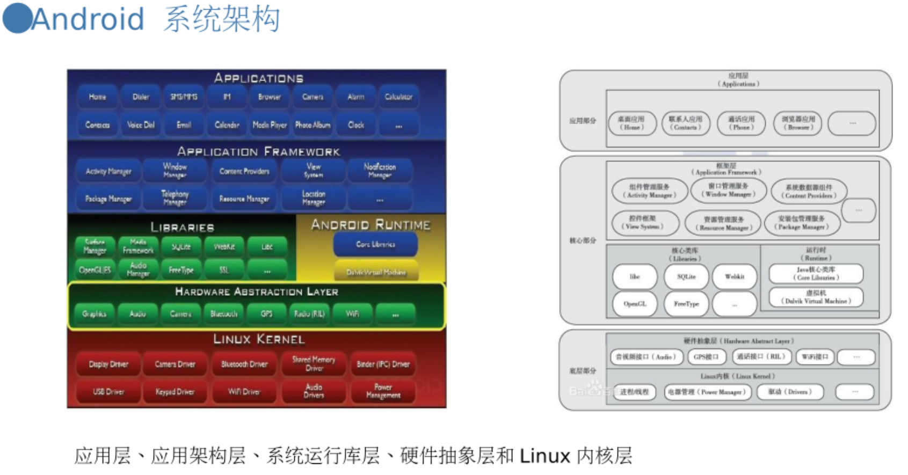

### 1应用层

Android应用层由运行在Android 设备上的所有应用共同构成，包括:
通话、短信、联系人等系统应用，其他后续安装到设备中的第三方应用。

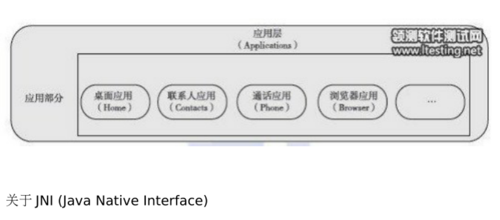

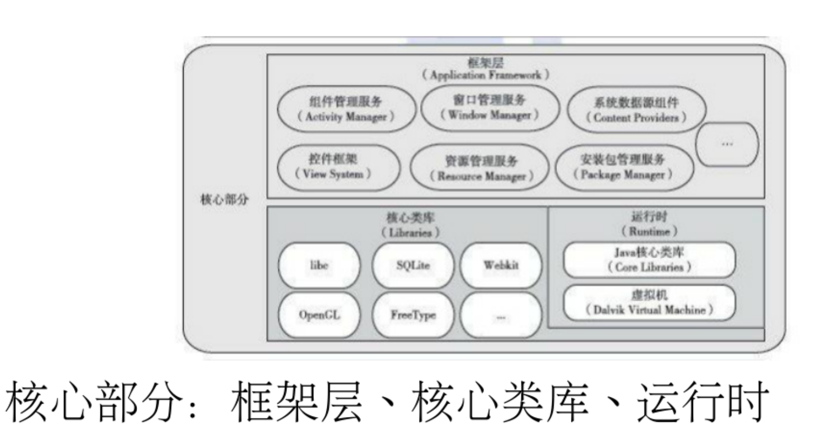

### 2、框架层

框架层是Android 系统中最核心的部分

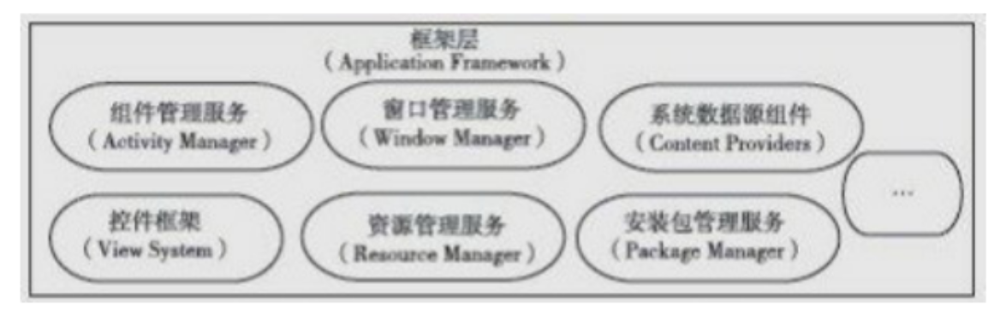

框架层由多个系统服务(System Service)共同组成，包括组件管理服务、窗口管理服务、地理信息服务、电源管理服务、通话管理服务，等等。
所有服务都寄宿在系统核心进程(System Core Process)中;
运行时每个服务都占据-一个独立的线程，彼此通过进程间的通信机制(Inter- Process Communication，IPC) 发送消息和传输数据
关注: SDK版本.

### 3、运行时

运行时由Java 核心类库和Java 虚拟机Dalvik 共同构成。
Java 核心类库:包括Java对象库、文件管理库、网络通信库等。
Dalvik: Java虚拟机，负责动态解析执行应用、分配空间、管理对象生命周期等工作。(ART)
关注:基于寄存器的虚拟机，比较基于栈的虚拟机

### 4、核心类库

核心类库由一系列的二进制动态库共同构成，通常使用C/C++进行开发。

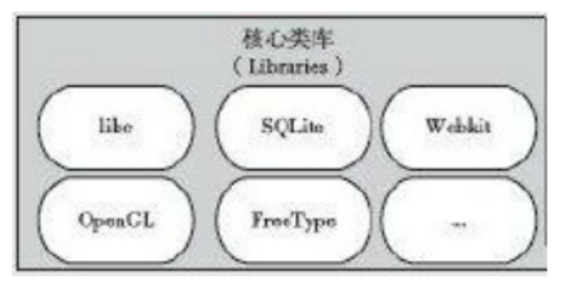

硬件抽象层 hardware abstract layer

底层部分:硬件抽象层、Linux内核

### 5、硬件抽象层

硬件抽象层(Hardware Abstract Layer，HAL)， 是Android 为厂商定义的- -套接口标准,
它为框架层提供接口支持，厂商需要根据定义的接口实现相应功能。

### 6、Linux内核

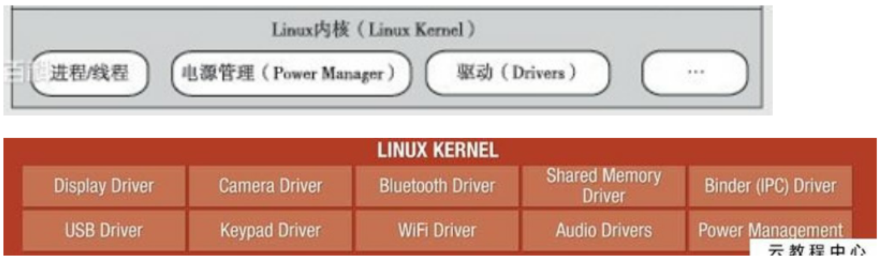

Linux之于Android 最大的价值，便是其强大的可移植性。
Linux可以运行在各式各样的芯片架构和硬件环境下，而依托于它的Android 系统，也便有了强大的
可移植性。

### Harmony

基于微内核的全场晨分布式操作系统

HarmonyOS

鸿蒙系统( HarmonyOS) , 第-款基于微内核的全场景分布式OS ,是华为自主研发的操作系统。

2019年8月9日,华为在开发者大会HDC.2019上正式发布了鸿蒙系统，该系统将率先部署在智慧屏、车载终
端、穿戴等智能终端上,未来会有越来越多的智能设备使用开源的鸿蒙OS。

## 三、Android系统定位策略

### Android系统使用

- GPS
- 网络定位

### 定位不准的原因也是android的系统定位面临的问题

1. 多个位置来源
2. 用户移动
3. 变化的精度

### GPS定位

GPS定位启动分为三种:
**冷启动**
初次使用时:电池耗尽导致星历信息丢失时;
Cold start
关机状态下将接收机移动1000公里以上距离。
**温启动**

距离上次定位的时间超过两 个小时的启动。
Warm start
**热启动**

距离 上次定位的时间小于两个小时的启动。
Hot start

### A-GPS定位

A-GPS

1. Assisted GPS,在原来的
2. GPS定位，上加上了辅助信息，以提高
3. GPS定位速度(将达到秒级)。

目前手机广泛采用该定位方式。

### 基站定位

1.手机附近的三个基站进行三角定位.

2.获取最近的基站信息

包括了:
基站id
location area
code
mobile
country code,
mobile
network code
信号强度

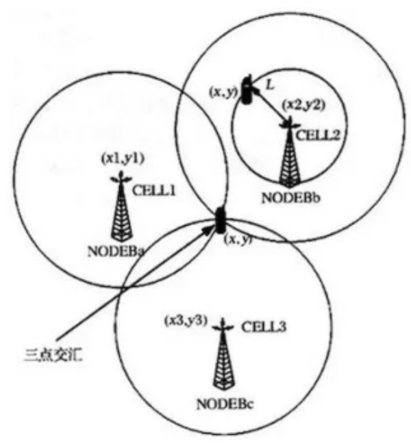

### Wi-Fi定位

1. 获取最近的Wi-Fi源信息通过
2. Wi-Fi的MAC地址去查询
3. Wi-Fi定位比基站定位更准

## 四、Android架构中GPS的位置

### Android GPS构架

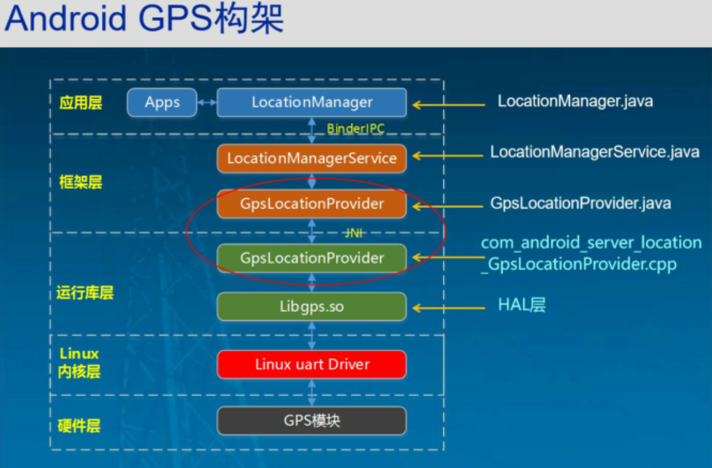

#### ( 1)第一层是应用层:可安装基于定位服务的应用，这些应用可以发起定位请求，比如百度地图

#### (2 )第二层是框架层(framework层)，这一-层包含了系统服务的实现，主要由Java 语言来实现。

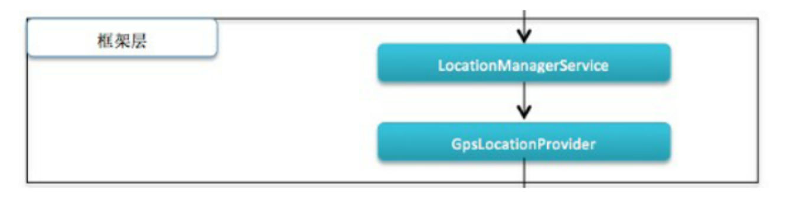

在框架层

- 实现位置服务的类是LocationManagerService

- LocationManagerService是- -个系统服务
- 关注: LocationManager 和LocationManagerService 两者是什么关系，它们是如何关联
  起来的呢?

LocationManager和LocationManagerService 的关联

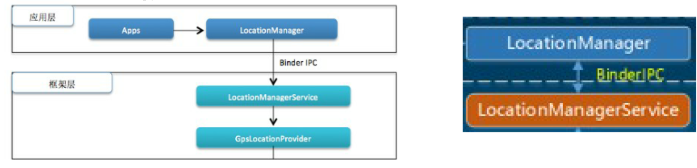

答案: android 系统的Binder 机制
Binder是一种跨进程通信( IPC，Inter-Process Communication )的
手段;

梳理一下的Bi nder 机制

Service Manager。这个类负责注册并管理所有的系统服务

Android系统中，系统服务运行在- - 个专门的进程system_ server 中;
当应用程序想要使用系统服务时，需要通过服务的代理来调用服务;
代理需要通过进程间通讯将请求发送到system_ server 进程，由该进程来响应服务,然后再返回
结果。

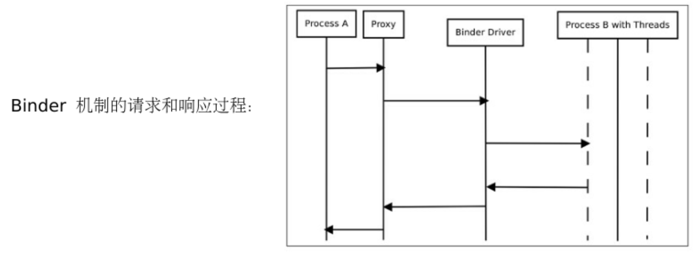

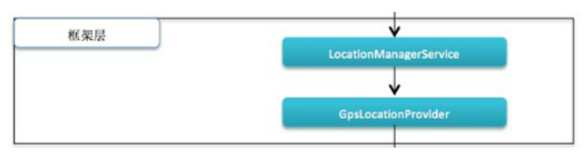

定位服务的真正实现类: LocationManagerService
目录:
frameworks/base/services/java/com/android/server/
文件名: LocationManagerService.java (共2400多行)

获取位置信息可以选择不同的Location Provider
GpsLocationProvider
使用Gps卫星定位，最准确的定位方式。
LaioroviderPror 使用网格实现定位的服务的代理。网络定位依赖于手机信号的基站或者Wifi接入点作为定位的基
础。注意该类只是个代理，并不包含真正的实现逻辑。

#### (3)第三层是JNI JNI(Java Native Interface)

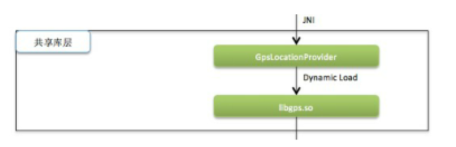

Gps模块的功能实现最终需要调用硬件来完成，这些实现必须通过C/C++ 语言才能完成。为了能在GpsLocationProvider.java 中调用到这些功能,GpsLocationProvider中包含了许多的native 方法，这些方法如:

native_ start	开始导航

native_ stop	停止导航

native_ jinject_ location	注入位置信息

native_ inject_ _time	注入时间信息_

native_ agps_ ,data_ .conn_ open	打开AGps数据连接

native_ agps_ data_ conn_ _closed 	关闭AGps数据连接

#### ( 4)第四层是共享库层(HAL层)

HAL(Hardware Abstract Layer)层是对硬件的抽象，这是整个模块实现的最底层。

#### (5)第五层是Linux内核层,整个Android系统都是以Linux内核为基础的。

#### ( 6)最底层是GPS硬件设备层

## 五、定位服务类解析

### android.location

1. Android平台提供了一个专门的位置功能类库
2. android.location来支持基于定位服务的应用程序开发
3. android. Location包含了-套与定位相关的类

android.location包中的类和接口

重点

- L ocation
- L ocation
  Mananger
- L ocation
  Provider
- L ocation
  Listener
-  Criteria

名称		类型		说明
GpsStatus.Listener		接口		用于接受GPS 状态改变时的通知。

GpsStatus.NmeaListener		接口		用于接受Nmea (为海 用电子设备制定的格式)信息。

LocationListener	接口	用于接受位置信息改变时的通知

Address		类		用于描述地址信息。

Criteria		类		用于选择LocationProvider 。

Geocoder		类		用于处理地理位置的编码。

GpsSatellite		类		用于描述GPS卫星的状态。

GpsStatus		类	用于描述GPS 设备的状态

Location	类	用于描述地理位置信息，包括经度，纬度，海拔，方向等信息。

LocationManager		类	用于获取和调用定位服务。

LocationProvider		类	描述Location Provider的超类，LocationProvider是真正用来获取位置信息的组件。Location Provider的实现主要可以分为两类:一种依赖于GPS设备，另一种依赖网络状态。

**Location Manager**
定位管理类Location
Manager是
android.location中最重要
的一个类
Location Manager调用
Context
get System
Service(Context .
LOCATION
SERVICE)来进行初始化

Location Manager
LocationManager常用属性和方法
属性或方法名称.
属性或方法描述
GPS_ PROVIDER .
静态字符串常量，表明LocationProvider是GPS
NETWORK_ PROVIDER
静态字符串常量，表明LocationProvider是网络

Location Manager
LocationManager常用属性和方法
属性或方法名称
属性或方法描述
addGpsStatusListener(GpsStatus.Listener listener)
添加一个GPS状态监听器
addProximityAler(double latitude, double longitude, float
添加一个趋近警告
radius, long expiration, PendingIntent intent)
getAllProviders()
获得所有LocationProvider列表
getBestProvider(Criteria criteria, boolean enabledOnly)
根据Criteria返回最适合的LocationProvider

LocationManager常用属性和方法
属性或方法名称
属性或方法描述
getLastKnownLocation(String provider)
根据Provider获得位置信息
getProvider(String name)
获得指定名称的LocationProvider
getProviders(boolean enabledOnly)
获得可利用的LocationProvider列表
removeProximityAler(PendingIntent intent)
删除趋近警告
requestLocationUpdates(String provider, long minTime, float
通过给定的Provider名称，周期性地通知当前Activity
minDistance, PendingIntent intent)

案例：

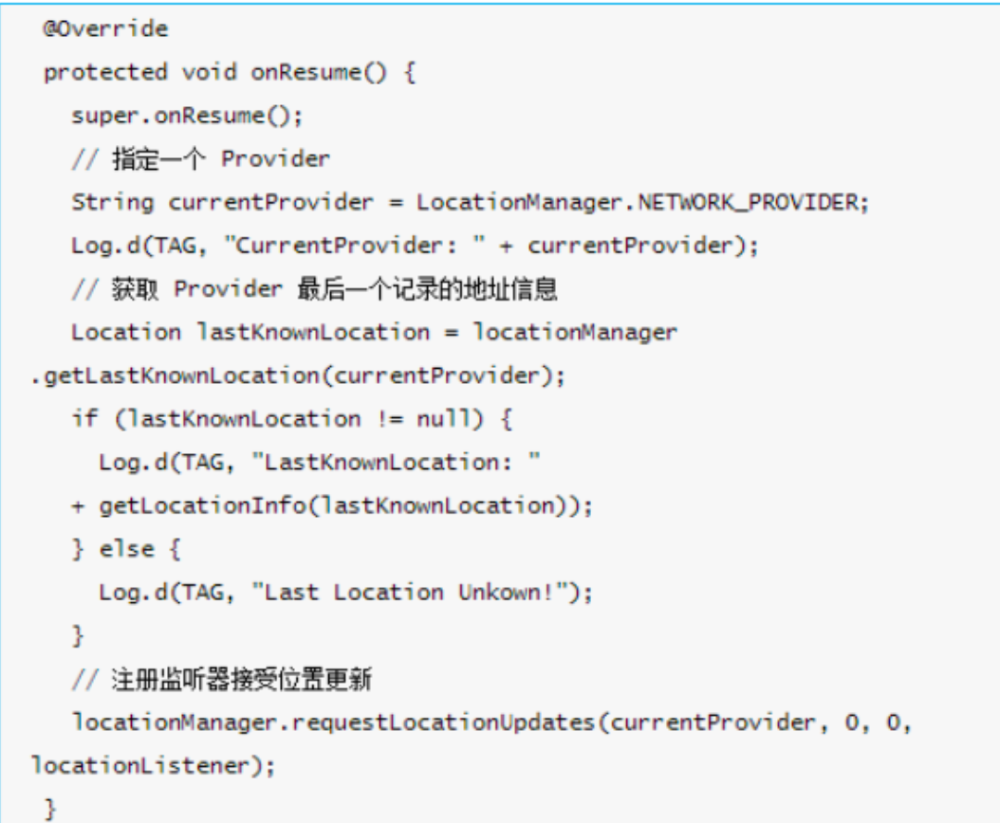

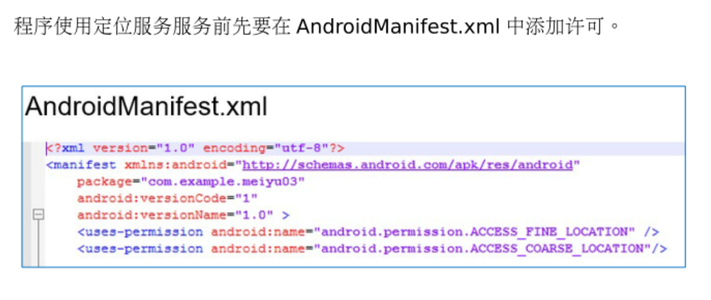