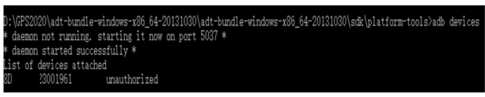

# Android的定位类分析

## 1、获取位置信息程序

【作业，和打包名称 jk517228Maguansheng 】

创建项目后，在MainActivity的onCreate方法里面获取实例

```java
locationManager = (LocationManager) getSystemService (Context . LOCATION SERVICE) ;
```

```java
获得位置信息
Location location=locationManager . getLastKnownLocation (LocationManager .GPS_ PROVIDER) ;
//
显示位置信息
//
printMsg (location);
```


```java
private void printMsg (Location l) {
//
StringBuilder builder- new StringBuilder ("可利用的providers:");
if (l!=nu11) {
double lat =l.getLatitude () ;
//
double lng=l.getLongitude () ;
//
builder . append ("\n经度: ");
builder. append (lat) ;
builder. append ("\n纬度: ");
builder . append (1ng) ;
if (l. hasAccuracy()) { .
builder . append ("\n精度: ");
builder. append (l. getAccuracy()) ;
}
//
1f(l.hasAltitude ()) {
builder .append("\n高度: ");
builder. append (l.getAltitude ());
}
//
if (l.hasBearing()) {
builder .append("\n方向: ");
builder . append (l.getBearing()) ;
}
if(l.hasSpeed()) {
builder .append("\n速度: ");
builder. append (l.getSpeed()) ;
}
else{
builder.append("\n目前没有位置信息");
tv.setText (builder) ;
}

```

//添加的全选

```xml
<uses-permission android:name= "android. permission. ACCESS FINE LOCATION" / >
<uses-permission android :name= "android.permission.ACcEss COARSE LOCATION"/>
```

## 2、location详解

开发文档地址：https://developer.android.google.cn/reference/android/location/Location?hl=en

**getAccuracy**
Added in API level 1
**public float getAccuracy ()**

以米为单位获取此位置的估计水平精度（径向）。 我们将水平精度定义为68％置信度的半径。 换句话说，如果绘制一个以该位置的纬度和经度为中心且半径等于精度的圆，则真实位置在该圆内的可能性为68％。 此精度估计仅与水平精度有关，如果此位置中包括方位，速度或高度的精度，则不表示精度。 如果此位置没有水平精度，则返回0.0。 LocationManager生成的所有位置都包含水平精度。


public boolean hasAccuracy ()
如果该位置具有水平精度，则为True。

LocationManager生成的所有位置都具有水平精度。


详解见后面文章：


## 3、LocationManagerService


理解该类的作用
LocationManagerService作用是提供定位
服务
LocationManagerService实现下面这些功
能:
可以选择不同的Location Provider获取位
置信息，每个Location Provider可能会记
录最近一次的定位信息。
也可以使用监听器来主动获取位置更新通知。


## 4、实践操作难点

#### 实践难点1:手机进入USB调试模式

1 : 在手机桌面.上找到[设置]图标，然后点击进入

2: 然后点击[关于手机] ,接着拉到手机屏幕最下方,找到[版本号] ,然后用手猛点击5-7下

3 : 猛击过后,如果出现[您现在处于开发者模式] , 说明您猛击成功;如果没有,请继续猛击,直至出现为止。

4 : 然后再回到[设置]页面,您就可以找到[开发者选项]了!

5: 接着进入[开发者选项] ,点击[USB调试]选项

6: 这样你的usb调试就已经打开了。

#### 实践难点2:手机驱动加载成功测试




#### 实践难点3:在手机真机上测试软件


官网介绍：

Location

[Kotlin](https://developer.android.google.cn/reference/kotlin/android/location/Location) |**Java**

```
public class Location`
`extends Object ``implements Parcelable
```

| [java.lang.Object](https://developer.android.google.cn/reference/java/lang/Object) |                           |
| ------------------------------------------------------------ | ------------------------- |
| ↳                                                            | android.location.Location |


------

A data class representing a geographic location.

A location can consist of a latitude, longitude, timestamp, and other information such as bearing, altitude and velocity.

All locations generated by the `LocationManager` are guaranteed to have a valid latitude, longitude, and timestamp (both UTC time and elapsed real-time since boot), all other parameters are optional.

Summary

| Constants |                                                              |
| :-------- | ------------------------------------------------------------ |
| `int`     | `FORMAT_DEGREES`Constant used to specify formatting of a latitude or longitude in the form "[+-]DDD.DDDDD where D indicates degrees. |
| `int`     | `FORMAT_MINUTES`Constant used to specify formatting of a latitude or longitude in the form "[+-]DDD:MM.MMMMM" where D indicates degrees and M indicates minutes of arc (1 minute = 1/60th of a degree). |
| `int`     | `FORMAT_SECONDS`Constant used to specify formatting of a latitude or longitude in the form "DDD:MM:SS.SSSSS" where D indicates degrees, M indicates minutes of arc, and S indicates seconds of arc (1 minute = 1/60th of a degree, 1 second = 1/3600th of a degree). |

| Inherited constants                    |
| :------------------------------------- |
| From interface `android.os.Parcelable` |

| Fields                        |           |
| :---------------------------- | --------- |
| `public static final Creator` | `CREATOR` |

| Public constructors                                          |
| :----------------------------------------------------------- |
| `Location(String provider)`Construct a new Location with a named provider. |
| `Location(Location l)`Construct a new Location object that is copied from an existing one. |

| Public methods  |                                                              |
| :-------------- | ------------------------------------------------------------ |
| `float`         | `bearingTo(Location dest)`Returns the approximate initial bearing in degrees East of true North when traveling along the shortest path between this location and the given location. |
| `static String` | `convert(double coordinate, int outputType)`Converts a coordinate to a String representation. |
| `static double` | `convert(String coordinate)`Converts a String in one of the formats described by FORMAT_DEGREES, FORMAT_MINUTES, or FORMAT_SECONDS into a double. |
| `int`           | `describeContents()`Describe the kinds of special objects contained in this Parcelable instance's marshaled representation. |
| `static void`   | `distanceBetween(double startLatitude, double startLongitude, double endLatitude, double endLongitude, float[] results)`Computes the approximate distance in meters between two locations, and optionally the initial and final bearings of the shortest path between them. |
| `float`         | `distanceTo(Location dest)`Returns the approximate distance in meters between this location and the given location. |
| `void`          | `dump(Printer pw, String prefix)`                            |
| `float`         | `getAccuracy()`Get the estimated horizontal accuracy of this location, radial, in meters. |
| `double`        | `getAltitude()`Get the altitude if available, in meters above the WGS 84 reference ellipsoid. |
| `float`         | `getBearing()`Get the bearing, in degrees.                   |
| `float`         | `getBearingAccuracyDegrees()`Get the estimated bearing accuracy of this location, in degrees. |
| `long`          | `getElapsedRealtimeNanos()`Return the time of this fix, in elapsed real-time since system boot. |
| `double`        | `getElapsedRealtimeUncertaintyNanos()`Get estimate of the relative precision of the alignment of the ElapsedRealtimeNanos timestamp, with the reported measurements in nanoseconds (68% confidence). |
| `Bundle`        | `getExtras()`Returns additional provider-specific information about the location fix as a Bundle. |
| `double`        | `getLatitude()`Get the latitude, in degrees.                 |
| `double`        | `getLongitude()`Get the longitude, in degrees.               |
| `String`        | `getProvider()`Returns the name of the provider that generated this fix. |
| `float`         | `getSpeed()`Get the speed if it is available, in meters/second over ground. |
| `float`         | `getSpeedAccuracyMetersPerSecond()`Get the estimated speed accuracy of this location, in meters per second. |
| `long`          | `getTime()`Return the UTC time of this fix, in milliseconds since January 1, 1970. |
| `float`         | `getVerticalAccuracyMeters()`Get the estimated vertical accuracy of this location, in meters. |
| `boolean`       | `hasAccuracy()`True if this location has a horizontal accuracy. |
| `boolean`       | `hasAltitude()`True if this location has an altitude.        |
| `boolean`       | `hasBearing()`True if this location has a bearing.           |
| `boolean`       | `hasBearingAccuracy()`True if this location has a bearing accuracy. |
| `boolean`       | `hasElapsedRealtimeUncertaintyNanos()`True if this location has a elapsed realtime accuracy. |
| `boolean`       | `hasSpeed()`True if this location has a speed.               |
| `boolean`       | `hasSpeedAccuracy()`True if this location has a speed accuracy. |
| `boolean`       | `hasVerticalAccuracy()`True if this location has a vertical accuracy. |
| `boolean`       | `isFromMockProvider()`Returns true if the Location came from a mock provider. |
| `void`          | `removeAccuracy()`*This method was deprecated in API level 26. use a new Location object for location updates.* |
| `void`          | `removeAltitude()`*This method was deprecated in API level 26. use a new Location object for location updates.* |
| `void`          | `removeBearing()`*This method was deprecated in API level 26. use a new Location object for location updates.* |
| `void`          | `removeSpeed()`*This method was deprecated in API level 26. use a new Location object for location updates.* |
| `void`          | `reset()`Clears the contents of the location.                |
| `void`          | `set(Location l)`Sets the contents of the location to the values from the given location. |
| `void`          | `setAccuracy(float horizontalAccuracy)`Set the estimated horizontal accuracy of this location, meters. |
| `void`          | `setAltitude(double altitude)`Set the altitude, in meters above the WGS 84 reference ellipsoid. |
| `void`          | `setBearing(float bearing)`Set the bearing, in degrees.      |
| `void`          | `setBearingAccuracyDegrees(float bearingAccuracyDegrees)`Set the estimated bearing accuracy of this location, degrees. |
| `void`          | `setElapsedRealtimeNanos(long time)`Set the time of this fix, in elapsed real-time since system boot. |
| `void`          | `setElapsedRealtimeUncertaintyNanos(double time)`Set estimate of the relative precision of the alignment of the ElapsedRealtimeNanos timestamp, with the reported measurements in nanoseconds (68% confidence). |
| `void`          | `setExtras(Bundle extras)`Sets the extra information associated with this fix to the given Bundle. |
| `void`          | `setLatitude(double latitude)`Set the latitude, in degrees.  |
| `void`          | `setLongitude(double longitude)`Set the longitude, in degrees. |
| `void`          | `setProvider(String provider)`Sets the name of the provider that generated this fix. |
| `void`          | `setSpeed(float speed)`Set the speed, in meters/second over ground. |
| `void`          | `setSpeedAccuracyMetersPerSecond(float speedAccuracyMeterPerSecond)`Set the estimated speed accuracy of this location, meters per second. |
| `void`          | `setTime(long time)`Set the UTC time of this fix, in milliseconds since January 1, 1970. |
| `void`          | `setVerticalAccuracyMeters(float verticalAccuracyMeters)`Set the estimated vertical accuracy of this location, meters. |
| `String`        | `toString()`Returns a string representation of the object.   |
| `void`          | `writeToParcel(Parcel parcel, int flags)`Flatten this object in to a Parcel. |

| Inherited methods                      |
| :------------------------------------- |
| From class `java.lang.Object`          |
| From interface `android.os.Parcelable` |

Constants

FORMAT_DEGREES

Added in [API level 1](https://developer.android.google.cn/guide/topics/manifest/uses-sdk-element#ApiLevels)

```
public static final int FORMAT_DEGREES
```

Constant used to specify formatting of a latitude or longitude in the form "[+-]DDD.DDDDD where D indicates degrees.


Constant Value: 0 (0x00000000)

FORMAT_MINUTES

Added in [API level 1](https://developer.android.google.cn/guide/topics/manifest/uses-sdk-element#ApiLevels)

```
public static final int FORMAT_MINUTES
```

Constant used to specify formatting of a latitude or longitude in the form "[+-]DDD:MM.MMMMM" where D indicates degrees and M indicates minutes of arc (1 minute = 1/60th of a degree).


Constant Value: 1 (0x00000001)

FORMAT_SECONDS

Added in [API level 1](https://developer.android.google.cn/guide/topics/manifest/uses-sdk-element#ApiLevels)

```
public static final int FORMAT_SECONDS
```

Constant used to specify formatting of a latitude or longitude in the form "DDD:MM:SS.SSSSS" where D indicates degrees, M indicates minutes of arc, and S indicates seconds of arc (1 minute = 1/60th of a degree, 1 second = 1/3600th of a degree).


Constant Value: 2 (0x00000002)

Fields

CREATOR

Added in [API level 1](https://developer.android.google.cn/guide/topics/manifest/uses-sdk-element#ApiLevels)

```
public static final Creator CREATOR
```


Public constructors

Location

Added in [API level 1](https://developer.android.google.cn/guide/topics/manifest/uses-sdk-element#ApiLevels)

```
public Location (String provider)
```

Construct a new Location with a named provider.

By default time, latitude and longitude are 0, and the location has no bearing, altitude, speed, accuracy or extras.


| Parameters |                                                              |
| :--------- | ------------------------------------------------------------ |
| `provider` | `String`: the source that provides the location. It can be of type `LocationManager#GPS_PROVIDER`, `LocationManager#NETWORK_PROVIDER`, or `LocationManager#PASSIVE_PROVIDER`. You can also define your own provider string, in which case an empty string is a valid provider. |

Location

Added in [API level 1](https://developer.android.google.cn/guide/topics/manifest/uses-sdk-element#ApiLevels)

```
public Location (Location l)
```

Construct a new Location object that is copied from an existing one.


| Parameters |            |
| :--------- | ---------- |
| `l`        | `Location` |

Public methods

bearingTo

Added in [API level 1](https://developer.android.google.cn/guide/topics/manifest/uses-sdk-element#ApiLevels)

```
public float bearingTo (Location dest)
```

Returns the approximate initial bearing in degrees East of true North when traveling along the shortest path between this location and the given location. The shortest path is defined using the WGS84 ellipsoid. Locations that are (nearly) antipodal may produce meaningless results.


| Parameters |                                      |
| :--------- | ------------------------------------ |
| `dest`     | `Location`: the destination location |

| Returns |                                |
| :------ | ------------------------------ |
| `float` | the initial bearing in degrees |

convert

Added in [API level 1](https://developer.android.google.cn/guide/topics/manifest/uses-sdk-element#ApiLevels)

```
public static String convert (double coordinate,                 int outputType)
```

Converts a coordinate to a String representation. The outputType may be one of FORMAT_DEGREES, FORMAT_MINUTES, or FORMAT_SECONDS. The coordinate must be a valid double between -180.0 and 180.0. This conversion is performed in a method that is dependent on the default locale, and so is not guaranteed to round-trip with `convert(java.lang.String)`.


| Parameters   |          |
| :----------- | -------- |
| `coordinate` | `double` |
| `outputType` | `int`    |

| Returns  |      |
| :------- | ---- |
| `String` |      |

| Throws                     |                                                              |
| :------------------------- | ------------------------------------------------------------ |
| `IllegalArgumentException` | if coordinate is less than -180.0, greater than 180.0, or is not a number. |
| `IllegalArgumentException` | if outputType is not one of FORMAT_DEGREES, FORMAT_MINUTES, or FORMAT_SECONDS. |

convert

Added in [API level 1](https://developer.android.google.cn/guide/topics/manifest/uses-sdk-element#ApiLevels)

```
public static double convert (String coordinate)
```

Converts a String in one of the formats described by FORMAT_DEGREES, FORMAT_MINUTES, or FORMAT_SECONDS into a double. This conversion is performed in a locale agnostic method, and so is not guaranteed to round-trip with `convert(double, int)`.


| Parameters   |          |
| :----------- | -------- |
| `coordinate` | `String` |

| Returns  |      |
| :------- | ---- |
| `double` |      |

| Throws                     |                                                       |
| :------------------------- | ----------------------------------------------------- |
| `NullPointerException`     | if coordinate is null                                 |
| `IllegalArgumentException` | if the coordinate is not in one of the valid formats. |

describeContents

Added in [API level 1](https://developer.android.google.cn/guide/topics/manifest/uses-sdk-element#ApiLevels)

```
public int describeContents ()
```

Describe the kinds of special objects contained in this Parcelable instance's marshaled representation. For example, if the object will include a file descriptor in the output of `writeToParcel(android.os.Parcel, int)`, the return value of this method must include the `CONTENTS_FILE_DESCRIPTOR` bit.


| Returns |                                                              |
| :------ | ------------------------------------------------------------ |
| `int`   | a bitmask indicating the set of special object types marshaled by this Parcelable object instance. Value is either `0` or `CONTENTS_FILE_DESCRIPTOR` |

distanceBetween

Added in [API level 1](https://developer.android.google.cn/guide/topics/manifest/uses-sdk-element#ApiLevels)

```
public static void distanceBetween (double startLatitude,                 double startLongitude,                 double endLatitude,                 double endLongitude,                 float[] results)
```

Computes the approximate distance in meters between two locations, and optionally the initial and final bearings of the shortest path between them. Distance and bearing are defined using the WGS84 ellipsoid.

The computed distance is stored in results[0]. If results has length 2 or greater, the initial bearing is stored in results[1]. If results has length 3 or greater, the final bearing is stored in results[2].


| Parameters       |                                                 |
| :--------------- | ----------------------------------------------- |
| `startLatitude`  | `double`: the starting latitude                 |
| `startLongitude` | `double`: the starting longitude                |
| `endLatitude`    | `double`: the ending latitude                   |
| `endLongitude`   | `double`: the ending longitude                  |
| `results`        | `float`: an array of floats to hold the results |

| Throws                     |                                      |
| :------------------------- | ------------------------------------ |
| `IllegalArgumentException` | if results is null or has length < 1 |

distanceTo

Added in [API level 1](https://developer.android.google.cn/guide/topics/manifest/uses-sdk-element#ApiLevels)

```
public float distanceTo (Location dest)
```

Returns the approximate distance in meters between this location and the given location. Distance is defined using the WGS84 ellipsoid.


| Parameters |                                      |
| :--------- | ------------------------------------ |
| `dest`     | `Location`: the destination location |

| Returns |                                    |
| :------ | ---------------------------------- |
| `float` | the approximate distance in meters |

dump

Added in [API level 3](https://developer.android.google.cn/guide/topics/manifest/uses-sdk-element#ApiLevels)

```
public void dump (Printer pw,                 String prefix)
```


| Parameters |           |
| :--------- | --------- |
| `pw`       | `Printer` |
| `prefix`   | `String`  |

getAccuracy

Added in [API level 1](https://developer.android.google.cn/guide/topics/manifest/uses-sdk-element#ApiLevels)

```
public float getAccuracy ()
```

Get the estimated horizontal accuracy of this location, radial, in meters.

We define horizontal accuracy as the radius of 68% confidence. In other words, if you draw a circle centered at this location's latitude and longitude, and with a radius equal to the accuracy, then there is a 68% probability that the true location is inside the circle.

This accuracy estimation is only concerned with horizontal accuracy, and does not indicate the accuracy of bearing, velocity or altitude if those are included in this Location.

If this location does not have a horizontal accuracy, then 0.0 is returned. All locations generated by the `LocationManager` include horizontal accuracy.


| Returns |      |
| :------ | ---- |
| `float` |      |

getAltitude

Added in [API level 1](https://developer.android.google.cn/guide/topics/manifest/uses-sdk-element#ApiLevels)

```
public double getAltitude ()
```

Get the altitude if available, in meters above the WGS 84 reference ellipsoid.

If this location does not have an altitude then 0.0 is returned.


| Returns  |      |
| :------- | ---- |
| `double` |      |

getBearing

Added in [API level 1](https://developer.android.google.cn/guide/topics/manifest/uses-sdk-element#ApiLevels)

```
public float getBearing ()
```

Get the bearing, in degrees.

Bearing is the horizontal direction of travel of this device, and is not related to the device orientation. It is guaranteed to be in the range (0.0, 360.0] if the device has a bearing.

If this location does not have a bearing then 0.0 is returned.


| Returns |      |
| :------ | ---- |
| `float` |      |

getBearingAccuracyDegrees

Added in [API level 26](https://developer.android.google.cn/guide/topics/manifest/uses-sdk-element#ApiLevels)

```
public float getBearingAccuracyDegrees ()
```

Get the estimated bearing accuracy of this location, in degrees.

We define bearing accuracy at 68% confidence. Specifically, as 1-side of the 2-sided range on each side of the estimated bearing reported by `getBearing()`, within which there is a 68% probability of finding the true bearing.

In the case where the underlying distribution is assumed Gaussian normal, this would be considered 1 standard deviation.

For example, if `getBearing()` returns 60, and `getBearingAccuracyDegrees()` returns 10, then there is a 68% probability of the true bearing being between 50 and 70 degrees.

If this location does not have a bearing accuracy, then 0.0 is returned.


| Returns |      |
| :------ | ---- |
| `float` |      |

getElapsedRealtimeNanos

Added in [API level 17](https://developer.android.google.cn/guide/topics/manifest/uses-sdk-element#ApiLevels)

```
public long getElapsedRealtimeNanos ()
```

Return the time of this fix, in elapsed real-time since system boot.

This value can be reliably compared to `SystemClock.elapsedRealtimeNanos()`, to calculate the age of a fix and to compare Location fixes. This is reliable because elapsed real-time is guaranteed monotonic for each system boot and continues to increment even when the system is in deep sleep (unlike `getTime()`.

All locations generated by the `LocationManager` are guaranteed to have a valid elapsed real-time.


| Returns |                                                             |
| :------ | ----------------------------------------------------------- |
| `long`  | elapsed real-time of fix, in nanoseconds since system boot. |

getElapsedRealtimeUncertaintyNanos

Added in [API level 29](https://developer.android.google.cn/guide/topics/manifest/uses-sdk-element#ApiLevels)

```
public double getElapsedRealtimeUncertaintyNanos ()
```

Get estimate of the relative precision of the alignment of the ElapsedRealtimeNanos timestamp, with the reported measurements in nanoseconds (68% confidence). This means that we have 68% confidence that the true timestamp of the event is within ElapsedReatimeNanos +/- uncertainty. Example : - getElapsedRealtimeNanos() returns 10000000 - getElapsedRealtimeUncertaintyNanos() returns 1000000 (equivalent to 1millisecond) This means that the event most likely happened between 9000000 and 11000000.


| Returns  |                                                          |
| :------- | -------------------------------------------------------- |
| `double` | uncertainty of elapsed real-time of fix, in nanoseconds. |

getExtras

Added in [API level 1](https://developer.android.google.cn/guide/topics/manifest/uses-sdk-element#ApiLevels)

```
public Bundle getExtras ()
```

Returns additional provider-specific information about the location fix as a Bundle. The keys and values are determined by the provider. If no additional information is available, null is returned.

A number of common key/value pairs are listed below. Providers that use any of the keys on this list must provide the corresponding value as described below.

- satellites - the number of satellites used to derive the fix


| Returns  |      |
| :------- | ---- |
| `Bundle` |      |

getLatitude

Added in [API level 1](https://developer.android.google.cn/guide/topics/manifest/uses-sdk-element#ApiLevels)

```
public double getLatitude ()
```

Get the latitude, in degrees.

All locations generated by the `LocationManager` will have a valid latitude.


| Returns  |      |
| :------- | ---- |
| `double` |      |

getLongitude

Added in [API level 1](https://developer.android.google.cn/guide/topics/manifest/uses-sdk-element#ApiLevels)

```
public double getLongitude ()
```

Get the longitude, in degrees.

All locations generated by the `LocationManager` will have a valid longitude.


| Returns  |      |
| :------- | ---- |
| `double` |      |

getProvider

Added in [API level 1](https://developer.android.google.cn/guide/topics/manifest/uses-sdk-element#ApiLevels)

```
public String getProvider ()
```

Returns the name of the provider that generated this fix.


| Returns  |                                              |
| :------- | -------------------------------------------- |
| `String` | the provider, or null if it has not been set |

getSpeed

Added in [API level 1](https://developer.android.google.cn/guide/topics/manifest/uses-sdk-element#ApiLevels)

```
public float getSpeed ()
```

Get the speed if it is available, in meters/second over ground.

If this location does not have a speed then 0.0 is returned.


| Returns |      |
| :------ | ---- |
| `float` |      |

getSpeedAccuracyMetersPerSecond

Added in [API level 26](https://developer.android.google.cn/guide/topics/manifest/uses-sdk-element#ApiLevels)

```
public float getSpeedAccuracyMetersPerSecond ()
```

Get the estimated speed accuracy of this location, in meters per second.

We define speed accuracy at 68% confidence. Specifically, as 1-side of the 2-sided range above and below the estimated speed reported by `getSpeed()`, within which there is a 68% probability of finding the true speed.

In the case where the underlying distribution is assumed Gaussian normal, this would be considered 1 standard deviation.

For example, if `getSpeed()` returns 5, and `getSpeedAccuracyMetersPerSecond()` returns 1, then there is a 68% probability of the true speed being between 4 and 6 meters per second.

Note that the speed and speed accuracy is often better than would be obtained simply from differencing sequential positions, such as when the Doppler measurements from GNSS satellites are used.

If this location does not have a speed accuracy, then 0.0 is returned.


| Returns |      |
| :------ | ---- |
| `float` |      |

getTime

Added in [API level 1](https://developer.android.google.cn/guide/topics/manifest/uses-sdk-element#ApiLevels)

```
public long getTime ()
```

Return the UTC time of this fix, in milliseconds since January 1, 1970.

Note that the UTC time on a device is not monotonic: it can jump forwards or backwards unpredictably. So always use `getElapsedRealtimeNanos()` when calculating time deltas.

On the other hand, `getTime()` is useful for presenting a human readable time to the user, or for carefully comparing location fixes across reboot or across devices.

All locations generated by the `LocationManager` are guaranteed to have a valid UTC time, however remember that the system time may have changed since the location was generated.


| Returns |                                                     |
| :------ | --------------------------------------------------- |
| `long`  | time of fix, in milliseconds since January 1, 1970. |

getVerticalAccuracyMeters

Added in [API level 26](https://developer.android.google.cn/guide/topics/manifest/uses-sdk-element#ApiLevels)

```
public float getVerticalAccuracyMeters ()
```

Get the estimated vertical accuracy of this location, in meters.

We define vertical accuracy at 68% confidence. Specifically, as 1-side of the 2-sided range above and below the estimated altitude reported by `getAltitude()`, within which there is a 68% probability of finding the true altitude.

In the case where the underlying distribution is assumed Gaussian normal, this would be considered 1 standard deviation.

For example, if `getAltitude()` returns 150, and `getVerticalAccuracyMeters()` returns 20 then there is a 68% probability of the true altitude being between 130 and 170 meters.

If this location does not have a vertical accuracy, then 0.0 is returned.


| Returns |      |
| :------ | ---- |
| `float` |      |

hasAccuracy

Added in [API level 1](https://developer.android.google.cn/guide/topics/manifest/uses-sdk-element#ApiLevels)

```
public boolean hasAccuracy ()
```

True if this location has a horizontal accuracy.

All locations generated by the `LocationManager` have an horizontal accuracy.


| Returns   |      |
| :-------- | ---- |
| `boolean` |      |

hasAltitude

Added in [API level 1](https://developer.android.google.cn/guide/topics/manifest/uses-sdk-element#ApiLevels)

```
public boolean hasAltitude ()
```

True if this location has an altitude.


| Returns   |      |
| :-------- | ---- |
| `boolean` |      |

hasBearing

Added in [API level 1](https://developer.android.google.cn/guide/topics/manifest/uses-sdk-element#ApiLevels)

```
public boolean hasBearing ()
```

True if this location has a bearing.


| Returns   |      |
| :-------- | ---- |
| `boolean` |      |

hasBearingAccuracy

Added in [API level 26](https://developer.android.google.cn/guide/topics/manifest/uses-sdk-element#ApiLevels)

```
public boolean hasBearingAccuracy ()
```

True if this location has a bearing accuracy.


| Returns   |      |
| :-------- | ---- |
| `boolean` |      |

hasElapsedRealtimeUncertaintyNanos

Added in [API level 29](https://developer.android.google.cn/guide/topics/manifest/uses-sdk-element#ApiLevels)

```
public boolean hasElapsedRealtimeUncertaintyNanos ()
```

True if this location has a elapsed realtime accuracy.


| Returns   |      |
| :-------- | ---- |
| `boolean` |      |

hasSpeed

Added in [API level 1](https://developer.android.google.cn/guide/topics/manifest/uses-sdk-element#ApiLevels)

```
public boolean hasSpeed ()
```

True if this location has a speed.


| Returns   |      |
| :-------- | ---- |
| `boolean` |      |

hasSpeedAccuracy

Added in [API level 26](https://developer.android.google.cn/guide/topics/manifest/uses-sdk-element#ApiLevels)

```
public boolean hasSpeedAccuracy ()
```

True if this location has a speed accuracy.


| Returns   |      |
| :-------- | ---- |
| `boolean` |      |

hasVerticalAccuracy

Added in [API level 26](https://developer.android.google.cn/guide/topics/manifest/uses-sdk-element#ApiLevels)

```
public boolean hasVerticalAccuracy ()
```

True if this location has a vertical accuracy.


| Returns   |      |
| :-------- | ---- |
| `boolean` |      |

isFromMockProvider

Added in [API level 18](https://developer.android.google.cn/guide/topics/manifest/uses-sdk-element#ApiLevels)

```
public boolean isFromMockProvider ()
```

Returns true if the Location came from a mock provider.


| Returns   |                                                              |
| :-------- | ------------------------------------------------------------ |
| `boolean` | true if this Location came from a mock provider, false otherwise |

removeAccuracy

Added in [API level 1](https://developer.android.google.cn/guide/topics/manifest/uses-sdk-element#ApiLevels)
Deprecated in [API level 26](https://developer.android.google.cn/guide/topics/manifest/uses-sdk-element#ApiLevels)

```
public void removeAccuracy ()
```


**This method was deprecated in API level 26.**
use a new Location object for location updates.

Remove the horizontal accuracy from this location.

Following this call `hasAccuracy()` will return false, and `getAccuracy()` will return 0.0.


removeAltitude

Added in [API level 1](https://developer.android.google.cn/guide/topics/manifest/uses-sdk-element#ApiLevels)
Deprecated in [API level 26](https://developer.android.google.cn/guide/topics/manifest/uses-sdk-element#ApiLevels)

```
public void removeAltitude ()
```


**This method was deprecated in API level 26.**
use a new Location object for location updates.

Remove the altitude from this location.

Following this call `hasAltitude()` will return false, and `getAltitude()` will return 0.0.


removeBearing

Added in [API level 1](https://developer.android.google.cn/guide/topics/manifest/uses-sdk-element#ApiLevels)
Deprecated in [API level 26](https://developer.android.google.cn/guide/topics/manifest/uses-sdk-element#ApiLevels)

```
public void removeBearing ()
```


**This method was deprecated in API level 26.**
use a new Location object for location updates.

Remove the bearing from this location.

Following this call `hasBearing()` will return false, and `getBearing()` will return 0.0.


removeSpeed

Added in [API level 1](https://developer.android.google.cn/guide/topics/manifest/uses-sdk-element#ApiLevels)
Deprecated in [API level 26](https://developer.android.google.cn/guide/topics/manifest/uses-sdk-element#ApiLevels)

```
public void removeSpeed ()
```


**This method was deprecated in API level 26.**
use a new Location object for location updates.

Remove the speed from this location.

Following this call `hasSpeed()` will return false, and `getSpeed()` will return 0.0.


reset

Added in [API level 1](https://developer.android.google.cn/guide/topics/manifest/uses-sdk-element#ApiLevels)

```
public void reset ()
```

Clears the contents of the location.


set

Added in [API level 1](https://developer.android.google.cn/guide/topics/manifest/uses-sdk-element#ApiLevels)

```
public void set (Location l)
```

Sets the contents of the location to the values from the given location.


| Parameters |            |
| :--------- | ---------- |
| `l`        | `Location` |

setAccuracy

Added in [API level 1](https://developer.android.google.cn/guide/topics/manifest/uses-sdk-element#ApiLevels)

```
public void setAccuracy (float horizontalAccuracy)
```

Set the estimated horizontal accuracy of this location, meters.

See `getAccuracy()` for the definition of horizontal accuracy.

Following this call `hasAccuracy()` will return true.


| Parameters           |         |
| :------------------- | ------- |
| `horizontalAccuracy` | `float` |

setAltitude

Added in [API level 1](https://developer.android.google.cn/guide/topics/manifest/uses-sdk-element#ApiLevels)

```
public void setAltitude (double altitude)
```

Set the altitude, in meters above the WGS 84 reference ellipsoid.

Following this call `hasAltitude()` will return true.


| Parameters |          |
| :--------- | -------- |
| `altitude` | `double` |

setBearing

Added in [API level 1](https://developer.android.google.cn/guide/topics/manifest/uses-sdk-element#ApiLevels)

```
public void setBearing (float bearing)
```

Set the bearing, in degrees.

Bearing is the horizontal direction of travel of this device, and is not related to the device orientation.

The input will be wrapped into the range (0.0, 360.0].


| Parameters |         |
| :--------- | ------- |
| `bearing`  | `float` |

setBearingAccuracyDegrees

Added in [API level 26](https://developer.android.google.cn/guide/topics/manifest/uses-sdk-element#ApiLevels)

```
public void setBearingAccuracyDegrees (float bearingAccuracyDegrees)
```

Set the estimated bearing accuracy of this location, degrees.

See `getBearingAccuracyDegrees()` for the definition of bearing accuracy.

Following this call `hasBearingAccuracy()` will return true.


| Parameters               |         |
| :----------------------- | ------- |
| `bearingAccuracyDegrees` | `float` |

setElapsedRealtimeNanos

Added in [API level 17](https://developer.android.google.cn/guide/topics/manifest/uses-sdk-element#ApiLevels)

```
public void setElapsedRealtimeNanos (long time)
```

Set the time of this fix, in elapsed real-time since system boot.


| Parameters |                                                              |
| :--------- | ------------------------------------------------------------ |
| `time`     | `long`: elapsed real-time of fix, in nanoseconds since system boot. |

setElapsedRealtimeUncertaintyNanos

Added in [API level 29](https://developer.android.google.cn/guide/topics/manifest/uses-sdk-element#ApiLevels)

```
public void setElapsedRealtimeUncertaintyNanos (double time)
```

Set estimate of the relative precision of the alignment of the ElapsedRealtimeNanos timestamp, with the reported measurements in nanoseconds (68% confidence).


| Parameters |                                                              |
| :--------- | ------------------------------------------------------------ |
| `time`     | `double`: uncertainty of the elapsed real-time of fix, in nanoseconds. |

setExtras

Added in [API level 1](https://developer.android.google.cn/guide/topics/manifest/uses-sdk-element#ApiLevels)

```
public void setExtras (Bundle extras)
```

Sets the extra information associated with this fix to the given Bundle.

Note this stores a copy of the given extras, so any changes to extras after calling this method won't be reflected in the location bundle.


| Parameters |          |
| :--------- | -------- |
| `extras`   | `Bundle` |

setLatitude

Added in [API level 1](https://developer.android.google.cn/guide/topics/manifest/uses-sdk-element#ApiLevels)

```
public void setLatitude (double latitude)
```

Set the latitude, in degrees.


| Parameters |          |
| :--------- | -------- |
| `latitude` | `double` |

setLongitude

Added in [API level 1](https://developer.android.google.cn/guide/topics/manifest/uses-sdk-element#ApiLevels)

```
public void setLongitude (double longitude)
```

Set the longitude, in degrees.


| Parameters  |          |
| :---------- | -------- |
| `longitude` | `double` |

setProvider

Added in [API level 1](https://developer.android.google.cn/guide/topics/manifest/uses-sdk-element#ApiLevels)

```
public void setProvider (String provider)
```

Sets the name of the provider that generated this fix.


| Parameters |          |
| :--------- | -------- |
| `provider` | `String` |

setSpeed

Added in [API level 1](https://developer.android.google.cn/guide/topics/manifest/uses-sdk-element#ApiLevels)

```
public void setSpeed (float speed)
```

Set the speed, in meters/second over ground.

Following this call `hasSpeed()` will return true.


| Parameters |         |
| :--------- | ------- |
| `speed`    | `float` |

setSpeedAccuracyMetersPerSecond

Added in [API level 26](https://developer.android.google.cn/guide/topics/manifest/uses-sdk-element#ApiLevels)

```
public void setSpeedAccuracyMetersPerSecond (float speedAccuracyMeterPerSecond)
```

Set the estimated speed accuracy of this location, meters per second.

See `getSpeedAccuracyMetersPerSecond()` for the definition of speed accuracy.

Following this call `hasSpeedAccuracy()` will return true.


| Parameters                    |         |
| :---------------------------- | ------- |
| `speedAccuracyMeterPerSecond` | `float` |

setTime

Added in [API level 1](https://developer.android.google.cn/guide/topics/manifest/uses-sdk-element#ApiLevels)

```
public void setTime (long time)
```

Set the UTC time of this fix, in milliseconds since January 1, 1970.


| Parameters |                                                              |
| :--------- | ------------------------------------------------------------ |
| `time`     | `long`: UTC time of this fix, in milliseconds since January 1, 1970 |

setVerticalAccuracyMeters

Added in [API level 26](https://developer.android.google.cn/guide/topics/manifest/uses-sdk-element#ApiLevels)

```
public void setVerticalAccuracyMeters (float verticalAccuracyMeters)
```

Set the estimated vertical accuracy of this location, meters.

See `getVerticalAccuracyMeters()` for the definition of vertical accuracy.

Following this call `hasVerticalAccuracy()` will return true.


| Parameters               |         |
| :----------------------- | ------- |
| `verticalAccuracyMeters` | `float` |

toString

Added in [API level 1](https://developer.android.google.cn/guide/topics/manifest/uses-sdk-element#ApiLevels)

```
public String toString ()
```

Returns a string representation of the object. In general, the `toString` method returns a string that "textually represents" this object. The result should be a concise but informative representation that is easy for a person to read. It is recommended that all subclasses override this method.

The `toString` method for class `Object` returns a string consisting of the name of the class of which the object is an instance, the at-sign character ``@`', and the unsigned hexadecimal representation of the hash code of the object. In other words, this method returns a string equal to the value of:

> ```
>  getClass().getName() + '@' + Integer.toHexString(hashCode())
>  
> ```


| Returns  |                                        |
| :------- | -------------------------------------- |
| `String` | a string representation of the object. |

writeToParcel

Added in [API level 1](https://developer.android.google.cn/guide/topics/manifest/uses-sdk-element#ApiLevels)

```
public void writeToParcel (Parcel parcel,                 int flags)
```

Flatten this object in to a Parcel.


| Parameters |                                                              |
| :--------- | ------------------------------------------------------------ |
| `parcel`   | `Parcel`: The Parcel in which the object should be written.  |
| `flags`    | `int`: Additional flags about how the object should be written. May be 0 or `Parcelable.PARCELABLE_WRITE_RETURN_VALUE`. Value is either `0` or a combination of `Parcelable.PARCELABLE_WRITE_RETURN_VALUE`, and android.os.Parcelable.PARCELABLE_ELIDE_DUPLICATES |


location类的讲解：

```java
/*
 * Copyright (C) 2007 The Android Open Source Project
 *
 * Licensed under the Apache License, Version 2.0 (the "License");
 * you may not use this file except in compliance with the License.
 * You may obtain a copy of the License at
 *
 *      http://www.apache.org/licenses/LICENSE-2.0
 *
 * Unless required by applicable law or agreed to in writing, software
 * distributed under the License is distributed on an "AS IS" BASIS,
 * WITHOUT WARRANTIES OR CONDITIONS OF ANY KIND, either express or implied.
 * See the License for the specific language governing permissions and
 * limitations under the License.
 */

package android.location;

import android.annotation.SystemApi;
import android.annotation.TestApi;
import android.annotation.UnsupportedAppUsage;
import android.os.Build;
import android.os.Bundle;
import android.os.Parcel;
import android.os.Parcelable;
import android.os.SystemClock;
import android.util.Printer;
import android.util.TimeUtils;

import java.text.DecimalFormat;
import java.util.StringTokenizer;

/**
 * A data class representing a geographic location.
 *
 * <p>A location can consist of a latitude, longitude, timestamp,
 * and other information such as bearing, altitude and velocity.
 *
 * <p>All locations generated by the {@link LocationManager} are
 * guaranteed to have a valid latitude, longitude, and timestamp
 * (both UTC time and elapsed real-time since boot), all other
 * parameters are optional.
 */
public class Location implements Parcelable {
    /**
     * Constant used to specify formatting of a latitude or longitude
     * in the form "[+-]DDD.DDDDD where D indicates degrees.
     */
    public static final int FORMAT_DEGREES = 0;

    /**
     * Constant used to specify formatting of a latitude or longitude
     * in the form "[+-]DDD:MM.MMMMM" where D indicates degrees and
     * M indicates minutes of arc (1 minute = 1/60th of a degree).
     */
    public static final int FORMAT_MINUTES = 1;

    /**
     * Constant used to specify formatting of a latitude or longitude
     * in the form "DDD:MM:SS.SSSSS" where D indicates degrees, M
     * indicates minutes of arc, and S indicates seconds of arc (1
     * minute = 1/60th of a degree, 1 second = 1/3600th of a degree).
     */
    public static final int FORMAT_SECONDS = 2;

    /**
     * Bundle key for a version of the location that has been fed through
     * LocationFudger. Allows location providers to flag locations as being
     * safe for use with ACCESS_COARSE_LOCATION permission.
     *
     * @hide
     */
    public static final String EXTRA_COARSE_LOCATION = "coarseLocation";

    /**
     * Bundle key for a version of the location containing no GPS data.
     * Allows location providers to flag locations as being safe to
     * feed to LocationFudger.
     *
     * @hide
     */
    public static final String EXTRA_NO_GPS_LOCATION = "noGPSLocation";

    /**
     * Bit mask for mFieldsMask indicating the presence of mAltitude.
     */
    private static final int HAS_ALTITUDE_MASK = 1;
    /**
     * Bit mask for mFieldsMask indicating the presence of mSpeed.
     */
    private static final int HAS_SPEED_MASK = 2;
    /**
     * Bit mask for mFieldsMask indicating the presence of mBearing.
     */
    private static final int HAS_BEARING_MASK = 4;
    /**
     * Bit mask for mFieldsMask indicating the presence of mHorizontalAccuracy.
     */
    private static final int HAS_HORIZONTAL_ACCURACY_MASK = 8;
    /**
     * Bit mask for mFieldsMask indicating location is from a mock provider.
     */
    private static final int HAS_MOCK_PROVIDER_MASK = 16;
    /**
     * Bit mask for mFieldsMask indicating the presence of mVerticalAccuracy.
     */
    private static final int HAS_VERTICAL_ACCURACY_MASK = 32;
    /**
     * Bit mask for mFieldsMask indicating the presence of mSpeedAccuracy.
     */
    private static final int HAS_SPEED_ACCURACY_MASK = 64;
    /**
     * Bit mask for mFieldsMask indicating the presence of mBearingAccuracy.
     */
    private static final int HAS_BEARING_ACCURACY_MASK = 128;
    /**
     * Bit mask for mFieldsMask indicating the presence of mElapsedRealtimeUncertaintyNanos.
     */
    private static final int HAS_ELAPSED_REALTIME_UNCERTAINTY_MASK = 256;

    // Cached data to make bearing/distance computations more efficient for the case
    // where distanceTo and bearingTo are called in sequence.  Assume this typically happens
    // on the same thread for caching purposes.
    private static ThreadLocal<BearingDistanceCache> sBearingDistanceCache
            = new ThreadLocal<BearingDistanceCache>() {
        @Override
        protected BearingDistanceCache initialValue() {
            return new BearingDistanceCache();
        }
    };

    @UnsupportedAppUsage(maxTargetSdk = Build.VERSION_CODES.P, trackingBug = 115609023)
    private String mProvider;
    private long mTime = 0;
    @UnsupportedAppUsage
    private long mElapsedRealtimeNanos = 0;
    // Estimate of the relative precision of the alignment of this SystemClock
    // timestamp, with the reported measurements in nanoseconds (68% confidence).
    private double mElapsedRealtimeUncertaintyNanos = 0.0f;
    private double mLatitude = 0.0;
    private double mLongitude = 0.0;
    private double mAltitude = 0.0f;
    private float mSpeed = 0.0f;
    private float mBearing = 0.0f;
    private float mHorizontalAccuracyMeters = 0.0f;
    private float mVerticalAccuracyMeters = 0.0f;
    private float mSpeedAccuracyMetersPerSecond = 0.0f;
    private float mBearingAccuracyDegrees = 0.0f;

    private Bundle mExtras = null;

    // A bitmask of fields present in this object (see HAS_* constants defined above).
    private int mFieldsMask = 0;

    /**
     * Construct a new Location with a named provider.
     *
     * <p>By default time, latitude and longitude are 0, and the location
     * has no bearing, altitude, speed, accuracy or extras.
     *
     * @param provider the name of the provider that generated this location
     */
    public Location(String provider) {
        mProvider = provider;
    }

    /**
     * Construct a new Location object that is copied from an existing one.
     */
    public Location(Location l) {
        set(l);
    }

    /**
     * Sets the contents of the location to the values from the given location.
     */
    public void set(Location l) {
        mProvider = l.mProvider;
        mTime = l.mTime;
        mElapsedRealtimeNanos = l.mElapsedRealtimeNanos;
        mElapsedRealtimeUncertaintyNanos = l.mElapsedRealtimeUncertaintyNanos;
        mFieldsMask = l.mFieldsMask;
        mLatitude = l.mLatitude;
        mLongitude = l.mLongitude;
        mAltitude = l.mAltitude;
        mSpeed = l.mSpeed;
        mBearing = l.mBearing;
        mHorizontalAccuracyMeters = l.mHorizontalAccuracyMeters;
        mVerticalAccuracyMeters = l.mVerticalAccuracyMeters;
        mSpeedAccuracyMetersPerSecond = l.mSpeedAccuracyMetersPerSecond;
        mBearingAccuracyDegrees = l.mBearingAccuracyDegrees;
        mExtras = (l.mExtras == null) ? null : new Bundle(l.mExtras);
    }

    /**
     * Clears the contents of the location.
     */
    public void reset() {
        mProvider = null;
        mTime = 0;
        mElapsedRealtimeNanos = 0;
        mElapsedRealtimeUncertaintyNanos = 0.0;
        mFieldsMask = 0;
        mLatitude = 0;
        mLongitude = 0;
        mAltitude = 0;
        mSpeed = 0;
        mBearing = 0;
        mHorizontalAccuracyMeters = 0;
        mVerticalAccuracyMeters = 0;
        mSpeedAccuracyMetersPerSecond = 0;
        mBearingAccuracyDegrees = 0;
        mExtras = null;
    }

    /**
     * Converts a coordinate to a String representation. The outputType
     * may be one of FORMAT_DEGREES, FORMAT_MINUTES, or FORMAT_SECONDS.
     * The coordinate must be a valid double between -180.0 and 180.0.
     * This conversion is performed in a method that is dependent on the
     * default locale, and so is not guaranteed to round-trip with
     * {@link #convert(String)}.
     *
     * @throws IllegalArgumentException if coordinate is less than
     * -180.0, greater than 180.0, or is not a number.
     * @throws IllegalArgumentException if outputType is not one of
     * FORMAT_DEGREES, FORMAT_MINUTES, or FORMAT_SECONDS.
     */
    public static String convert(double coordinate, int outputType) {
        if (coordinate < -180.0 || coordinate > 180.0 ||
            Double.isNaN(coordinate)) {
            throw new IllegalArgumentException("coordinate=" + coordinate);
        }
        if ((outputType != FORMAT_DEGREES) &&
            (outputType != FORMAT_MINUTES) &&
            (outputType != FORMAT_SECONDS)) {
            throw new IllegalArgumentException("outputType=" + outputType);
        }

        StringBuilder sb = new StringBuilder();

        // Handle negative values
        if (coordinate < 0) {
            sb.append('-');
            coordinate = -coordinate;
        }

        DecimalFormat df = new DecimalFormat("###.#####");
        if (outputType == FORMAT_MINUTES || outputType == FORMAT_SECONDS) {
            int degrees = (int) Math.floor(coordinate);
            sb.append(degrees);
            sb.append(':');
            coordinate -= degrees;
            coordinate *= 60.0;
            if (outputType == FORMAT_SECONDS) {
                int minutes = (int) Math.floor(coordinate);
                sb.append(minutes);
                sb.append(':');
                coordinate -= minutes;
                coordinate *= 60.0;
            }
        }
        sb.append(df.format(coordinate));
        return sb.toString();
    }

    /**
     * Converts a String in one of the formats described by
     * FORMAT_DEGREES, FORMAT_MINUTES, or FORMAT_SECONDS into a
     * double. This conversion is performed in a locale agnostic
     * method, and so is not guaranteed to round-trip with
     * {@link #convert(double, int)}.
     *
     * @throws NullPointerException if coordinate is null
     * @throws IllegalArgumentException if the coordinate is not
     * in one of the valid formats.
     */
    public static double convert(String coordinate) {
        // IllegalArgumentException if bad syntax
        if (coordinate == null) {
            throw new NullPointerException("coordinate");
        }

        boolean negative = false;
        if (coordinate.charAt(0) == '-') {
            coordinate = coordinate.substring(1);
            negative = true;
        }

        StringTokenizer st = new StringTokenizer(coordinate, ":");
        int tokens = st.countTokens();
        if (tokens < 1) {
            throw new IllegalArgumentException("coordinate=" + coordinate);
        }
        try {
            String degrees = st.nextToken();
            double val;
            if (tokens == 1) {
                val = Double.parseDouble(degrees);
                return negative ? -val : val;
            }

            String minutes = st.nextToken();
            int deg = Integer.parseInt(degrees);
            double min;
            double sec = 0.0;
            boolean secPresent = false;

            if (st.hasMoreTokens()) {
                min = Integer.parseInt(minutes);
                String seconds = st.nextToken();
                sec = Double.parseDouble(seconds);
                secPresent = true;
            } else {
                min = Double.parseDouble(minutes);
            }

            boolean isNegative180 = negative && (deg == 180) &&
                (min == 0) && (sec == 0);

            // deg must be in [0, 179] except for the case of -180 degrees
            if ((deg < 0.0) || (deg > 179 && !isNegative180)) {
                throw new IllegalArgumentException("coordinate=" + coordinate);
            }

            // min must be in [0, 59] if seconds are present, otherwise [0.0, 60.0)
            if (min < 0 || min >= 60 || (secPresent && (min > 59))) {
                throw new IllegalArgumentException("coordinate=" +
                        coordinate);
            }

            // sec must be in [0.0, 60.0)
            if (sec < 0 || sec >= 60) {
                throw new IllegalArgumentException("coordinate=" +
                        coordinate);
            }

            val = deg*3600.0 + min*60.0 + sec;
            val /= 3600.0;
            return negative ? -val : val;
        } catch (NumberFormatException nfe) {
            throw new IllegalArgumentException("coordinate=" + coordinate);
        }
    }

    private static void computeDistanceAndBearing(double lat1, double lon1,
        double lat2, double lon2, BearingDistanceCache results) {
        // Based on http://www.ngs.noaa.gov/PUBS_LIB/inverse.pdf
        // using the "Inverse Formula" (section 4)

        int MAXITERS = 20;
        // Convert lat/long to radians
        lat1 *= Math.PI / 180.0;
        lat2 *= Math.PI / 180.0;
        lon1 *= Math.PI / 180.0;
        lon2 *= Math.PI / 180.0;

        double a = 6378137.0; // WGS84 major axis
        double b = 6356752.3142; // WGS84 semi-major axis
        double f = (a - b) / a;
        double aSqMinusBSqOverBSq = (a * a - b * b) / (b * b);

        double L = lon2 - lon1;
        double A = 0.0;
        double U1 = Math.atan((1.0 - f) * Math.tan(lat1));
        double U2 = Math.atan((1.0 - f) * Math.tan(lat2));

        double cosU1 = Math.cos(U1);
        double cosU2 = Math.cos(U2);
        double sinU1 = Math.sin(U1);
        double sinU2 = Math.sin(U2);
        double cosU1cosU2 = cosU1 * cosU2;
        double sinU1sinU2 = sinU1 * sinU2;

        double sigma = 0.0;
        double deltaSigma = 0.0;
        double cosSqAlpha = 0.0;
        double cos2SM = 0.0;
        double cosSigma = 0.0;
        double sinSigma = 0.0;
        double cosLambda = 0.0;
        double sinLambda = 0.0;

        double lambda = L; // initial guess
        for (int iter = 0; iter < MAXITERS; iter++) {
            double lambdaOrig = lambda;
            cosLambda = Math.cos(lambda);
            sinLambda = Math.sin(lambda);
            double t1 = cosU2 * sinLambda;
            double t2 = cosU1 * sinU2 - sinU1 * cosU2 * cosLambda;
            double sinSqSigma = t1 * t1 + t2 * t2; // (14)
            sinSigma = Math.sqrt(sinSqSigma);
            cosSigma = sinU1sinU2 + cosU1cosU2 * cosLambda; // (15)
            sigma = Math.atan2(sinSigma, cosSigma); // (16)
            double sinAlpha = (sinSigma == 0) ? 0.0 :
                cosU1cosU2 * sinLambda / sinSigma; // (17)
            cosSqAlpha = 1.0 - sinAlpha * sinAlpha;
            cos2SM = (cosSqAlpha == 0) ? 0.0 :
                cosSigma - 2.0 * sinU1sinU2 / cosSqAlpha; // (18)

            double uSquared = cosSqAlpha * aSqMinusBSqOverBSq; // defn
            A = 1 + (uSquared / 16384.0) * // (3)
                (4096.0 + uSquared *
                 (-768 + uSquared * (320.0 - 175.0 * uSquared)));
            double B = (uSquared / 1024.0) * // (4)
                (256.0 + uSquared *
                 (-128.0 + uSquared * (74.0 - 47.0 * uSquared)));
            double C = (f / 16.0) *
                cosSqAlpha *
                (4.0 + f * (4.0 - 3.0 * cosSqAlpha)); // (10)
            double cos2SMSq = cos2SM * cos2SM;
            deltaSigma = B * sinSigma * // (6)
                (cos2SM + (B / 4.0) *
                 (cosSigma * (-1.0 + 2.0 * cos2SMSq) -
                  (B / 6.0) * cos2SM *
                  (-3.0 + 4.0 * sinSigma * sinSigma) *
                  (-3.0 + 4.0 * cos2SMSq)));

            lambda = L +
                (1.0 - C) * f * sinAlpha *
                (sigma + C * sinSigma *
                 (cos2SM + C * cosSigma *
                  (-1.0 + 2.0 * cos2SM * cos2SM))); // (11)

            double delta = (lambda - lambdaOrig) / lambda;
            if (Math.abs(delta) < 1.0e-12) {
                break;
            }
        }

        float distance = (float) (b * A * (sigma - deltaSigma));
        results.mDistance = distance;
        float initialBearing = (float) Math.atan2(cosU2 * sinLambda,
            cosU1 * sinU2 - sinU1 * cosU2 * cosLambda);
        initialBearing *= 180.0 / Math.PI;
        results.mInitialBearing = initialBearing;
        float finalBearing = (float) Math.atan2(cosU1 * sinLambda,
                -sinU1 * cosU2 + cosU1 * sinU2 * cosLambda);
        finalBearing *= 180.0 / Math.PI;
        results.mFinalBearing = finalBearing;
        results.mLat1 = lat1;
        results.mLat2 = lat2;
        results.mLon1 = lon1;
        results.mLon2 = lon2;
    }

    /**
     * Computes the approximate distance in meters between two
     * locations, and optionally the initial and final bearings of the
     * shortest path between them.  Distance and bearing are defined using the
     * WGS84 ellipsoid.
     *
     * <p> The computed distance is stored in results[0].  If results has length
     * 2 or greater, the initial bearing is stored in results[1]. If results has
     * length 3 or greater, the final bearing is stored in results[2].
     *
     * @param startLatitude the starting latitude
     * @param startLongitude the starting longitude
     * @param endLatitude the ending latitude
     * @param endLongitude the ending longitude
     * @param results an array of floats to hold the results
     *
     * @throws IllegalArgumentException if results is null or has length < 1
     */
    public static void distanceBetween(double startLatitude, double startLongitude,
        double endLatitude, double endLongitude, float[] results) {
        if (results == null || results.length < 1) {
            throw new IllegalArgumentException("results is null or has length < 1");
        }
        BearingDistanceCache cache = sBearingDistanceCache.get();
        computeDistanceAndBearing(startLatitude, startLongitude,
                endLatitude, endLongitude, cache);
        results[0] = cache.mDistance;
        if (results.length > 1) {
            results[1] = cache.mInitialBearing;
            if (results.length > 2) {
                results[2] = cache.mFinalBearing;
            }
        }
    }

    /**
     * Returns the approximate distance in meters between this
     * location and the given location.  Distance is defined using
     * the WGS84 ellipsoid.
     *
     * @param dest the destination location
     * @return the approximate distance in meters
     */
    public float distanceTo(Location dest) {
        BearingDistanceCache cache = sBearingDistanceCache.get();
        // See if we already have the result
        if (mLatitude != cache.mLat1 || mLongitude != cache.mLon1 ||
            dest.mLatitude != cache.mLat2 || dest.mLongitude != cache.mLon2) {
            computeDistanceAndBearing(mLatitude, mLongitude,
                dest.mLatitude, dest.mLongitude, cache);
        }
        return cache.mDistance;
    }

    /**
     * Returns the approximate initial bearing in degrees East of true
     * North when traveling along the shortest path between this
     * location and the given location.  The shortest path is defined
     * using the WGS84 ellipsoid.  Locations that are (nearly)
     * antipodal may produce meaningless results.
     *
     * @param dest the destination location
     * @return the initial bearing in degrees
     */
    public float bearingTo(Location dest) {
        BearingDistanceCache cache = sBearingDistanceCache.get();
        // See if we already have the result
        if (mLatitude != cache.mLat1 || mLongitude != cache.mLon1 ||
                        dest.mLatitude != cache.mLat2 || dest.mLongitude != cache.mLon2) {
            computeDistanceAndBearing(mLatitude, mLongitude,
                dest.mLatitude, dest.mLongitude, cache);
        }
        return cache.mInitialBearing;
    }

    /**
     * Returns the name of the provider that generated this fix.
     *
     * @return the provider, or null if it has not been set
     */
    public String getProvider() {
        return mProvider;
    }

    /**
     * Sets the name of the provider that generated this fix.
     */
    public void setProvider(String provider) {
        mProvider = provider;
    }

    /**
     * Return the UTC time of this fix, in milliseconds since January 1, 1970.
     *
     * <p>Note that the UTC time on a device is not monotonic: it
     * can jump forwards or backwards unpredictably. So always use
     * {@link #getElapsedRealtimeNanos} when calculating time deltas.
     *
     * <p>On the other hand, {@link #getTime} is useful for presenting
     * a human readable time to the user, or for carefully comparing
     * location fixes across reboot or across devices.
     *
     * <p>All locations generated by the {@link LocationManager}
     * are guaranteed to have a valid UTC time, however remember that
     * the system time may have changed since the location was generated.
     *
     * @return time of fix, in milliseconds since January 1, 1970.
     */
    public long getTime() {
        return mTime;
    }

    /**
     * Set the UTC time of this fix, in milliseconds since January 1,
     * 1970.
     *
     * @param time UTC time of this fix, in milliseconds since January 1, 1970
     */
    public void setTime(long time) {
        mTime = time;
    }

    /**
     * Return the time of this fix, in elapsed real-time since system boot.
     *
     * <p>This value can be reliably compared to
     * {@link android.os.SystemClock#elapsedRealtimeNanos},
     * to calculate the age of a fix and to compare Location fixes. This
     * is reliable because elapsed real-time is guaranteed monotonic for
     * each system boot and continues to increment even when the system
     * is in deep sleep (unlike {@link #getTime}.
     *
     * <p>All locations generated by the {@link LocationManager}
     * are guaranteed to have a valid elapsed real-time.
     *
     * @return elapsed real-time of fix, in nanoseconds since system boot.
     */
    public long getElapsedRealtimeNanos() {
        return mElapsedRealtimeNanos;
    }

    /**
     * Set the time of this fix, in elapsed real-time since system boot.
     *
     * @param time elapsed real-time of fix, in nanoseconds since system boot.
     */
    public void setElapsedRealtimeNanos(long time) {
        mElapsedRealtimeNanos = time;
    }

    /**
     * Get estimate of the relative precision of the alignment of the
     * ElapsedRealtimeNanos timestamp, with the reported measurements in
     * nanoseconds (68% confidence).
     *
     * This means that we have 68% confidence that the true timestamp of the
     * event is within ElapsedReatimeNanos +/- uncertainty.
     *
     * Example :
     *   - getElapsedRealtimeNanos() returns 10000000
     *   - getElapsedRealtimeUncertaintyNanos() returns 1000000 (equivalent to 1millisecond)
     *   This means that the event most likely happened between 9000000 and 11000000.
     *
     * @return uncertainty of elapsed real-time of fix, in nanoseconds.
     */
    public double getElapsedRealtimeUncertaintyNanos() {
        return mElapsedRealtimeUncertaintyNanos;
    }

    /**
     * Set estimate of the relative precision of the alignment of the
     * ElapsedRealtimeNanos timestamp, with the reported measurements in
     * nanoseconds (68% confidence).
     *
     * @param time uncertainty of the elapsed real-time of fix, in nanoseconds.
     */
    public void setElapsedRealtimeUncertaintyNanos(double time) {
        mElapsedRealtimeUncertaintyNanos = time;
        mFieldsMask |= HAS_ELAPSED_REALTIME_UNCERTAINTY_MASK;
    }

    /**
     * True if this location has a elapsed realtime accuracy.
     */
    public boolean hasElapsedRealtimeUncertaintyNanos() {
        return (mFieldsMask & HAS_ELAPSED_REALTIME_UNCERTAINTY_MASK) != 0;
    }


    /**
     * Get the latitude, in degrees.
     *
     * <p>All locations generated by the {@link LocationManager}
     * will have a valid latitude.
     */
    public double getLatitude() {
        return mLatitude;
    }

    /**
     * Set the latitude, in degrees.
     */
    public void setLatitude(double latitude) {
        mLatitude = latitude;
    }

    /**
     * Get the longitude, in degrees.
     *
     * <p>All locations generated by the {@link LocationManager}
     * will have a valid longitude.
     */
    public double getLongitude() {
        return mLongitude;
    }

    /**
     * Set the longitude, in degrees.
     */
    public void setLongitude(double longitude) {
        mLongitude = longitude;
    }

    /**
     * True if this location has an altitude.
     */
    public boolean hasAltitude() {
        return (mFieldsMask & HAS_ALTITUDE_MASK) != 0;
    }

    /**
     * Get the altitude if available, in meters above the WGS 84 reference
     * ellipsoid.
     *
     * <p>If this location does not have an altitude then 0.0 is returned.
     */
    public double getAltitude() {
        return mAltitude;
    }

    /**
     * Set the altitude, in meters above the WGS 84 reference ellipsoid.
     *
     * <p>Following this call {@link #hasAltitude} will return true.
     */
    public void setAltitude(double altitude) {
        mAltitude = altitude;
        mFieldsMask |= HAS_ALTITUDE_MASK;
    }

    /**
     * Remove the altitude from this location.
     *
     * <p>Following this call {@link #hasAltitude} will return false,
     * and {@link #getAltitude} will return 0.0.
     *
     * @deprecated use a new Location object for location updates.
     */
    @Deprecated
    public void removeAltitude() {
        mAltitude = 0.0f;
        mFieldsMask &= ~HAS_ALTITUDE_MASK;
    }

    /**
     * True if this location has a speed.
     */
    public boolean hasSpeed() {
        return (mFieldsMask & HAS_SPEED_MASK) != 0;
    }

    /**
     * Get the speed if it is available, in meters/second over ground.
     *
     * <p>If this location does not have a speed then 0.0 is returned.
     */
    public float getSpeed() {
        return mSpeed;
    }

    /**
     * Set the speed, in meters/second over ground.
     *
     * <p>Following this call {@link #hasSpeed} will return true.
     */
    public void setSpeed(float speed) {
        mSpeed = speed;
        mFieldsMask |= HAS_SPEED_MASK;
    }

    /**
     * Remove the speed from this location.
     *
     * <p>Following this call {@link #hasSpeed} will return false,
     * and {@link #getSpeed} will return 0.0.
     *
     * @deprecated use a new Location object for location updates.
     */
    @Deprecated
    public void removeSpeed() {
        mSpeed = 0.0f;
        mFieldsMask &= ~HAS_SPEED_MASK;
    }

    /**
     * True if this location has a bearing.
     */
    public boolean hasBearing() {
        return (mFieldsMask & HAS_BEARING_MASK) != 0;
    }

    /**
     * Get the bearing, in degrees.
     *
     * <p>Bearing is the horizontal direction of travel of this device,
     * and is not related to the device orientation. It is guaranteed to
     * be in the range (0.0, 360.0] if the device has a bearing.
     *
     * <p>If this location does not have a bearing then 0.0 is returned.
     */
    public float getBearing() {
        return mBearing;
    }

    /**
     * Set the bearing, in degrees.
     *
     * <p>Bearing is the horizontal direction of travel of this device,
     * and is not related to the device orientation.
     *
     * <p>The input will be wrapped into the range (0.0, 360.0].
     */
    public void setBearing(float bearing) {
        while (bearing < 0.0f) {
            bearing += 360.0f;
        }
        while (bearing >= 360.0f) {
            bearing -= 360.0f;
        }
        mBearing = bearing;
        mFieldsMask |= HAS_BEARING_MASK;
    }

    /**
     * Remove the bearing from this location.
     *
     * <p>Following this call {@link #hasBearing} will return false,
     * and {@link #getBearing} will return 0.0.
     *
     * @deprecated use a new Location object for location updates.
     */
    @Deprecated
    public void removeBearing() {
        mBearing = 0.0f;
        mFieldsMask &= ~HAS_BEARING_MASK;
    }

    /**
     * True if this location has a horizontal accuracy.
     *
     * <p>All locations generated by the {@link LocationManager} have an horizontal accuracy.
     */
    public boolean hasAccuracy() {
        return (mFieldsMask & HAS_HORIZONTAL_ACCURACY_MASK) != 0;
    }

    /**
     * Get the estimated horizontal accuracy of this location, radial, in meters.
     *
     * <p>We define horizontal accuracy as the radius of 68% confidence. In other
     * words, if you draw a circle centered at this location's
     * latitude and longitude, and with a radius equal to the accuracy,
     * then there is a 68% probability that the true location is inside
     * the circle.
     *
     * <p>This accuracy estimation is only concerned with horizontal
     * accuracy, and does not indicate the accuracy of bearing,
     * velocity or altitude if those are included in this Location.
     *
     * <p>If this location does not have a horizontal accuracy, then 0.0 is returned.
     * All locations generated by the {@link LocationManager} include horizontal accuracy.
     */
    public float getAccuracy() {
        return mHorizontalAccuracyMeters;
    }

    /**
     * Set the estimated horizontal accuracy of this location, meters.
     *
     * <p>See {@link #getAccuracy} for the definition of horizontal accuracy.
     *
     * <p>Following this call {@link #hasAccuracy} will return true.
     */
    public void setAccuracy(float horizontalAccuracy) {
        mHorizontalAccuracyMeters = horizontalAccuracy;
        mFieldsMask |= HAS_HORIZONTAL_ACCURACY_MASK;
    }

    /**
     * Remove the horizontal accuracy from this location.
     *
     * <p>Following this call {@link #hasAccuracy} will return false, and
     * {@link #getAccuracy} will return 0.0.
     *
     * @deprecated use a new Location object for location updates.
     */
    @Deprecated
    public void removeAccuracy() {
        mHorizontalAccuracyMeters = 0.0f;
        mFieldsMask &= ~HAS_HORIZONTAL_ACCURACY_MASK;
    }

    /**
     * True if this location has a vertical accuracy.
     */
    public boolean hasVerticalAccuracy() {
        return (mFieldsMask & HAS_VERTICAL_ACCURACY_MASK) != 0;
    }

    /**
     * Get the estimated vertical accuracy of this location, in meters.
     *
     * <p>We define vertical accuracy at 68% confidence.  Specifically, as 1-side of the
     * 2-sided range above and below the estimated altitude reported by {@link #getAltitude()},
     * within which there is a 68% probability of finding the true altitude.
     *
     * <p>In the case where the underlying distribution is assumed Gaussian normal, this would be
     * considered 1 standard deviation.
     *
     * <p>For example, if {@link #getAltitude()} returns 150, and
     * {@link #getVerticalAccuracyMeters()} returns 20 then there is a 68% probability
     * of the true altitude being between 130 and 170 meters.
     *
     * <p>If this location does not have a vertical accuracy, then 0.0 is returned.
     */
    public float getVerticalAccuracyMeters() {
        return mVerticalAccuracyMeters;
    }

    /**
     * Set the estimated vertical accuracy of this location, meters.
     *
     * <p>See {@link #getVerticalAccuracyMeters} for the definition of vertical accuracy.
     *
     * <p>Following this call {@link #hasVerticalAccuracy} will return true.
     */
    public void setVerticalAccuracyMeters(float verticalAccuracyMeters) {
        mVerticalAccuracyMeters = verticalAccuracyMeters;
        mFieldsMask |= HAS_VERTICAL_ACCURACY_MASK;
    }

    /**
     * Remove the vertical accuracy from this location.
     *
     * <p>Following this call {@link #hasVerticalAccuracy} will return false, and
     * {@link #getVerticalAccuracyMeters} will return 0.0.
     *
     * @deprecated use a new Location object for location updates.
     * @removed
     */
    @Deprecated
    public void removeVerticalAccuracy() {
        mVerticalAccuracyMeters = 0.0f;
        mFieldsMask &= ~HAS_VERTICAL_ACCURACY_MASK;
    }

    /**
     * True if this location has a speed accuracy.
     */
    public boolean hasSpeedAccuracy() {
        return (mFieldsMask & HAS_SPEED_ACCURACY_MASK) != 0;
    }

    /**
     * Get the estimated speed accuracy of this location, in meters per second.
     *
     * <p>We define speed accuracy at 68% confidence.  Specifically, as 1-side of the
     * 2-sided range above and below the estimated speed reported by {@link #getSpeed()},
     * within which there is a 68% probability of finding the true speed.
     *
     * <p>In the case where the underlying
     * distribution is assumed Gaussian normal, this would be considered 1 standard deviation.
     *
     * <p>For example, if {@link #getSpeed()} returns 5, and
     * {@link #getSpeedAccuracyMetersPerSecond()} returns 1, then there is a 68% probability of
     * the true speed being between 4 and 6 meters per second.
     *
     * <p>Note that the speed and speed accuracy is often better than would be obtained simply from
     * differencing sequential positions, such as when the Doppler measurements from GNSS satellites
     * are used.
     *
     * <p>If this location does not have a speed accuracy, then 0.0 is returned.
     */
    public float getSpeedAccuracyMetersPerSecond() {
        return mSpeedAccuracyMetersPerSecond;
    }

    /**
     * Set the estimated speed accuracy of this location, meters per second.
     *
     * <p>See {@link #getSpeedAccuracyMetersPerSecond} for the definition of speed accuracy.
     *
     * <p>Following this call {@link #hasSpeedAccuracy} will return true.
     */
    public void setSpeedAccuracyMetersPerSecond(float speedAccuracyMeterPerSecond) {
        mSpeedAccuracyMetersPerSecond = speedAccuracyMeterPerSecond;
        mFieldsMask |= HAS_SPEED_ACCURACY_MASK;
    }

    /**
     * Remove the speed accuracy from this location.
     *
     * <p>Following this call {@link #hasSpeedAccuracy} will return false, and
     * {@link #getSpeedAccuracyMetersPerSecond} will return 0.0.
     *
     * @deprecated use a new Location object for location updates.
     * @removed
     */
    @Deprecated
    public void removeSpeedAccuracy() {
        mSpeedAccuracyMetersPerSecond = 0.0f;
        mFieldsMask &= ~HAS_SPEED_ACCURACY_MASK;
    }

    /**
     * True if this location has a bearing accuracy.
     */
    public boolean hasBearingAccuracy() {
        return (mFieldsMask & HAS_BEARING_ACCURACY_MASK) != 0;
    }

    /**
     * Get the estimated bearing accuracy of this location, in degrees.
     *
     * <p>We define bearing accuracy at 68% confidence.  Specifically, as 1-side of the
     * 2-sided range on each side of the estimated bearing reported by {@link #getBearing()},
     * within which there is a 68% probability of finding the true bearing.
     *
     * <p>In the case where the underlying distribution is assumed Gaussian normal, this would be
     * considered 1 standard deviation.
     *
     * <p>For example, if {@link #getBearing()} returns 60, and
     * {@link #getBearingAccuracyDegrees()} returns 10, then there is a 68% probability of the
     * true bearing being between 50 and 70 degrees.
     *
     * <p>If this location does not have a bearing accuracy, then 0.0 is returned.
     */
    public float getBearingAccuracyDegrees() {
        return mBearingAccuracyDegrees;
    }

    /**
     * Set the estimated bearing accuracy of this location, degrees.
     *
     * <p>See {@link #getBearingAccuracyDegrees} for the definition of bearing accuracy.
     *
     * <p>Following this call {@link #hasBearingAccuracy} will return true.
     */
    public void setBearingAccuracyDegrees(float bearingAccuracyDegrees) {
        mBearingAccuracyDegrees = bearingAccuracyDegrees;
        mFieldsMask |= HAS_BEARING_ACCURACY_MASK;
    }

    /**
     * Remove the bearing accuracy from this location.
     *
     * <p>Following this call {@link #hasBearingAccuracy} will return false, and
     * {@link #getBearingAccuracyDegrees} will return 0.0.
     *
     * @deprecated use a new Location object for location updates.
     * @removed
     */
    @Deprecated
    public void removeBearingAccuracy() {
        mBearingAccuracyDegrees = 0.0f;
        mFieldsMask &= ~HAS_BEARING_ACCURACY_MASK;
    }

    /**
     * Return true if this Location object is complete.
     *
     * <p>A location object is currently considered complete if it has
     * a valid provider, accuracy, wall-clock time and elapsed real-time.
     *
     * <p>All locations supplied by the {@link LocationManager} to
     * applications must be complete.
     *
     * @see #makeComplete
     * @hide
     */
    @SystemApi
    public boolean isComplete() {
        if (mProvider == null) return false;
        if (!hasAccuracy()) return false;
        if (mTime == 0) return false;
        if (mElapsedRealtimeNanos == 0) return false;
        return true;
    }

    /**
     * Helper to fill incomplete fields.
     *
     * <p>Used to assist in backwards compatibility with
     * Location objects received from applications.
     *
     * @see #isComplete
     * @hide
     */
    @TestApi
    @SystemApi
    public void makeComplete() {
        if (mProvider == null) mProvider = "?";
        if (!hasAccuracy()) {
            mFieldsMask |= HAS_HORIZONTAL_ACCURACY_MASK;
            mHorizontalAccuracyMeters = 100.0f;
        }
        if (mTime == 0) mTime = System.currentTimeMillis();
        if (mElapsedRealtimeNanos == 0) mElapsedRealtimeNanos = SystemClock.elapsedRealtimeNanos();
    }

    /**
     * Returns additional provider-specific information about the
     * location fix as a Bundle.  The keys and values are determined
     * by the provider.  If no additional information is available,
     * null is returned.
     *
     * <p> A number of common key/value pairs are listed
     * below. Providers that use any of the keys on this list must
     * provide the corresponding value as described below.
     *
     * <ul>
     * <li> satellites - the number of satellites used to derive the fix
     * </ul>
     */
    public Bundle getExtras() {
        return mExtras;
    }

    /**
     * Sets the extra information associated with this fix to the
     * given Bundle.
     *
     * <p>Note this stores a copy of the given extras, so any changes to extras after calling this
     * method won't be reflected in the location bundle.
     */
    public void setExtras(Bundle extras) {
        mExtras = (extras == null) ? null : new Bundle(extras);
    }

    @Override
    public String toString() {
        StringBuilder s = new StringBuilder();
        s.append("Location[");
        s.append(mProvider);
        s.append(String.format(" %.6f,%.6f", mLatitude, mLongitude));
        if (hasAccuracy()) s.append(String.format(" hAcc=%.0f", mHorizontalAccuracyMeters));
        else s.append(" hAcc=???");
        if (mTime == 0) {
            s.append(" t=?!?");
        }
        if (mElapsedRealtimeNanos == 0) {
            s.append(" et=?!?");
        } else {
            s.append(" et=");
            TimeUtils.formatDuration(mElapsedRealtimeNanos / 1000000L, s);
        }
        if (hasElapsedRealtimeUncertaintyNanos()) {
            s.append(" etAcc=");
            TimeUtils.formatDuration((long) (mElapsedRealtimeUncertaintyNanos / 1000000), s);
        }
        if (hasAltitude()) s.append(" alt=").append(mAltitude);
        if (hasSpeed()) s.append(" vel=").append(mSpeed);
        if (hasBearing()) s.append(" bear=").append(mBearing);
        if (hasVerticalAccuracy()) s.append(String.format(" vAcc=%.0f", mVerticalAccuracyMeters));
        else s.append(" vAcc=???");
        if (hasSpeedAccuracy()) s.append(String.format(" sAcc=%.0f", mSpeedAccuracyMetersPerSecond));
        else s.append(" sAcc=???");
        if (hasBearingAccuracy()) s.append(String.format(" bAcc=%.0f", mBearingAccuracyDegrees));
        else s.append(" bAcc=???");
        if (isFromMockProvider()) s.append(" mock");

        if (mExtras != null) {
            s.append(" {").append(mExtras).append('}');
        }
        s.append(']');
        return s.toString();
    }

    public void dump(Printer pw, String prefix) {
        pw.println(prefix + toString());
    }

    public static final @android.annotation.NonNull Parcelable.Creator<Location> CREATOR =
        new Parcelable.Creator<Location>() {
        @Override
        public Location createFromParcel(Parcel in) {
            String provider = in.readString();
            Location l = new Location(provider);
            l.mTime = in.readLong();
            l.mElapsedRealtimeNanos = in.readLong();
            l.mElapsedRealtimeUncertaintyNanos = in.readDouble();
            l.mFieldsMask = in.readInt();
            l.mLatitude = in.readDouble();
            l.mLongitude = in.readDouble();
            l.mAltitude = in.readDouble();
            l.mSpeed = in.readFloat();
            l.mBearing = in.readFloat();
            l.mHorizontalAccuracyMeters = in.readFloat();
            l.mVerticalAccuracyMeters = in.readFloat();
            l.mSpeedAccuracyMetersPerSecond = in.readFloat();
            l.mBearingAccuracyDegrees = in.readFloat();
            l.mExtras = Bundle.setDefusable(in.readBundle(), true);
            return l;
        }

        @Override
        public Location[] newArray(int size) {
            return new Location[size];
        }
    };

    @Override
    public int describeContents() {
        return 0;
    }

    @Override
    public void writeToParcel(Parcel parcel, int flags) {
        parcel.writeString(mProvider);
        parcel.writeLong(mTime);
        parcel.writeLong(mElapsedRealtimeNanos);
        parcel.writeDouble(mElapsedRealtimeUncertaintyNanos);
        parcel.writeInt(mFieldsMask);
        parcel.writeDouble(mLatitude);
        parcel.writeDouble(mLongitude);
        parcel.writeDouble(mAltitude);
        parcel.writeFloat(mSpeed);
        parcel.writeFloat(mBearing);
        parcel.writeFloat(mHorizontalAccuracyMeters);
        parcel.writeFloat(mVerticalAccuracyMeters);
        parcel.writeFloat(mSpeedAccuracyMetersPerSecond);
        parcel.writeFloat(mBearingAccuracyDegrees);
        parcel.writeBundle(mExtras);
    }

    /**
     * Returns one of the optional extra {@link Location}s that can be attached
     * to this Location.
     *
     * @param key the key associated with the desired extra Location
     * @return the extra Location, or null if unavailable
     * @hide
     */
    public Location getExtraLocation(String key) {
        if (mExtras != null) {
            Parcelable value = mExtras.getParcelable(key);
            if (value instanceof Location) {
                return (Location) value;
            }
        }
        return null;
    }

    /**
     * Attaches an extra {@link Location} to this Location.
     *
     * @param key the key associated with the Location extra
     * @param value the Location to attach
     * @hide
     */
    @UnsupportedAppUsage
    public void setExtraLocation(String key, Location value) {
        if (mExtras == null) {
            mExtras = new Bundle();
        }
        mExtras.putParcelable(key, value);
    }

    /**
     * Returns true if the Location came from a mock provider.
     *
     * @return true if this Location came from a mock provider, false otherwise
     */
    public boolean isFromMockProvider() {
        return (mFieldsMask & HAS_MOCK_PROVIDER_MASK) != 0;
    }

    /**
     * Flag this Location as having come from a mock provider or not.
     *
     * @param isFromMockProvider true if this Location came from a mock provider, false otherwise
     * @hide
     */
    @SystemApi
    public void setIsFromMockProvider(boolean isFromMockProvider) {
        if (isFromMockProvider) {
            mFieldsMask |= HAS_MOCK_PROVIDER_MASK;
        } else {
            mFieldsMask &= ~HAS_MOCK_PROVIDER_MASK;
        }
    }

    /**
     * Caches data used to compute distance and bearing (so successive calls to {@link #distanceTo}
     * and {@link #bearingTo} don't duplicate work.
     */
    private static class BearingDistanceCache {
        private double mLat1 = 0.0;
        private double mLon1 = 0.0;
        private double mLat2 = 0.0;
        private double mLon2 = 0.0;
        private float mDistance = 0.0f;
        private float mInitialBearing = 0.0f;
        private float mFinalBearing = 0.0f;
    }
}

```

