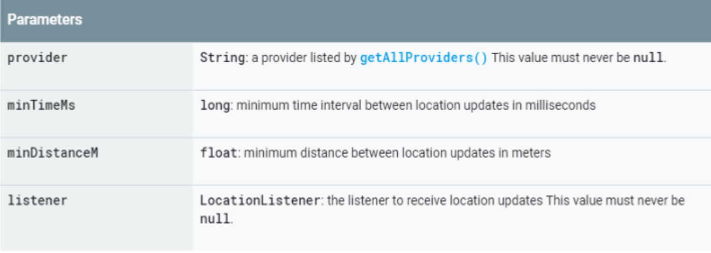

# 位置追踪与预警

## 1	位置追踪

跟踪是通过注册监听器来实现的。声明LocationListener 监听器,在onLocationChanged(Location l)方法中实现位置变化的代码。通过LocationManager的requestLocationUpdatesO方法注册监听器，当设备位置发生变化时监听器被触发，onLocationChanged(Location I)方法被调用。

### 核心方法、接口分析:

**requestLocationUpdates**

**LocationListener**

关于

#### requestLocationUpdates

```java
requestLocationUpdates
public void requestLocationUpdates (String provider,
1ong minTineMs,
float minDistanceM,
LocationListener listener)
```




位置更新间隔可以使用最小时间参数。尽管可能更多取决于位置可用性和其他因素。 选择合理的价值最短时间参数对于节省电池很重要
生活。 每次位置更新都需要多种电源传感器。 选择一个最小时间参数仍然可以提供合理的用户经验。如果您的应用程序不在前台并显示
位置，然后您的应用程序应考虑切换到PASSIVE_ PROVIDER。

```java
PASSIVE_ PROVIDER
public static final String PASSIVE PROVIDER
```

此提供程序可用于被动接收其他应用程式或服务实际上没有要求自己要求位置。


#### LocationListener 


位置更改后，用于从LocationManager接收通知。如果已使用该`LocationManager#requestLocationUpdates(String, long, float, LocationListener)` 方法向Location Manager服务注册了LocationListener，则将调用这些方法。


| 公开方法        |                                                              |
| :-------------- | ------------------------------------------------------------ |
| `abstract void` | `onLocationChanged(Location location)`位置更改时调用。       |
| `default void`  | `onProviderDisabled(String provider)`当用户禁用提供程序时调用。 |
| `default void`  | `onProviderEnabled(String provider)`当用户启用提供程序时调用。 |
| `default void`  | `onStatusChanged(String provider, int status, Bundle extras)`*此方法已在API级别29中弃用。永远不会在Android Q及更高版本上调用此回调。* |


```java
// Acquire a reference to the system Location Manager
LocationManager locationManager = (LocationManager) this . getSystemService (LOCATION SERVICE) ;
// Define a listener that responds to location updates
    LocationListener locationListener = new LocationListener() {
    public void onLocationChanged(Location location) {
       	//位置更新世调用方法
        makeUseOfNewLocation( location);
    }
    //失效调用
    public void onStatusChanged(String provider, int status, Bundle extras) {}
    //生效时调用方法
    public void onProviderEnabled(String provider) {}
    //状态改变时调用
    public void onProviderDisabled(String provider) {}
};
// 请求位置更新
locationManager . requestLocationUpdates(LocationManager . NETWORK PROVIDER， 0，0，locationListener

```


## 2	趋近预警

### 简介

如果有这样一种位置服务，能够对我们进入或退出某个设定的区域进行提示，这样的应用是很有意义的。LocationManager 类提供这一功能， LocationManager 实例提供了一个方法addProximity Alert (double latitude, double longitude, float radius, long expiration,PendingIntent intent)，该方法用来实现这一功能。

### 方法

```java
public void addProximityAlert (double latitude, 
                double longitude, 
                float radius, 
                long expiration, 
                PendingIntent intent)
```

根据位置（纬度，经度）和半径指定的位置设置接近警报。当设备检测到它已进入或退出该位置周围的区域时，给定的PendingIntent将用于创建要触发的Intent。触发的Intent将带有键KEY_PROXIMITY_ENTERING添加的布尔值。如果值为true，则设备正在进入邻近区域；否则，设备将进入邻近区域。如果为假，则退出。由于位置估算的近似性质，如果设备短暂通过给定区域，则可能不会触发Intent。同样，如果设备经过非常接近给定区域但实际上没有进入的区域，则可能触发Intent。在expiration参数指定的毫秒数后，位置管理器将删除此接近警报，并且不再对其进行监视。值-1表示应该没有到期时间。在内部，此方法同时使用NETWORK_PROVIDER和GPS_PROVIDER。在API版本17之前，此方法可以与Manifest.permission.ACCESS_FINE_LOCATION或Manifest.permission.ACCESS_COARSE_LOCATION一起使用。从API版本17开始，此方法需要Manifest.permission.ACCESS_FINE_LOCATION权限。需要Manifest.permission.ACCESS_COARSE_LOCATION或Manifest.permission.ACCESS_FINE_LOCATION

| 参量         |                                                              |
| :----------- | ------------------------------------------------------------ |
| `latitude`   | `double`：警报区域中心点的纬度                               |
| `longitude`  | `double`：警报区域中心点的经度                               |
| `radius`     | `float`：警报区域中心点的半径，以米为单位                    |
| `expiration` | `long`：此接近警报的时间（以毫秒为单位，或-1表示没有过期）   |
| `intent`     | `PendingIntent`：一个PendingIntent，将用于在检测到进入或退出警报区域时生成要触发的Intent `null`。该值不能为。 |

| Throws              |                                                         |
| :------------------ | ------------------------------------------------------- |
| `SecurityException` | 如果 没有许可`Manifest.permission.ACCESS_FINE_LOCATION` |

要实现这一功能需要两个步骤:一是获得LocationManager 实例，调用其方法addProximityAlert并添加趋近提示:二是定义一个广播接收器，当设备进入设定区域时提醒用户。下面是程序的实现步骤。

### 案例

```java
public class MainActivity extends Activity {
    // Intent Action常量
    private static String PROXIMITY_ ALERT ACTION NAME = "com. amaker. ch14. ProximityAlert";
    //声明按钮Button实例
    private Button btn;
    @Override
    public void onCreate (Bundle savedInstanceState) {
    super . onCreate (savedInstanceState) ;
    //设置当前Activity的界面布局
    setContentView (R.layout .main) ;
    //通过findViewById方法获得Button实例
    btn■(Button) findViewById (R. id. Button01) ;
    btn. setOnClickListener (new OnClickListener () {
        public void onClick(View V) {
        //设定
        set() ;
    });
        
    //趋近提示方法
    private void set (){
    //定位服务常量
        String locService = Context. LOCATION SERVICE:
        //定位服务管理器实例
        LocationManager locationManager;
        //通过getSystemService方法获得LocationManager实例
        locationManager = (Locati onManager) getSystemService (locService) ;
        //声明经度
        double lat = 30.4;
        //声明纬度
        double lng = 112.2;
        //声明半径(单位米) ,
        float radius一200f;
        //不过期
        long expiration = -1;
        //声明Intent .
        Intent intent = new Intent ( PROXIMITY_ ALERT ACTION NAME) ;
        //声明pendingIntent
        PendingIntent p1 =
        PendingIntent. getBroadcast(this, -1, intent,0);
        //添加趋近警告
        locati onManager . addProximityAlert(lat, 1ng, radius, expiration,pi) ;
    }

}
```


定义广播接收器，用来检测当设备进入设定区域时提示用户。

```java
public class ProximityAlertReciever extends BroadcastReceiver{
    @Override
    public void onReceive (Context context, Intent intent) {
        //趋近关键字
        String key = LocationManager. KEY_ PrROXIMITY_ ENTERING;
        //从Intent获得额外信息，判断是否进入设置区域
        Boolean isEnter = intent. getBooleanExtra(key, false) ;
        if (isEnter) {
            Toast .makeText (context, "你已经进入荆州区! "，Toast. LENGTH_ LONG) ;
        }
    }
}

```


## 3	位置信息与经纬度转换


### GeoCoder

Geocoder可以完成位置信息和经纬度坐标之间的相互转换。例如，你知道了某个地方的名称，想知道它的经纬度坐标，或者你知道了某个地方的经纬度坐标，想知道其名称，那么Geocoder就可以完成这一功能了 。

解码方式有以下两种:

●正向编码:通过位置名称获得经纬度坐标。

●反向编码:通过经纬度坐标获得位置名称。

用于处理地理编码和反向地理编码的类。地理编码是将街道地址或其他位置描述转换为（纬度，经度）坐标的过程。反向地理编码是将（纬度，经度）坐标转换为（部分）地址的过程。反向地理编码的位置描述中的详细信息量可能会有所不同，例如，一个可能包含最近建筑物的完整街道地址，而另一个可能仅包含城市名称和邮政编码。Geocoder类需要后端服务，该服务未包含在核心android框架中。如果平台中没有后端服务，则Geocoder查询方法将返回一个空列表。使用isPresent（）方法来确定是否存在Geocoder实现。


#### 摘要

| 公共建设者                                                   |
| :----------------------------------------------------------- |
| `Geocoder(Context context, Locale locale)`构造一个Geocoder，其响应将针对给定的Locale进行本地化。 |
| `Geocoder(Context context)`构造一个Geocoder，其响应将针对默认系统Locale进行本地化。 |


| 公开方法         |                                                              |
| :--------------- | ------------------------------------------------------------ |
| `List`           | `getFromLocation(double latitude, double longitude, int maxResults)`返回一个地址数组，该地址已知可描述紧接给定纬度和经度的区域。 |
| `List`           | `getFromLocationName(String locationName, int maxResults, double lowerLeftLatitude, double lowerLeftLongitude, double upperRightLatitude, double upperRightLongitude)`返回已知用来描述命名位置的地址数组，该地址可以是诸如“ Dalvik，Iceland”的地名，诸如“ 1600 Amphitheatre Parkway，Mountain View，CA”的地址，以及机场代码，例如“ SFO” ”等。 |
| `List`           | `getFromLocationName(String locationName, int maxResults)`返回已知用来描述命名位置的地址数组，该地址可以是诸如“ Dalvik，Iceland”的地名，诸如“ 1600 Amphitheatre Parkway，Mountain View，CA”的地址，以及机场代码，例如“ SFO” ”等。 |
| `static boolean` | `isPresent()`如果实现了Geocoder方法getFromLocation和getFromLocationName，则返回true。 |


### getFromLocationName

````java
public List<Address> getFromLocationName (String locationName, 
                int maxResults, 
                double lowerLeftLatitude, 
                double lowerLeftLongitude, 
                double upperRightLatitude, 
                double upperRightLongitude)
````

返回一个已知用来描述命名位置的地址数组，该地址可以是诸如“ Dalvik，Iceland”的地名，诸如“ 1600 Amphitheatre Parkway，Mountain View，CA”的地址，以及一个机场代码，例如“ SFO” ”等。返回的地址将针对提供给此类的构造函数的语言环境进行本地化。

您可以通过包括搜索框的左下点和右上点的经度和纬度来为搜索结果指定一个边界框。

该查询将被阻止，并且将通过网络查找获得返回的值。结果是最佳猜测，不能保证是有意义或正确的。从与主UI线程分开的线程中调用此方法可能很有用。


| 参量                  |                                                       |
| :-------------------- | ----------------------------------------------------- |
| `locationName`        | `String`：用户提供的位置描述                          |
| `maxResults`          | `int`：要返回的最大地址数。建议使用较小的数字（1到5） |
| `lowerLeftLatitude`   | `double`：边界框左下角的纬度                          |
| `lowerLeftLongitude`  | `double`：边界框左下角的经度                          |
| `upperRightLatitude`  | `double`：边界框右上角的纬度                          |
| `upperRightLongitude` | `double`：边界框右上角的经度                          |

| 退货   |                                                              |
| :----- | ------------------------------------------------------------ |
| `List` | 地址对象列表。如果找不到匹配项或没有可用的后端服务，则返回null或空列表。 |

| 投掷                       |                                       |
| :------------------------- | ------------------------------------- |
| `IllegalArgumentException` | 如果locationName为null                |
| `IllegalArgumentException` | 如果任何纬度小于-90或大于90           |
| `IllegalArgumentException` | 如果任何经度小于-180或大于180         |
| `IOException`              | 如果网络不可用或发生任何其他I / O问题 |


```java
public List<Address> getFromLocationName (String locationName, 
                int maxResults)
```

返回已知用来描述命名位置的地址数组，该地址可以是诸如“ Dalvik，Iceland”的地名，诸如“ 1600 Amphitheatre Parkway，Mountain View，CA”的地址，以及机场代码，例如“ SFO” ”等。返回的地址将针对提供给此类的构造函数的语言环境进行本地化。 该查询将被阻止，并且将通过网络查找获得返回的值。 结果是最佳猜测，不能保证是有意义或正确的。 从与主UI线程分开的线程中调用此方法可能很有用。


| 参量           |                                                       |
| :------------- | ----------------------------------------------------- |
| `locationName` | `String`: a user-supplied description of a location   |
| `maxResults`   | `int`：要返回的最大结果数。建议使用较小的数字（1到5） |

| 退货   |                                                              |
| :----- | ------------------------------------------------------------ |
| `List` | 地址对象列表。如果找不到匹配项或没有可用的后端服务，则返回null或空列表。 |

| Throws                     |                                       |
| :------------------------- | ------------------------------------- |
| `IllegalArgumentException` | 如果locationName为null                |
| `IOException`              | 如果网络不可用或发生任何其他I / O问题 |

