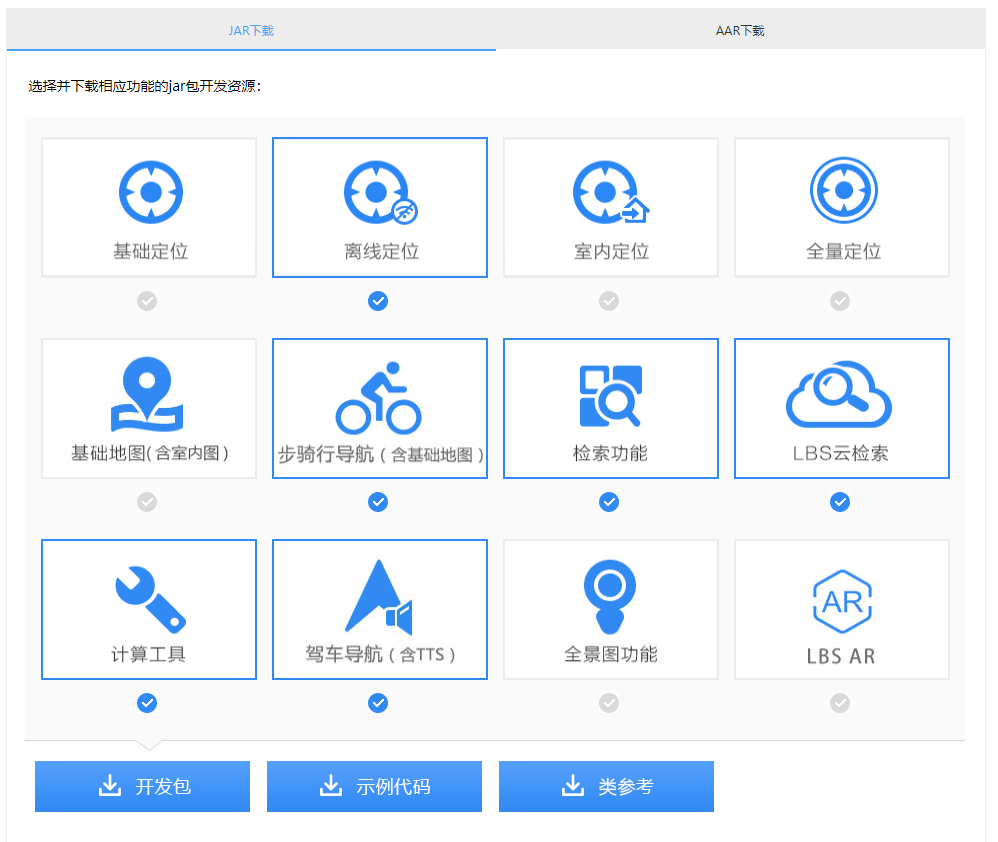
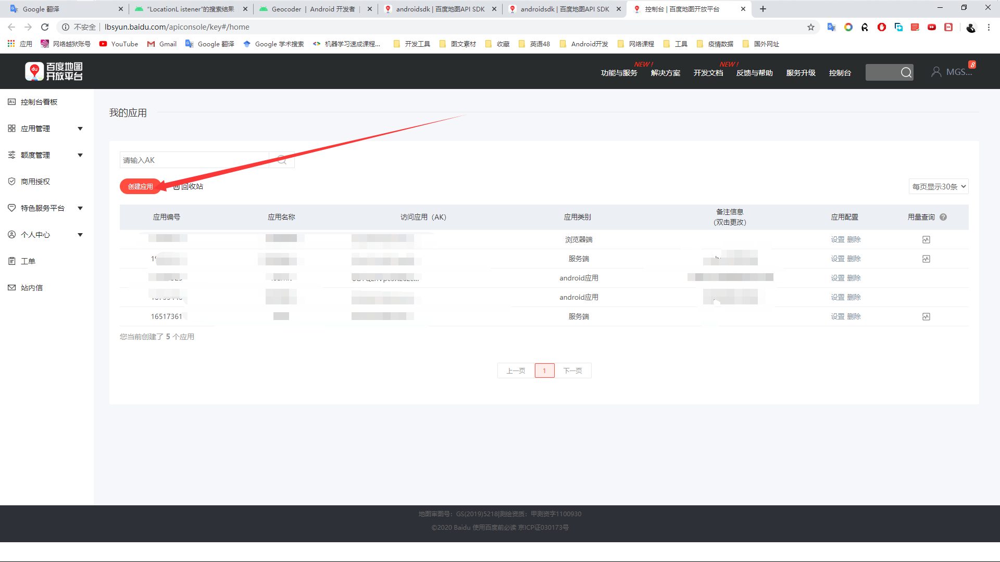
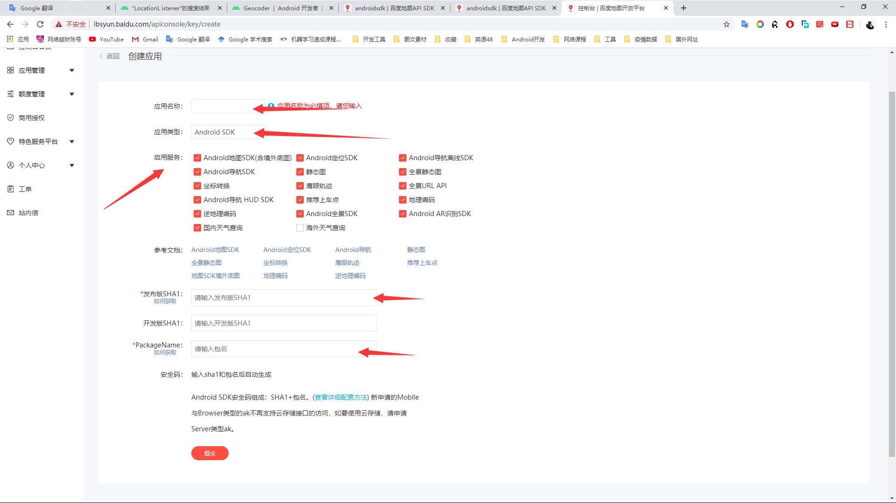
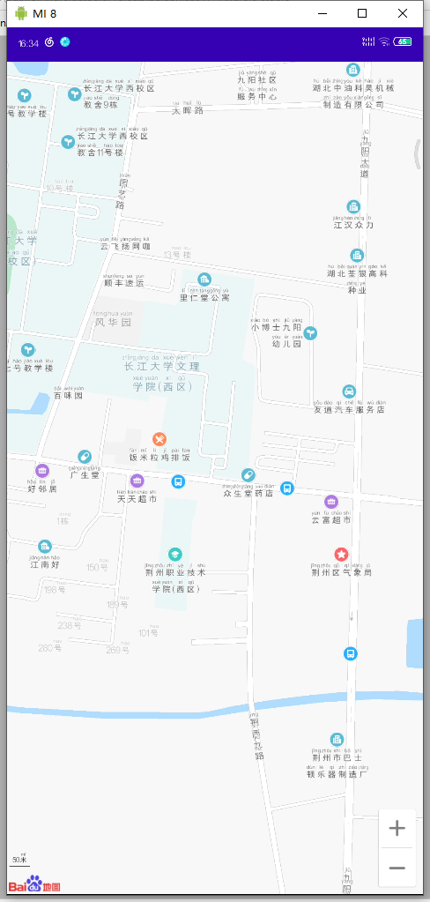

# 地图开发平台与百度地图

## 1、地图开发平台概述

### 百度地图SDK项目配置

#### Android地图SDK

百度地图Android SDK是一套基于Android 4.0及以上版本设备的应用程序接口。您可以使用该套SDK开发适用于Android系统移动设备的地图应用，通过调用地图SDK接口，您可以轻松访问百度地图服务和数据，构建功能丰富、交互性强的地图类应用程序。

#### 1、下载开发包




#### 2、配置工程

将开发包拷贝至工程(截图以普通地图服务的开发包为例，步骑行导航的开发包同理)

##### 1、添加jar文件

   打开解压后的开发包文件夹，找到BaiduLBS_Android.jar文件将其拷贝至工程的app/libs目录下，如图：


##### 2、添加so文件

​     有两种方法可以往项目中添加so文件。
​     方法一：
​    在下载的开发包中拷贝需要的CPU架构对应的so文件文件夹到app/libs目录下，如图：


在app目录下的build.gradle文件中android块中配置sourceSets标签，如果没有使用该标签则新增，详细配置代码如下：

```javascript
sourceSets {
           main {
               jniLibs.srcDir 'libs'
           }
    }
```

注意：Jar文件和so文件的版本号必须一致，并且保证Jar文件与so文件是同一版本包取出的。 

方法二：
     在src/main/目录下新建jniLibs目录（如果您的项目中已经包含该目录不用重复创建），在下载的开发包中拷贝项目中需要的CPU架构对应的so文件文件夹到jniLibs目录，如图：


##### 3、往工程中添加jar文件

在工程配置中需要将前面添加的jar文件集成到我们的工程中。
 方法一：
       在libs目录下，选中每一个jar文件（此处只有一个BaiduLbs_Android.jar）右键，选择Add As Library…，如图：


  此时会发现在app目录的build.gradle的dependencies块中生成了工程所依赖的jar文件的对应说明，如下所示：


 注意:最新版本的Android Studio中compile被替换为implementation，具体的写法与您的Android Studio版本有关。


### 百度地图开发秘钥申请

1、登录注册百度地图开发者：http://lbsyun.baidu.com/apiconsole/key





2、点击创建应用：



3、最好写你的当前开发的应用程序名称，记者应用类型一定选择Android SDK

选择自己所需要的SDK服务模块，我建议全选。

4、怎么获取SHA1呢。开发版的获取方法：

进入控制台：进入目录  用户目录/.android


```shell
keytool -list -v -keystore debug.keystore > sha1.txt
```

我的建议是输出到文件里面，方便查看，这是开发版的，开发版和发布版的SHA1可以写一样的。

【如果你有自己的签名，你也可以配置一个发布版的sha1，没有签名的后面可省略配置发布版的SHA1】

进入你的签名文件目录：在控制台输入：

```shell
keytool -list -v -keystore > sha1.txt
```


5、填写你的应用程序的包名，一定跟你的AndroidManifest.xml中的包名是一致的，


6、点击提交即可；


## 2、百度地图开发配置

### AndroidManifest.xml配置

#### 第一步 配置AndroidManifest.xml文件

1.在 application 中加入如下代码配置开发密钥（AK）：

2.在 application 外部添加如下权限声明：

```xml
<?xml version="1.0" encoding="utf-8"?>
<manifest xmlns:android="http://schemas.android.com/apk/res/android"
    package="icu.shaoyayu.android.baidumap">
	<!--配置权限-->
    <!-- 访问网络，进行地图相关业务数据请求，包括地图数据，路线规划，POI检索等 -->
    <uses-permission android:name="android.permission.INTERNET" />
    <!-- 获取网络状态，根据网络状态切换进行数据请求网络转换 -->
    <uses-permission android:name="android.permission.ACCESS_NETWORK_STATE" />
    <!-- 读取外置存储。如果开发者使用了so动态加载功能并且把so文件放在了外置存储区域，则需要申请该权限，否则不需要 -->
    <uses-permission android:name="android.permission.READ_EXTERNAL_STORAGE" />
    <!-- 写外置存储。如果开发者使用了离线地图，并且数据写在外置存储区域，则需要申请该权限 -->
    <uses-permission android:name="android.permission.WRITE_EXTERNAL_STORAGE" />

    <application
        android:name=".application.DemoApplication"
        android:allowBackup="true"
        android:icon="@mipmap/ic_launcher"
        android:label="@string/app_name"
        android:roundIcon="@mipmap/ic_launcher_round"
        android:supportsRtl="true"
        android:theme="@style/AppTheme">
		<!--在这里配置你的ak-->
        <meta-data
            android:name="com.baidu.lbsapi.API_KEY"
            android:value="###你的ak" />

        <activity android:name=".activity.DemoListActivity">
            <intent-filter>
                <action android:name="android.intent.action.MAIN" />

                <category android:name="android.intent.category.LAUNCHER" />
            </intent-filter>
        </activity>
        <activity android:name=".activity.MainActivity" />
        <activity android:name=".activity.AuthorityManagementActivity" />
        <activity android:name=".activity.MapLayerActivity" />
        <activity android:name=".activity.CircelOverlayActivity" />
        <activity android:name=".activity.TextOverlayActivity" />
        <activity android:name=".activity.MarkerOverlayActivity" />
        <activity android:name=".activity.SearchInBoundActivity" />
        <activity android:name=".activity.LocationDomeActivity" />
        <activity android:name=".activity.SearchInCityActivity" />
        <activity android:name=".activity.SearchInNearbyActivity" />
        <activity android:name=".activity.DrivingSearchActivity" />
        <activity android:name=".activity.TransitSearchActivity" />
        <activity android:name=".activity.WalkingSearchActivity" />
        <activity android:name=".activity.LocateActivity"></activity>
        <service
            android:name="com.baidu.location.f"
            android:enabled="true"
            android:process=":remote"></service>
    </application>

</manifest>
```

#### 第二步 在布局文件中添加地图容器

MapView是View的一个子类，用于在Android View中放置地图。MapView的使用方法与Android提供的其他View一样。

```xml
<?xml version="1.0" encoding="utf-8"?>
<LinearLayout xmlns:android="http://schemas.android.com/apk/res/android"
    xmlns:app="http://schemas.android.com/apk/res-auto"
    xmlns:tools="http://schemas.android.com/tools"
    android:layout_width="match_parent"
    android:layout_height="match_parent"
    android:orientation="vertical"
    tools:context=".activity.MainActivity">
    <!--添加地图容器-->
    <com.baidu.mapapi.map.MapView
        android:id="@+id/bmapView"
        android:layout_width="match_parent"
        android:layout_height="match_parent"
        android:clickable="true">
    </com.baidu.mapapi.map.MapView>
    
</LinearLayout>
```

## 3、地图显示

#### 第三步 地图初始化

注意：在SDK各功能组件使用之前都需要调用“SDKInitializer.initialize(getApplicationContext())”，因此建议在应用创建时初始化SDK引用的Context为全局变量。

新建一个自定义的Application，在其onCreate方法中完成SDK的初始化。示例代码如下：

````java
public class DemoApplication extends Application {
    @Override
    public void onCreate() {
        super.onCreate();
        //在使用SDK各组件之前初始化context信息，传入ApplicationContext   
        SDKInitializer.initialize(this);
        //自4.3.0起，百度地图SDK所有接口均支持百度坐标和国测局坐标，用此方法设置您使用的坐标类型.
        //包括BD09LL和GCJ02两种坐标，默认是BD09LL坐标。
        SDKInitializer.setCoordType(CoordType.BD09LL);
    }
}
````

在AndroidManifest.xml文件中声明该Application

```xml
<application
        android:name=".application.DemoApplication"
```

创建地图Activity，管理MapView生命周期

注意：在项目中使用地图的时候要特别注意合理地管理地图生命周期，这非常重要。

以下示例代码简述对地图生命周期的管理：

```java
package icu.shaoyayu.android.baidumap.activity;

import android.app.Activity;
import android.os.Bundle;
import android.util.Log;
import android.view.Gravity;
import android.widget.Toast;

import androidx.annotation.Nullable;

import com.baidu.mapapi.map.BaiduMap;
import com.baidu.mapapi.map.MapStatusUpdate;
import com.baidu.mapapi.map.MapStatusUpdateFactory;
import com.baidu.mapapi.map.MapView;
import com.baidu.mapapi.model.LatLng;

import icu.shaoyayu.android.baidumap.R;

/**
 * @author shaoyayu
 * 显示百度地图的模板类
 */
public abstract class BaiDuMapBaseActivity extends Activity {

    //百度地图控制器
    protected BaiduMap baiduMap = null;
    private static final String TAG = "BaseActivity";


    protected MapView mMapView = null;


    @Override
    protected final void onCreate(@Nullable Bundle savedInstanceState) {
        super.onCreate(savedInstanceState);
        setContentView(R.layout.activity_main);

        mMapView = findViewById(R.id.bmapView);
        baiduMap = mMapView.getMap();
        //获取地图的最大最小缩放
        Log.i(TAG,"最大缩放："+baiduMap.getMaxZoomLevel()+",最小缩放："+baiduMap.getMinZoomLevel());
        //设置地图的中心,通过工厂进行创建,注意经纬度是反的
        MapStatusUpdate centerPoint = MapStatusUpdateFactory.newLatLng(new LatLng(30.35645,112.158437));
        baiduMap.setMapStatus(centerPoint);
        //设置一个默认的缩放
        MapStatusUpdate defaultZoom = MapStatusUpdateFactory.zoomTo(18);
        baiduMap.setMapStatus(defaultZoom);
        init();
    }

    /**
     * 子类抽象接口
     */
    public abstract void init();


    /**
     * 在屏幕中央显示Toast
     * @param text
     */
    public void showToast(CharSequence text){
        Toast toast = Toast.makeText(this,text,Toast.LENGTH_SHORT);
        toast.setGravity(Gravity.CENTER,0,0);
        toast.show();
    }


    @Override
    protected void onResume() {
        super.onResume();
        //在activity执行onResume时执行mMapView. onResume ()，实现地图生命周期管理
        mMapView.onResume();
    }
    @Override
    protected void onPause() {
        super.onPause();
        //在activity执行onPause时执行mMapView. onPause ()，实现地图生命周期管理
        mMapView.onPause();
    }

    @Override
    protected void onDestroy() {
        super.onDestroy();
        //在activity执行onDestroy时执行mMapView.onDestroy()，实现地图生命周期管理
        mMapView.onDestroy();
    }
}

```

## 4、案例Demo

```xml
package icu.shaoyayu.android.baidumap.activity;

import android.util.Log;

/**
 * @author shaoyayu
 * 一个简单的百度地图页面
 */
public class MainActivity extends BaiDuMapBaseActivity {


    private final String ATG = "MainActivity";

    @Override
    public void init() {
        Log.i(ATG,"初始化");
    }
}
```

