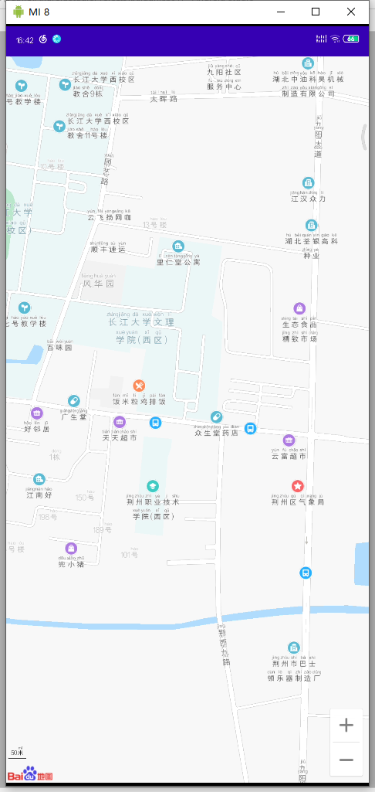
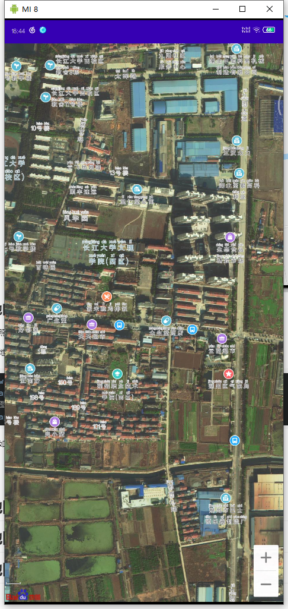
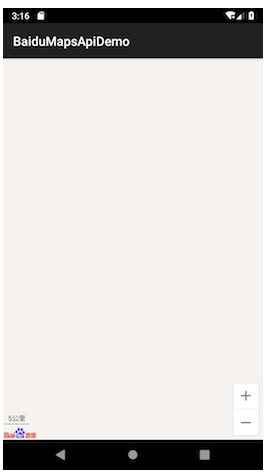
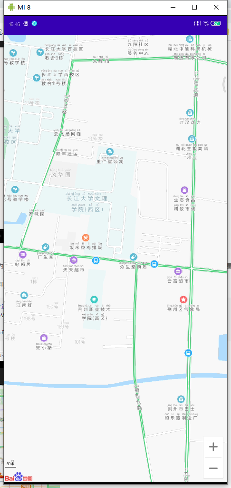
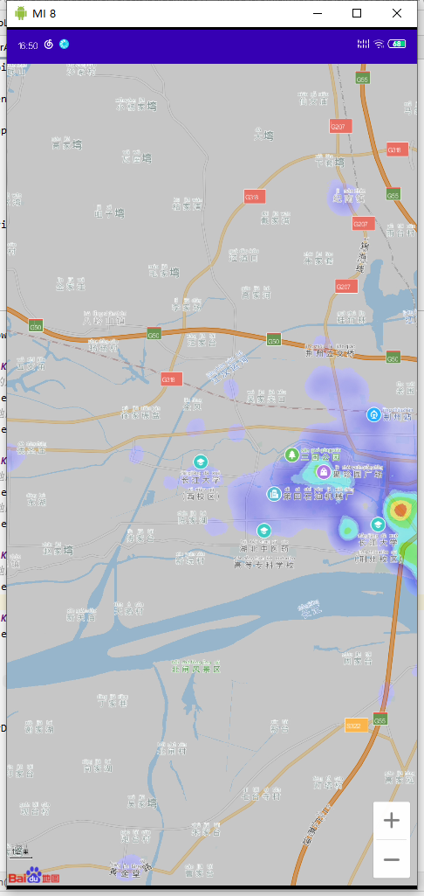
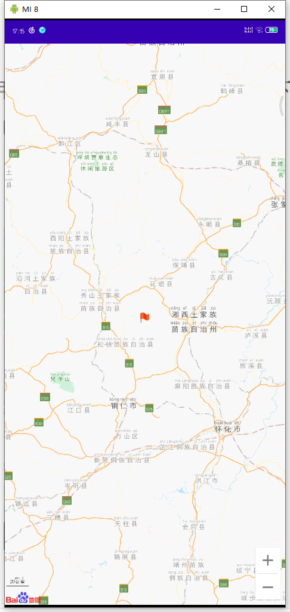
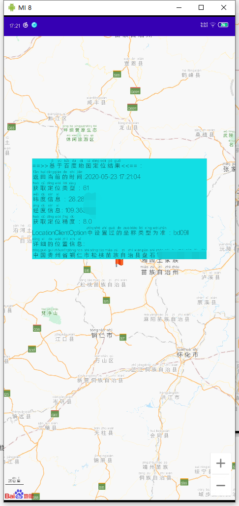

# 地图切换与地图标注

## 1、地图切换

地图SDK提供了3种预置的地图类型，包括**普通地图**，**卫星图**，**空白地图**。另外提供了2种常用图层**实时路况图**以及**百度城市热力图**。

目前百度地图SDK所提供的地图缩放等级为4-21级（室内图可以缩放至22级），所包含的信息有建筑物、道路、河流、学校、公园等内容。

下面主要介绍如何切换这3种地图类型，以及如何打开实时路况图和添加城市热力图。

地图类型

百度地图SDK为您提供了3种类型的地图资源（普通矢量地图、卫星图和空白地图），BaiduMap 类提供图层类型常量，详细如下：

|    **类型名称**    |        **说明**        |
| :----------------: | :--------------------: |
|  MAP_TYPE_NORMAL   | 普通地图（包含3D地图） |
| MAP_TYPE_SATELLITE |         卫星图         |
|   MAP_TYPE_NONE    |        空白地图        |

开发者可以利用BaiduMap中的setMapType()方法来设置地图类型,下面做简单展示。

### 普通地图

基础的道路地图。 显示道路、建筑物、绿地以及河流等重要的自然特征。

设置普通地图的代码如下：

```java
mMapView = (MapView) findViewById(R.id.bmapView);  
mBaiduMap = mMapView.getMap();  
//普通地图 ,mBaiduMap是地图控制器对象
mBaiduMap.setMapType(BaiduMap.MAP_TYPE_NORMAL);   
```

显示效果如下：



### 卫星地图

显示卫星照片数据。

设置卫星地图的代码如下：

```java
mMapView = (MapView) findViewById(R.id.bmapView);  
mBaiduMap = mMapView.getMap();
//卫星地图   
mBaiduMap.setMapType(BaiduMap.MAP_TYPE_SATELLITE); 
```

显示效果如下：




### 空白地图

无地图瓦片,地图将渲染为空白地图。不加载任何图块，将不会使用流量下载基础地图瓦片图层。支持叠加任何覆盖物。

适用场景:与瓦片图层（tileOverlay）一起使用，节省流量，提升自定义瓦片图下载速度。参考自定义瓦片图相应部分的使用介绍。

设置空白地图的代码如下：

```java
mMapView = (MapView) findViewById(R.id.bmapView);  
mBaiduMap = mMapView.getMap();  
//空白地图 
mBaiduMap.setMapType(BaiduMap.MAP_TYPE_NONE);
```




实时路况图
全实时路况图全国范围内已支持绝大部分城市实时路况查询，路况图依据实时路况数据渲染。普通地图和卫星地图，均支持叠加实时路况图。

实时路况图的开启方法如下：

```java
mMapView = (MapView) findViewById(R.id.bmapView); 
mBaiduMap = mMapView.getMap();  
//开启交通图   
mBaiduMap.setTrafficEnabled(true);
```

普通地图叠加路况图显示效果如下：




### 自定义路况图颜色

Android SDK V4.5.0版本起支持路况颜色的自定义。支持对路况图的颜色做修改和取消显示，适用于在屏幕上突出显示拥堵路况的场景。

1.路况颜色设置方法

```
setCustomTrafficColor(String severeCongestion,String congestion,String slow,String smooth)
```

1）参数含义

```
String severeCongestion,String congestion,String slow,String smooth 分别代表严重拥堵，拥堵，缓行，畅通 
```

2）颜色格式

```
#AARRGGBB A:Alpha、R:Red、G:Green、B:Blue；其中AA为透明度；4个参数必须全部设置，不需要的颜色，透明度AA可以设置为00，即透明不显示。
```

注意：透明度顺序与个性化地图中的透明度顺序不一致。
2.示例如下

```java
mBaiduMap.setTrafficEnabled(true);
mBaiduMap.setCustomTrafficColor("#ffba0101", "#fff33131", "#ffff9e19", "#00000000");
//  对地图状态做更新，否则可能不会触发渲染，造成样式定义无法立即生效。
MapStatusUpdate u = MapStatusUpdateFactory.zoomTo(13);
mBaiduMap.animateMapStatus(u);
```

### 百度城市热力图

百度城市热力图是百度基于强大的地理位置大数据，根据实时的人群分布密度和变化趋势，用热力图的形式展现给广大开发者。

百度城市热力图的使用方式和实时路况图类似，只需要简单的接口调用，即可在地图上展现样式丰富的热力图层。

注意：只有在地图层级介于11-20级时，可显示城市热力图。

百度城市热力图开启方法如下：

```java
mMapView = (MapView) findViewById(R.id.bmapView); 
mBaiduMap = mMapView.getMap();  
//开启热力图  
mBaiduMap.setBaiduHeatMapEnabled(true);
```

显示如下：



## 2、地图切换的程序实现

### AndroidManifest.xml

```xml
<?xml version="1.0" encoding="utf-8"?>
<manifest xmlns:android="http://schemas.android.com/apk/res/android"
    package="icu.shaoyayu.android.baidumap">

    <!-- 访问网络，进行地图相关业务数据请求，包括地图数据，路线规划，POI检索等 -->
    <uses-permission android:name="android.permission.INTERNET" />
    <!-- 获取网络状态，根据网络状态切换进行数据请求网络转换 -->
    <uses-permission android:name="android.permission.ACCESS_NETWORK_STATE" />
    <!-- 读取外置存储。如果开发者使用了so动态加载功能并且把so文件放在了外置存储区域，则需要申请该权限，否则不需要 -->
    <uses-permission android:name="android.permission.READ_EXTERNAL_STORAGE" />
    <!-- 写外置存储。如果开发者使用了离线地图，并且数据写在外置存储区域，则需要申请该权限 -->
    <uses-permission android:name="android.permission.WRITE_EXTERNAL_STORAGE" />

    <application
        android:name=".application.DemoApplication"
        android:allowBackup="true"
        android:icon="@mipmap/ic_launcher"
        android:label="@string/app_name"
        android:roundIcon="@mipmap/ic_launcher_round"
        android:supportsRtl="true"
        android:theme="@style/AppTheme">

        <meta-data
            android:name="com.baidu.lbsapi.API_KEY"
            android:value="你的ak" />

        <activity android:name=".activity.DemoListActivity">
            <intent-filter>
                <action android:name="android.intent.action.MAIN" />

                <category android:name="android.intent.category.LAUNCHER" />
            </intent-filter>
        </activity>
        <activity android:name=".activity.MainActivity" />
        <activity android:name=".activity.AuthorityManagementActivity" />
        <activity android:name=".activity.MapLayerActivity" />
        <activity android:name=".activity.CircelOverlayActivity" />
        <activity android:name=".activity.TextOverlayActivity" />
        <activity android:name=".activity.MarkerOverlayActivity" />
        <activity android:name=".activity.SearchInBoundActivity" />
        <activity android:name=".activity.LocationDomeActivity" />
        <activity android:name=".activity.SearchInCityActivity" />
        <activity android:name=".activity.SearchInNearbyActivity" />
        <activity android:name=".activity.DrivingSearchActivity" />
        <activity android:name=".activity.TransitSearchActivity" />
        <activity android:name=".activity.WalkingSearchActivity" />
        <activity android:name=".activity.LocateActivity"></activity>
    </application>

</manifest>
```

### 布局文件activity_main

```xml
<?xml version="1.0" encoding="utf-8"?>
<LinearLayout xmlns:android="http://schemas.android.com/apk/res/android"
    xmlns:app="http://schemas.android.com/apk/res-auto"
    xmlns:tools="http://schemas.android.com/tools"
    android:layout_width="match_parent"
    android:layout_height="match_parent"
    android:orientation="vertical"
    tools:context=".activity.MainActivity">

    <com.baidu.mapapi.map.MapView
        android:id="@+id/bmapView"
        android:layout_width="match_parent"
        android:layout_height="match_parent"
        android:clickable="true">

    </com.baidu.mapapi.map.MapView>


</LinearLayout>
```


### BaiDuMapBaseActivity

```java
package icu.shaoyayu.android.baidumap.activity;

import android.app.Activity;
import android.os.Bundle;
import android.util.Log;
import android.view.Gravity;
import android.widget.Toast;

import androidx.annotation.Nullable;

import com.baidu.mapapi.map.BaiduMap;
import com.baidu.mapapi.map.MapStatusUpdate;
import com.baidu.mapapi.map.MapStatusUpdateFactory;
import com.baidu.mapapi.map.MapView;
import com.baidu.mapapi.model.LatLng;

import icu.shaoyayu.android.baidumap.R;

/**
 * @author shaoyayu
 * 显示百度地图的模板类
 */
public abstract class BaiDuMapBaseActivity extends Activity {

    //百度地图控制器
    protected BaiduMap baiduMap = null;
    private static final String TAG = "BaseActivity";


    protected MapView mMapView = null;


    @Override
    protected final void onCreate(@Nullable Bundle savedInstanceState) {
        super.onCreate(savedInstanceState);
        setContentView(R.layout.activity_main);

        mMapView = findViewById(R.id.bmapView);
        baiduMap = mMapView.getMap();
        //获取地图的最大最小缩放
        Log.i(TAG,"最大缩放："+baiduMap.getMaxZoomLevel()+",最小缩放："+baiduMap.getMinZoomLevel());
        //设置地图的中心,通过工厂进行创建,注意经纬度是反的
        MapStatusUpdate centerPoint = MapStatusUpdateFactory.newLatLng(new LatLng(30.35645,112.158437));
        baiduMap.setMapStatus(centerPoint);
        //设置一个默认的缩放
        MapStatusUpdate defaultZoom = MapStatusUpdateFactory.zoomTo(18);
        baiduMap.setMapStatus(defaultZoom);
        init();
    }

    /**
     * 子类抽象接口
     */
    public abstract void init();


    /**
     * 在屏幕中央显示Toast
     * @param text
     */
    public void showToast(CharSequence text){
        Toast toast = Toast.makeText(this,text,Toast.LENGTH_SHORT);
        toast.setGravity(Gravity.CENTER,0,0);
        toast.show();
    }


    @Override
    protected void onResume() {
        super.onResume();
        //在activity执行onResume时执行mMapView. onResume ()，实现地图生命周期管理
        mMapView.onResume();
    }
    @Override
    protected void onPause() {
        super.onPause();
        //在activity执行onPause时执行mMapView. onPause ()，实现地图生命周期管理
        mMapView.onPause();
    }

    @Override
    protected void onDestroy() {
        super.onDestroy();
        //在activity执行onDestroy时执行mMapView.onDestroy()，实现地图生命周期管理
        mMapView.onDestroy();
    }
}

```

### MapLayerActivity

```java
package icu.shaoyayu.android.baidumap.activity;

import android.view.KeyEvent;

import com.baidu.mapapi.map.BaiduMap;

/**
 * @author shaoyayu
 * 切换不同的涂层地图
 */
public class MapLayerActivity extends BaiDuMapBaseActivity {
    @Override
    public void init() {

    }

    @Override
    public boolean onKeyDown(int keyCode, KeyEvent event) {
        switch (keyCode){
            case KeyEvent.KEYCODE_1:
                //显示普通的地图
                baiduMap.setMapType(BaiduMap.MAP_TYPE_NORMAL);
                //关闭交通地图
                baiduMap.setTrafficEnabled(false);
                break;
            case KeyEvent.KEYCODE_2:
                //显示卫星地图
                baiduMap.setMapType(BaiduMap.MAP_TYPE_SATELLITE);
                //关闭交通地图
                baiduMap.setTrafficEnabled(false);
                break;
            case KeyEvent.KEYCODE_3:
                //显示交通地图
                baiduMap.setTrafficEnabled(true);
                break;
            case KeyEvent.KEYCODE_4:
                baiduMap.setBaiduHeatMapEnabled(true);
                break;
            default:
                showToast("此选项无指令");
                break;
        }
        return super.onKeyDown(keyCode,event);
    }
}

```

### 显示效果

效果如上图所示：【这里我就不搬图了】


## 3、地图定位

坐标系说明
Android定位SDK产品，支持全球定位，能够精准的获取经纬度信息。
根据开发者的设置,
国内获得的坐标系类型可以是:
国测局坐标
百度墨卡托坐标
百度经纬度坐标。
海外地区，只能获得:
WGS84坐标。
定位SDK默认输出GCJ02坐标，地图SDK默认输出BD09I1坐标。

### 下载SDK和申请AK

由于我下载的SDK是包含定位服务的，我的AK也是含有定位服务的，所以这里略过，不明白的同学可以参考：第七节

### AndroidManifest.xml

```xml
<?xml version="1.0" encoding="utf-8"?>
<manifest xmlns:android="http://schemas.android.com/apk/res/android"
    package="icu.shaoyayu.android.baidumap">

    <!-- 访问网络，进行地图相关业务数据请求，包括地图数据，路线规划，POI检索等 -->
    <uses-permission android:name="android.permission.INTERNET" />
    <!-- 获取网络状态，根据网络状态切换进行数据请求网络转换 -->
    <uses-permission android:name="android.permission.ACCESS_NETWORK_STATE" />
    <!-- 读取外置存储。如果开发者使用了so动态加载功能并且把so文件放在了外置存储区域，则需要申请该权限，否则不需要 -->
    <uses-permission android:name="android.permission.READ_EXTERNAL_STORAGE" />
    <!-- 写外置存储。如果开发者使用了离线地图，并且数据写在外置存储区域，则需要申请该权限 -->
    <uses-permission android:name="android.permission.WRITE_EXTERNAL_STORAGE" />
    
    
    <!--这个地方需要添加定位的权限-->
    <!-- 这个权限用于进行网络定位-->
    <uses-permission android:name="android.permission.ACCESS_COARSE_LOCATION"></uses-permission>
    <!-- 这个权限用于访问GPS定位-->
    <uses-permission android:name="android.permission.ACCESS_FINE_LOCATION"></uses-permission>
    <!-- 用于访问wifi网络信息，wifi信息会用于进行网络定位-->
    <uses-permission android:name="android.permission.ACCESS_WIFI_STATE"></uses-permission>
    <!-- 这个权限用于获取wifi的获取权限，wifi信息会用来进行网络定位-->
    <uses-permission android:name="android.permission.CHANGE_WIFI_STATE"></uses-permission>

    <application
        android:name=".application.DemoApplication"
        android:allowBackup="true"
        android:icon="@mipmap/ic_launcher"
        android:label="@string/app_name"
        android:roundIcon="@mipmap/ic_launcher_round"
        android:supportsRtl="true"
        android:theme="@style/AppTheme">


        <meta-data
            android:name="com.baidu.lbsapi.API_KEY"
            android:value="你的ak" />

		.....
        <!--添加一个定位服务-->
        <service
            android:name="com.baidu.location.f"
            android:enabled="true"
            android:process=":remote"></service>
    </application>

</manifest>
```

### 开启地图的定位图层

mBaiduMap. setMyLocationEnabled(true) ;

### 构造地图数据

1)通过继承抽象类BDAbstractListener

2)重写其onReceieveLocation方法来获取定位数据

3)将其传给MapView。

```java
public Class MyLocationListener extends BDAbstractLocationListener {
    @Override
    public void onReceiveLocation(BDLocation location) {
        //mapView销毁后不在处理新接收的位置
        if (location == nu11|l mMapView == null){
      	  return;
        }
        MyLocationData locData = new MyLocationData.Builder()
            .accuracy(location.getRadius())
            //此处设置开发者获取到的方向信息，顺时针0-360
            . direction(location. getDirection()). latitude(location.getlatitude())
            .longitude(location.getLongitude()).build();
        mBaiduMap. setMyLocationData(locData);
    }
}
```

### 通过LocationClient发起定位

```java
//定位初始化
mLocationClient = new LocationClient(this);
//通过LocationClientOption设置LocationClient相关参数
LocationClientoption option =
new
LocationClientoption();
option. setOpenGps(true); //打开gps
option. setCoorType("bd0911"); // 设置坐标类型!
option.setScanSpan(1000);
//设置locationClientOption
mLocationClient.setLocoption(option);
//注册LocationListener监听器
MyLocationListener myLocationListener = new MyLocationListener();
mLocationClient.registerLocationListener(myLocationListener);
//开启地图定位图层
mLocationClient.start( );

```

### 生命周期管理

```java
@Override
protected void onResume( ) {
    mMapView. onResume( );
    super .onResume( );
}
@Override
protected void onPause() {
    mMapView.onPause() ;
    super .onPause();
}
@Override
protected void onDestroy() {
    mLocationClient.stop();
    mBaiduMap.setMyLocationEnabled(false);
    mMapView. onDestroy();
    mMapView = null ;
    super。onDestroy();
}

```

### 效果如下





## 4、地图定位的程序实现

### AndroidManifest.xml

```xml
<?xml version="1.0" encoding="utf-8"?>
<manifest xmlns:android="http://schemas.android.com/apk/res/android"
    package="icu.shaoyayu.android.baidumap">

    <!-- 访问网络，进行地图相关业务数据请求，包括地图数据，路线规划，POI检索等 -->
    <uses-permission android:name="android.permission.INTERNET" />
    <!-- 获取网络状态，根据网络状态切换进行数据请求网络转换 -->
    <uses-permission android:name="android.permission.ACCESS_NETWORK_STATE" />
    <!-- 读取外置存储。如果开发者使用了so动态加载功能并且把so文件放在了外置存储区域，则需要申请该权限，否则不需要 -->
    <uses-permission android:name="android.permission.READ_EXTERNAL_STORAGE" />
    <!-- 写外置存储。如果开发者使用了离线地图，并且数据写在外置存储区域，则需要申请该权限 -->
    <uses-permission android:name="android.permission.WRITE_EXTERNAL_STORAGE" />
    <!-- 这个权限用于进行网络定位-->
    <uses-permission android:name="android.permission.ACCESS_COARSE_LOCATION"></uses-permission>
    <!-- 这个权限用于访问GPS定位-->
    <uses-permission android:name="android.permission.ACCESS_FINE_LOCATION"></uses-permission>
    <!-- 用于访问wifi网络信息，wifi信息会用于进行网络定位-->
    <uses-permission android:name="android.permission.ACCESS_WIFI_STATE"></uses-permission>
    <!-- 这个权限用于获取wifi的获取权限，wifi信息会用来进行网络定位-->
    <uses-permission android:name="android.permission.CHANGE_WIFI_STATE"></uses-permission>

    <application
        android:name=".application.DemoApplication"
        android:allowBackup="true"
        android:icon="@mipmap/ic_launcher"
        android:label="@string/app_name"
        android:roundIcon="@mipmap/ic_launcher_round"
        android:supportsRtl="true"
        android:theme="@style/AppTheme">


        <meta-data
            android:name="com.baidu.lbsapi.API_KEY"
            android:value="##你的ak" />

        <activity android:name=".activity.DemoListActivity">
            <intent-filter>
                <action android:name="android.intent.action.MAIN" />

                <category android:name="android.intent.category.LAUNCHER" />
            </intent-filter>
        </activity>
        <activity android:name=".activity.MainActivity" />
        <activity android:name=".activity.AuthorityManagementActivity" />
        <activity android:name=".activity.MapLayerActivity" />
        <activity android:name=".activity.CircelOverlayActivity" />
        <activity android:name=".activity.TextOverlayActivity" />
        <activity android:name=".activity.MarkerOverlayActivity" />
        <activity android:name=".activity.SearchInBoundActivity" />
        <activity android:name=".activity.LocationDomeActivity" />
        <activity android:name=".activity.SearchInCityActivity" />
        <activity android:name=".activity.SearchInNearbyActivity" />
        <activity android:name=".activity.DrivingSearchActivity" />
        <activity android:name=".activity.TransitSearchActivity" />
        <activity android:name=".activity.WalkingSearchActivity" />
        <activity android:name=".activity.LocateActivity"></activity>
        <service
            android:name="com.baidu.location.f"
            android:enabled="true"
            android:process=":remote"></service>
    </application>

</manifest>
```


### activity_main.xml

```xml
<?xml version="1.0" encoding="utf-8"?>
<LinearLayout xmlns:android="http://schemas.android.com/apk/res/android"
    xmlns:app="http://schemas.android.com/apk/res-auto"
    xmlns:tools="http://schemas.android.com/tools"
    android:layout_width="match_parent"
    android:layout_height="match_parent"
    android:orientation="vertical"
    tools:context=".activity.MainActivity">

    <com.baidu.mapapi.map.MapView
        android:id="@+id/bmapView"
        android:layout_width="match_parent"
        android:layout_height="match_parent"
        android:clickable="true">

    </com.baidu.mapapi.map.MapView>


</LinearLayout>
```


### BaiDuMapBaseActivity

```java
package icu.shaoyayu.android.baidumap.activity;

import android.app.Activity;
import android.os.Bundle;
import android.util.Log;
import android.view.Gravity;
import android.widget.Toast;

import androidx.annotation.Nullable;

import com.baidu.mapapi.map.BaiduMap;
import com.baidu.mapapi.map.MapStatusUpdate;
import com.baidu.mapapi.map.MapStatusUpdateFactory;
import com.baidu.mapapi.map.MapView;
import com.baidu.mapapi.model.LatLng;

import icu.shaoyayu.android.baidumap.R;

/**
 * @author shaoyayu
 * 显示百度地图的模板类
 */
public abstract class BaiDuMapBaseActivity extends Activity {

    //百度地图控制器
    protected BaiduMap baiduMap = null;
    private static final String TAG = "BaseActivity";


    protected MapView mMapView = null;


    @Override
    protected final void onCreate(@Nullable Bundle savedInstanceState) {
        super.onCreate(savedInstanceState);
        setContentView(R.layout.activity_main);

        mMapView = findViewById(R.id.bmapView);
        baiduMap = mMapView.getMap();
        //获取地图的最大最小缩放
        Log.i(TAG,"最大缩放："+baiduMap.getMaxZoomLevel()+",最小缩放："+baiduMap.getMinZoomLevel());
        //设置地图的中心,通过工厂进行创建,注意经纬度是反的
        MapStatusUpdate centerPoint = MapStatusUpdateFactory.newLatLng(new LatLng(30.35645,112.158437));
        baiduMap.setMapStatus(centerPoint);
        //设置一个默认的缩放
        MapStatusUpdate defaultZoom = MapStatusUpdateFactory.zoomTo(18);
        baiduMap.setMapStatus(defaultZoom);
        init();
    }

    /**
     * 子类抽象接口
     */
    public abstract void init();


    /**
     * 在屏幕中央显示Toast
     * @param text
     */
    public void showToast(CharSequence text){
        Toast toast = Toast.makeText(this,text,Toast.LENGTH_SHORT);
        toast.setGravity(Gravity.CENTER,0,0);
        toast.show();
    }


    @Override
    protected void onResume() {
        super.onResume();
        //在activity执行onResume时执行mMapView. onResume ()，实现地图生命周期管理
        mMapView.onResume();
    }
    @Override
    protected void onPause() {
        super.onPause();
        //在activity执行onPause时执行mMapView. onPause ()，实现地图生命周期管理
        mMapView.onPause();
    }

    @Override
    protected void onDestroy() {
        super.onDestroy();
        //在activity执行onDestroy时执行mMapView.onDestroy()，实现地图生命周期管理
        mMapView.onDestroy();
    }
}

```


### LocationDomeActivity

```java
package icu.shaoyayu.android.baidumap.activity;

import android.util.Log;
import android.view.View;
import android.widget.TextView;

import com.baidu.location.BDAbstractLocationListener;
import com.baidu.location.BDLocation;
import com.baidu.location.LocationClient;
import com.baidu.location.LocationClientOption;
import com.baidu.mapapi.map.BaiduMap;
import com.baidu.mapapi.map.BitmapDescriptor;
import com.baidu.mapapi.map.BitmapDescriptorFactory;
import com.baidu.mapapi.map.MapStatusUpdate;
import com.baidu.mapapi.map.MapStatusUpdateFactory;
import com.baidu.mapapi.map.MapView;
import com.baidu.mapapi.map.MapViewLayoutParams;
import com.baidu.mapapi.map.Marker;
import com.baidu.mapapi.map.MarkerOptions;
import com.baidu.mapapi.model.LatLng;

import icu.shaoyayu.android.baidumap.R;

/**
 * @author shaoyayu
 */
public class LocationDomeActivity extends BaiDuMapBaseActivity {

    private static final String TAG = "LocationDomeActivity";

    public LocationClient mLocationClient = null;
    private MyLocationListener myListener = null;
    //BDAbstractLocationListener为7.2版本新增的Abstract类型的监听接口
    //原有BDLocationListener接口暂时同步保留。具体介绍请参考后文第四步的说明

    @Override
    public void init() {
        myListener = new MyLocationListener(mMapView,baiduMap);
        mLocationClient = new LocationClient(getApplicationContext());
        //声明LocationClient类
        mLocationClient.registerLocationListener(myListener);
        //注册监听函数
        initLocation();
        //开始定位
        mLocationClient.start();
        //mLocationClient为第二步初始化过的LocationClient对象
        //调用LocationClient的start()方法，便可发起定位请求
        //start()：启动定位SDK；stop()：关闭定位SDK。调用start()之后只需要等待定位结果自动回调即可。
        //开发者定位场景如果是单次定位的场景，在收到定位结果之后直接调用stop()函数即可。
        //如果stop()之后仍然想进行定位，可以再次start()等待定位结果回调即可。
    }

    @Override
    protected void onDestroy() {
        super.onDestroy();
        //停止供应
        mLocationClient.stop();
    }

    private void initLocation() {

        LocationClientOption option = new LocationClientOption();

        option.setLocationMode(LocationClientOption.LocationMode.Hight_Accuracy);
        //可选，设置定位模式，默认高精度
        //LocationMode.Hight_Accuracy：高精度；
        //LocationMode. Battery_Saving：低功耗；
        //LocationMode. Device_Sensors：仅使用设备；

        option.setCoorType("bd09ll");
        //可选，设置返回经纬度坐标类型，默认GCJ02
        //GCJ02：国测局坐标；
        //BD09ll：百度经纬度坐标；
        //BD09：百度墨卡托坐标；
        //海外地区定位，无需设置坐标类型，统一返回WGS84类型坐标

        option.setScanSpan(10);
        //可选，设置发起定位请求的间隔，int类型，单位ms
        //如果设置为0，则代表单次定位，即仅定位一次，默认为0
        //如果设置非0，需设置1000ms以上才有效

        option.setOpenGps(true);
        //可选，设置是否使用gps，默认false
        //使用高精度和仅用设备两种定位模式的，参数必须设置为true

        option.setLocationNotify(true);
        //可选，设置是否当GPS有效时按照1S/1次频率输出GPS结果，默认false

        option.setIgnoreKillProcess(false);
        //可选，定位SDK内部是一个service，并放到了独立进程。
        //设置是否在stop的时候杀死这个进程，默认（建议）不杀死，即setIgnoreKillProcess(true)

        option.SetIgnoreCacheException(false);
        //可选，设置是否收集Crash信息，默认收集，即参数为false

        option.setWifiCacheTimeOut(5*60*1000);
        //可选，V7.2版本新增能力
        //如果设置了该接口，首次启动定位时，会先判断当前Wi-Fi是否超出有效期，若超出有效期，会先重新扫描Wi-Fi，然后定位

        option.setEnableSimulateGps(false);
        //可选，设置是否需要过滤GPS仿真结果，默认需要，即参数为false

        option.setNeedNewVersionRgc(true);
        //可选，设置是否需要最新版本的地址信息。默认不需要，即参数为false

        //获取详细信息
        option.setIsNeedAddress(true);
        //可选，是否需要地址信息，默认为不需要，即参数为false
        //如果开发者需要获得当前点的地址信息，此处必须为true

        //获取位置描述
        option.setIsNeedLocationDescribe(true);
        //可选，是否需要位置描述信息，默认为不需要，即参数为false
        //如果开发者需要获得当前点的位置信息，此处必须为true

        mLocationClient.setLocOption(option);
        //mLocationClient为第二步初始化过的LocationClient对象
        //需将配置好的LocationClientOption对象，通过setLocOption方法传递给LocationClient对象使用
        //更多LocationClientOption的配置，请参照类参考中LocationClientOption类的详细说明
    }

     class MyLocationListener extends BDAbstractLocationListener {

         private  View pop = null;

         private TextView tvPopText = null;

        private MapView mapView = null;
        private BaiduMap baiduMap = null;

        MyLocationListener(MapView mapView,BaiduMap baiduMap){
            this.mapView = mapView;
            this.baiduMap = baiduMap;
        }

        /**
         * 注册成功的监听器坐标
         * @param location
         */
        @Override
        public void onReceiveLocation(BDLocation location) {
            //此处的BDLocation为定位结果信息类，通过它的各种get方法可获取定位相关的全部结果
            //以下只列举部分获取经纬度相关（常用）的结果信息
            //更多结果信息获取说明，请参照类参考中BDLocation类中的说明
            double latitude = location.getLatitude();    //获取纬度信息
            double longitude = location.getLongitude();    //获取经度信息
            float radius = location.getRadius();    //获取定位精度，默认值为0.0f
            String coorType = location.getCoorType();
            //获取经纬度坐标类型，以LocationClientOption中设置过的坐标类型为准
            int errorCode = location.getLocType();
            //获取定位类型、定位错误返回码，具体信息可参照类参考中BDLocation类中的说明
            Log.i(TAG,"==>>定位结果<<==：" +
                    "\n返回当前的时间:"+location.getTime()+
                    "\n获取定位类型: 参考 定位结果描述 相关的字段："+location.getLocType()+
                    "\n纬度信息："+latitude+
                    "\n经度信息: "+longitude+
                    "\n获取定位精度："+radius+
                    "\nLocationClientOption中设置过的坐标类型为准："+coorType+
                    "\n获取定位类型、定位错误返回码："+errorCode);
            //更新位置信息
            updateLocationInformation(location);
            //添加一个标记点
            placeMark(location);
            /*===============================================================================*/
            //此处的BDLocation为定位结果信息类，通过它的各种get方法可获取定位相关的全部结果
            //以下只列举部分获取地址相关的结果信息
            //更多结果信息获取说明，请参照类参考中BDLocation类中的说明
            String addr = location.getAddrStr();    //获取详细地址信息
            String country = location.getCountry();    //获取国家
            String province = location.getProvince();    //获取省份
            String city = location.getCity();    //获取城市
            String district = location.getDistrict();    //获取区县
            String street = location.getStreet();    //获取街道信息
            String adcode = location.getAdCode();    //获取adcode
            String town = location.getTown();    //获取乡镇信息
            Log.i(TAG,"==>>>获取地址<<<==："+
                    "\n获取详细地址信息:"+addr+
                    "\n获取国家:"+country+
                    "\n获取省份:"+province+
                    "\n获取城市:"+city+
                    "\n获取区县:"+district+
                    "\n获取街道信息:"+street+
                    "\n获取adcode:"+adcode+
                    "\n获取街道信息:"+town);
            String locationDescribe = location.getLocationDescribe();    //获取位置描述信息
            Log.i(TAG,"==>>>位置信息描述<<<==:\n"+locationDescribe);
            mLocationClient.stop();
        }

         void updateLocationInformation(BDLocation location){
             double latitude = location.getLatitude();    //获取纬度信息
             double longitude = location.getLongitude();    //获取经度信息
             MapStatusUpdate centerPoint = MapStatusUpdateFactory.newLatLng(new LatLng(latitude,longitude));
             baiduMap.setMapStatus(centerPoint);
             //设置一个默认的缩放
             MapStatusUpdate defaultZoom = MapStatusUpdateFactory.zoomTo(10);
             baiduMap.setMapStatus(defaultZoom);
         }

         /**
          * 添加一个位置图层个标志物点击事件
          * @param location
          */
         void placeMark(BDLocation location){

             double latitude = location.getLatitude();    //获取纬度信息
             double longitude = location.getLongitude();    //获取经度信息
             final LatLng point = new LatLng(latitude,longitude);
             final String positioningResults = "==>>基于百度地图定位结果<<==：" +
                     "\n返回当前的时间:"+location.getTime()+
                     "\n获取定位类型："+location.getLocType()+
                     "\n纬度信息："+latitude+
                     "\n经度信息: "+longitude+
                     "\n获取定位精度："+location.getRadius()+
                     "\nLocationClientOption中设置过的坐标类型为准："+location.getCoorType()+
                     "\n详细的位置信息:\n"+location.getAddrStr()+location.getLocationDescribe();
            //构建Marker图标
             MarkerOptions markerOptions = new MarkerOptions();
             BitmapDescriptor bitmapDescriptor4 = BitmapDescriptorFactory.fromResource(R.mipmap.flag_mark_red);
             markerOptions.position(point)
                     //添加图标
                     .icon(bitmapDescriptor4);
             baiduMap.addOverlay(markerOptions);
             //创建一个点击事件监听器
             BaiduMap.OnMarkerClickListener onMarkerClickListener = new BaiduMap.OnMarkerClickListener() {
                 @Override
                 public boolean onMarkerClick(Marker marker) {
                     LatLng latLng = point;
                     //显示一个顶部的View
                     if (pop==null){
                         pop = View.inflate(LocationDomeActivity.this,R.layout.layout_pop,null);
                         tvPopText = pop.findViewById(R.id.tv_pop_text);
                         mMapView.addView(pop,createLayout(latLng));
                     }{
                         //改变一下位置即可
                         mMapView.updateViewLayout(pop,createLayout(latLng));
                     }
                     //设置标题
                     tvPopText.setText(positioningResults);
                     //返回true代表消费点击事件
                     return true;
                 }
             };
             baiduMap.setOnMarkerClickListener(onMarkerClickListener);

         }

         private MapViewLayoutParams createLayout(LatLng latLng){
             MapViewLayoutParams.Builder builder = new MapViewLayoutParams.Builder();
             //指定坐标经纬度
             builder.layoutMode(MapViewLayoutParams.ELayoutMode.mapMode);
             //指定坐标
             builder.position(latLng);
             builder.yOffset(-40);
             //创建布局
             MapViewLayoutParams params = builder.build();
             return params;
         }

    }
}

```

### 显示效果


点击覆盖物：

