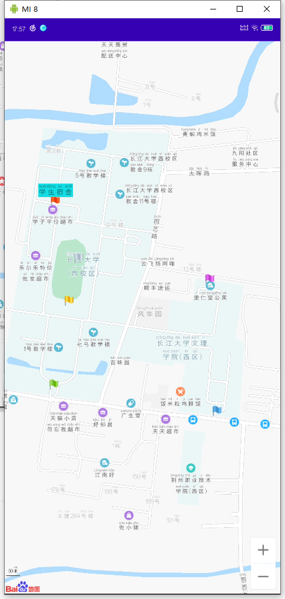

# 地图覆盖物与地理编码

## 1、地图覆盖物

### 地图元素压盖顺序

所有叠加或覆盖到地图的内容，统称为地图覆盖物。如标注、矢量图形元素(包括:折线、多边形和圆等)、 定位图标等。覆盖
物拥有自己的地理坐标，当您拖动或缩放地图时，它们会相应的移动

百度地图SDK为广大开发者提供的基础地图和.上面的各种覆盖物元素，具有- -定的层级压
盖关系，具体如下(从上至下的顺序) :

1.自定义View ( MapView.addView(View); ) ;
2.弹出窗图层(InfoWindow);
3.定位图层( BaiduMap.setMyLocationEnabled(true); ) ;
4.指南针图层( 当地图发生旋转和视角变化时，默认出现在左上角的指南针) ;
5.标注图层( Marker )，文字绘制图层 ( Text) ;
6.几何图形图层(点、折线、弧线、圆、多边形) ;
7.底图标注(指的是底图上面自带的那些POI元素) ;
8.百度城市热力图( BaiduMap.setBaiduHeatMapEnabled(true); ) ;
9.实时路况图图层( BaiduMap.setTrafficEnabled(true); ) ;
10.热力图图层( HeatMap ) ;
11.地形图图层( GroundOverlay ) ;
12.瓦片图层( TileOverlay );
13.基础底图(包括底图、底图道路、卫星图、室内图等)

### 点标记

点标记用来在地图.上标记任何位置，例如用户位置、车辆位置、店铺位置等一切带有位置属性的事物地图SDK提供的点标记功能包含两大部分，-部分是点(俗称Marker )同时，SDK对Marker 封装了大量的触发事件，例如:

点击事件

长按事件

拖拽事件


### 添加Marker

开发者可以根据自己实际的业务需求，利用标注覆盖物:在地图指定的位置.上添加标注信息。开发者通过MarkerOptions类来设置Marker的属性。

```java
//定义Maker坐标点
LatLng point = new LatLng(39.963175， 116.400244);
//构建Marker图标
BitmapDescriptor bitmap = BitmapDescriptorFactory
. fromResource(R.drawable.icon_ marka);
//构建MarkerOption,用于在地图上添加Marker
Overlay0ptions option = new MarkerOptions( )
position(point)
.icon(bitmap);
//在地图上添加Marker,并显示
mBaiduMap . addOverlay(option);
```


### 绘制自定义Marker

可根据实际的业务需求，在地图指定的位置上添加自定义的 Marker。MarkerOptions 是设置 Marker 参数变量的类，添加 Marker 时会经常用到。

**Marker常用属性：**

| **名称**               | **说明**                                      |                        |
| ---------------------- | --------------------------------------------- | ---------------------- |
| icon                   | 设置图标                                      |                        |
| animateType            | 动画类型                                      | MarkerAnimateType.none |
| MarkerAnimateType.drop |                                               |                        |
| MarkerAnimateType.grow |                                               |                        |
| MarkerAnimateType.jump |                                               |                        |
| alpha                  | 透明度                                        |                        |
| position               | 位置坐标                                      |                        |
| perspective            | 是否开启近大远小效果                          | true                   |
| false                  |                                               |                        |
| draggable              | 是否可拖拽                                    |                        |
| flat                   | 是否平贴地图 (俯视图)（双手下拉地图查看效果） | true                   |
| false                  |                                               |                        |
| anchor                 | 锚点比例                                      |                        |
| rotate                 | 旋转角度                                      |                        |
| title                  | 设置标题                                      |                        |
| visible                | 是否可见                                      |                        |
| extraInfo              | 额外信息                                      |                        |

#### 自定义Marker示例

```java
//定义Maker坐标点
LatLng point = new LatLng(39.944251, 116.494996);
//构建Marker图标
BitmapDescriptor bitmap = BitmapDescriptorFactory
        .fromResource(R.drawable.marker_custom);
//构建MarkerOption，用于在地图上添加Marker
OverlayOptions option = new MarkerOptions()
        .position(point) //必传参数
        .icon(bitmap) //必传参数
        .draggable(true)
//设置平贴地图，在地图中双指下拉查看效果
        .flat(true)
        .alpha(0.5f);
//在地图上添加Marker，并显示
mBaiduMap.addOverlay(option);
```

### 可触发的Marker事件

#### **Marker点击事件**

点击Marker时会回调BaiduMap.OnMarkerClickListener，监听器的实现方式示例如下：

```java
mBaiduMap.setOnMarkerClickListener(new BaiduMap.OnMarkerClickListener() {
    //marker被点击时回调的方法
    //若响应点击事件，返回true，否则返回false
    //默认返回false
    @Override
    public boolean onMarkerClick(Marker marker) {
        return false;
    }
});
```


#### **Marker拖拽事件**

在拖拽Marker时会回调BaiduMap.OnMarkerDragListener，监听器的实现方式如下(要在构造MarkerOptions时开启draggable):

```java
mBaiduMap.setOnMarkerDragListener(new BaiduMap.OnMarkerDragListener() {

            //在Marker拖拽过程中回调此方法，这个Marker的位置可以通过getPosition()方法获取
            //marker 被拖动的Marker对象
            @Override
            public void onMarkerDrag(Marker marker) {
                 //对marker处理拖拽逻辑               
            }

            //在Marker拖动完成后回调此方法， 这个Marker的位可以通过getPosition()方法获取
            //marker 被拖拽的Marker对象
            @Override
            public void onMarkerDragEnd(Marker marker) {

            }

            //在Marker开始被拖拽时回调此方法， 这个Marker的位可以通过getPosition()方法获取
            //marker 被拖拽的Marker对象
            @Override
            public void onMarkerDragStart(Marker marker) {

            }
});
```

#### 底图标注

自V3.6.0版本起，SDK在BaiduMap提供了控制底图标注的showMapPoi方法，默认显示底图标注。利用此属性可得到仅显示道路信息的地图，方法如下：

```java
 mBaiduMap.showMapPoi(false);
```


## 2、图形与文字

### 绘制折线

通过PolylineOptions类来设置折线的属性，绘制折线的示例代码如下：

```java
//构建折线点坐标
LatLng p1 = new LatLng(39.97923, 116.357428);
LatLng p2 = new LatLng(39.94923, 116.397428);
LatLng p3 = new LatLng(39.97923, 116.437428);
List<LatLng> points = new ArrayList<LatLng>();
points.add(p1);
points.add(p2);
points.add(p3);

//设置折线的属性
OverlayOptions mOverlayOptions = new PolylineOptions()
        .width(10)
        .color(0xAAFF0000)
        .points(points);
//在地图上绘制折线
//mPloyline 折线对象
Overlay mPolyline = mBaiduMap.addOverlay(mOverlayOptions);
```


PolylineOptions包含多种可供设置的属性。常用属性如下：

|       名称        |         说明         |
| :---------------: | :------------------: |
|       color       |       折线颜色       |
|       width       |       折线宽度       |
|      points       |    折线坐标点列表    |
|   colorsValues    |  分段折线颜色值列表  |
|   customTexture   |    折线自定义纹理    |
| customTextureList |   分段折线纹理列表   |
|   textureIndex    | 分段纹理绘制纹理索引 |
|      visible      |     折线是否可见     |
|     extraInfo     |     折线额外信息     |

### 绘制虚线

先绘制普通折线，然后可以通过两种方式来绘制虚线。
通过PolylineOptions设置

```java
//设置折线的属性
OverlayOptions mOverlayOptions = new PolylineOptions()
        .width(10)
        .color(0xAAFF0000)
        .points(points)
        .dottedLine(true); //设置折线显示为虚线
```

通过Polyline对象设置

```java
//设置折线显示为虚线
((Polyline) mPolyline).setDottedLine(true);
```

分段颜色绘制折线

自v3.6.0版本起，扩展了折线多段颜色绘制能力：支持分段颜色绘制。示例代码如下：

```java
//构建折线点坐标
List<LatLng> points = new ArrayList<LatLng>();
points.add(new LatLng(39.965,116.404));
points.add(new LatLng(39.925,116.454));
points.add(new LatLng(39.955,116.494));
points.add(new LatLng(39.905,116.554));
points.add(new LatLng(39.965,116.604));

List<Integer> colors = new ArrayList<>();
colors.add(Integer.valueOf(Color.BLUE));
colors.add(Integer.valueOf(Color.RED));
colors.add(Integer.valueOf(Color.YELLOW));
colors.add(Integer.valueOf(Color.GREEN));

//设置折线的属性
OverlayOptions mOverlayOptions = new PolylineOptions()
        .width(10)
        .color(0xAAFF0000)
        .points(points)
        .colorsValues(colors);//设置每段折线的颜色

//在地图上绘制折线
//mPloyline 折线对象
Overlay mPolyline = mBaiduMap.addOverlay(mOverlayOptions);
```


### 分段纹理绘制折线


自v3.6.0起，扩展了折线多段颜色绘制能力：增加支持分段纹理绘制。

纹理素材格式：纹理图片宽高须是2的整数幂，如16*64，否则绘制可能有问题；若设置了纹理图片，折线颜色将无效。分段纹理绘制折线时建议开启绘制虚线。

注意：目前仅支持对折线设置纹理，其余覆盖物目前暂不支持设置纹理。

示例代码如下：

```java
//构建折线点坐标
List<LatLng> points = new ArrayList<LatLng>();
points.add(new LatLng(39.865, 116.444));
points.add(new LatLng(39.825, 116.494));
points.add(new LatLng(39.855, 116.534));
points.add(new LatLng(39.805, 116.594));

//添加纹理图片
List<BitmapDescriptor> textureList = new ArrayList<>();
textureList.add(mRedTexture);
textureList.add(mBlueTexture);
textureList.add(mGreenTexture);

//添加纹理索引
List<Integer> indexList = new ArrayList<>();
indexList.add(0);
indexList.add(1);
indexList.add(2);


//设置折线的属性
OverlayOptions mOverlayOptions = new PolylineOptions()
        .width(20)
        .dottedLine(true)
        .points(points)
        .customTextureList(textureList)
        .textureIndex(indexList);//设置纹理列表

//在地图上绘制折线
//mPloyline 折线对象
Overlay mPolyline = mBaiduMap.addOverlay(mOverlayOptions);
```


### Polyline的点击事件


点击polyline会回调BaiduMap.OnPolylineClickListener接口的onPolylineClick方法。

示例代码如下：

```java
BaiduMap.OnPolylineClickListener listener = new BaiduMap.OnPolylineClickListener() {
    //处理Polyline点击逻辑
    @Override
    public boolean onPolylineClick(Polyline polyline) {
        Toast.makeText(PolylineDemo.this, "Click on polyline", Toast.LENGTH_LONG).show();
        return true;
    }
};

//设置Polyline点击监听器
mBaiduMap.setOnPolylineClickListener(listener);
```

### 绘制弧线

弧线由Arc类定义，一条弧线由起点、中点和终点三个点确定位置。开发者可以通过ArcOptions类设置弧线的位置，宽度和颜色。
示例代码如下：

```java
// 添加弧线坐标数据
LatLng p1 = new LatLng(39.97923, 116.357428);//起点
LatLng p2 = new LatLng(39.94923, 116.397428);//中间点
LatLng p3 = new LatLng(39.97923, 116.437428);//终点

//构造ArcOptions对象
OverlayOptions mArcOptions = new ArcOptions()
        .color(Color.RED)
        .width(10)
        .points(p1, p2, p3);

//在地图上显示弧线
Overlay mArc = mBaiduMap.addOverlay(mArcOptions);
```

### 绘制圆

圆由Circle类定义，开发者可以通过CircleOptions类设置圆心位置、半径(米)、边框以及填充颜色。
示例代码如下：

```java
//圆心位置
LatLng center = new LatLng(39.90923, 116.447428);

//构造CircleOptions对象
CircleOptions mCircleOptions = new CircleOptions().center(center)
        .radius(1400)
        .fillColor(0xAA0000FF) //填充颜色
        .stroke(new Stroke(5, 0xAA00ff00)); //边框宽和边框颜色

//在地图上显示圆
Overlay mCircle = mBaiduMap.addOverlay(mCircleOptions);
```


### 绘制多边形

多边形由Polygon类定义。开发者可以通过PolygonOptions来设置多边形的位置、边框和填充颜色。一个多边形是一组Latlng点按照传入顺序连接而成的封闭图形。
示例代码如下：

```java
//多边形顶点位置
List<LatLng> points = new ArrayList<>();
points.add(new LatLng(39.93923, 116.357428));
points.add(new LatLng(39.91923, 116.327428));
points.add(new LatLng(39.89923, 116.347428));
points.add(new LatLng(39.89923, 116.367428));
points.add(new LatLng(39.91923, 116.387428));

//构造PolygonOptions
PolygonOptions mPolygonOptions = new PolygonOptions()
        .points(points)
        .fillColor(0xAAFFFF00) //填充颜色
        .stroke(new Stroke(5, 0xAA00FF00)); //边框宽度和颜色

//在地图上显示多边形
mBaiduMap.addOverlay(mPolygonOptions);
```

### 文字覆盖物

文字（Text）在地图上也是一种覆盖物，由Text类定义。文字覆盖物的绘制通过TextOptions类来设置。示例代码如下：

```java
//文字覆盖物位置坐标
LatLng llText = new LatLng(39.86923, 116.397428);

//构建TextOptions对象
OverlayOptions mTextOptions = new TextOptions()
        .text("百度地图SDK") //文字内容
        .bgColor(0xAAFFFF00) //背景色
        .fontSize(24) //字号
        .fontColor(0xFFFF00FF) //文字颜色
        .rotate(-30) //旋转角度
        .position(llText);

//在地图上显示文字覆盖物
Overlay mText = mBaiduMap.addOverlay(mTextOptions);
```

### 添加信息窗（弹窗覆盖物InfoWindow）

下面简述两种构造InfoWindow的方法。
使用View构造InfoWindow

```java
//用来构造InfoWindow的Button
Button button = new Button(getApplicationContext());
button.setBackgroundResource(R.drawable.popup);
button.setText("InfoWindow");

//构造InfoWindow
//point 描述的位置点
//-100 InfoWindow相对于point在y轴的偏移量
mInfoWindow = new InfoWindow(button, point, -100);

//使InfoWindow生效
mBaiduMap.showInfoWindow(mInfoWindow);
```


使用BitmpDescriptor构造InfoWindow
**OnInfoWindowClickListener :**InfoWindow被点击时的回调接口，通过重写onInfoWindowClick方法来实现响应点击事件，在使用BitmapDescriptor来构造InfoWindow时需要传入一个OnInfoWindowClickListener对象。

```java
//用来构造InfoWindow
BitmapDescriptor mBitmap = BitmapDescriptorFactory.fromResource(R.drawable.popup);

//响应点击的OnInfoWindowClickListener
InfoWindow.OnInfoWindowClickListener listener = new InfoWindow.OnInfoWindowClickListener() {
    @Override
    public void onInfoWindowClick() {
        Toast.makeText(MarkerDemo.this, "Click on InfoWindow", Toast.LENGTH_LONG).show();
    }
};

//构造InfoWindow
//point 描述的位置点
//-100 InfoWindow相对于point在y轴的偏移量
mInfoWindow = new InfoWindow(mBitmap, point, -100, listener);

//使InfoWindow生效
mBaiduMap.showInfoWindow(mInfoWindow);
```


## 3、覆盖物程序分析

### activity_main.xml

```
<?xml version="1.0" encoding="utf-8"?>
<LinearLayout xmlns:android="http://schemas.android.com/apk/res/android"
    xmlns:app="http://schemas.android.com/apk/res-auto"
    xmlns:tools="http://schemas.android.com/tools"
    android:layout_width="match_parent"
    android:layout_height="match_parent"
    android:orientation="vertical"
    tools:context=".activity.MainActivity">

    <com.baidu.mapapi.map.MapView
        android:id="@+id/bmapView"
        android:layout_width="match_parent"
        android:layout_height="match_parent"
        android:clickable="true">

    </com.baidu.mapapi.map.MapView>
    
</LinearLayout>
```

### BaiDuMapBaseActivity

```java
package icu.shaoyayu.android.baidumap.activity;

import android.app.Activity;
import android.os.Bundle;
import android.util.Log;
import android.view.Gravity;
import android.widget.Toast;

import androidx.annotation.Nullable;

import com.baidu.mapapi.map.BaiduMap;
import com.baidu.mapapi.map.MapStatusUpdate;
import com.baidu.mapapi.map.MapStatusUpdateFactory;
import com.baidu.mapapi.map.MapView;
import com.baidu.mapapi.model.LatLng;

import icu.shaoyayu.android.baidumap.R;

/**
 * @author shaoyayu
 * 显示百度地图的模板类
 */
public abstract class BaiDuMapBaseActivity extends Activity {

    //百度地图控制器
    protected BaiduMap baiduMap = null;
    private static final String TAG = "BaseActivity";


    protected MapView mMapView = null;


    @Override
    protected final void onCreate(@Nullable Bundle savedInstanceState) {
        super.onCreate(savedInstanceState);
        setContentView(R.layout.activity_main);

        mMapView = findViewById(R.id.bmapView);
        baiduMap = mMapView.getMap();
        //获取地图的最大最小缩放
        Log.i(TAG,"最大缩放："+baiduMap.getMaxZoomLevel()+",最小缩放："+baiduMap.getMinZoomLevel());
        //设置地图的中心,通过工厂进行创建,注意经纬度是反的
        MapStatusUpdate centerPoint = MapStatusUpdateFactory.newLatLng(new LatLng(30.35645,112.158437));
        baiduMap.setMapStatus(centerPoint);
        //设置一个默认的缩放
        MapStatusUpdate defaultZoom = MapStatusUpdateFactory.zoomTo(18);
        baiduMap.setMapStatus(defaultZoom);
        init();
    }

    /**
     * 子类抽象接口
     */
    public abstract void init();


    /**
     * 在屏幕中央显示Toast
     * @param text
     */
    public void showToast(CharSequence text){
        Toast toast = Toast.makeText(this,text,Toast.LENGTH_SHORT);
        toast.setGravity(Gravity.CENTER,0,0);
        toast.show();
    }


    @Override
    protected void onResume() {
        super.onResume();
        //在activity执行onResume时执行mMapView. onResume ()，实现地图生命周期管理
        mMapView.onResume();
    }
    @Override
    protected void onPause() {
        super.onPause();
        //在activity执行onPause时执行mMapView. onPause ()，实现地图生命周期管理
        mMapView.onPause();
    }

    @Override
    protected void onDestroy() {
        super.onDestroy();
        //在activity执行onDestroy时执行mMapView.onDestroy()，实现地图生命周期管理
        mMapView.onDestroy();
    }
}
```


### CircelOverlayActivity

```java
package icu.shaoyayu.android.baidumap.activity;

import com.baidu.mapapi.map.CircleOptions;
import com.baidu.mapapi.map.Stroke;
import com.baidu.mapapi.model.LatLng;

/**
 * @author shaoyayu
 * 圆形覆盖物
 */
public class CircelOverlayActivity extends BaiDuMapBaseActivity {
    @Override
    public void init() {
        CircleOptions options = new CircleOptions () ;
        //创建一个圆形覆盖物的参数
        options . center (new LatLng(30.35645,112.158437))
                //圆心
                . radius (1000)
                //半径
                . stroke (new Stroke(20,0x55FF0000))//线条宽度、颜色
                .fillColor (0x5500FF00) ; //圆的填充颜色
        baiduMap. addOverlay (options) ; //添加一 个覆盖物
    }
}
```

### TextOverlayActivity

```java
package icu.shaoyayu.android.baidumap.activity;

import com.baidu.mapapi.map.TextOptions;
import com.baidu.mapapi.model.LatLng;

/**
 * @author shaoyayu
 * 文字覆盖物
 */
public class TextOverlayActivity extends BaiDuMapBaseActivity {
    @Override
    public void init() {

        TextOptions textOptions = new TextOptions();
        //设置位置
        textOptions.position(new LatLng(30.35645,112.158437))
                //设置内容
                .text("长江大学文理学院西校区")
                //设置文本大小
                .fontSize(50)
                //设置为黑色
                .fontColor(0XFF000000)
                //设置一个背景颜色
                .bgColor(0X55FF0000);
        baiduMap.addOverlay(textOptions);
    }
}
```


### MarkerOverlayActivity

```java
package icu.shaoyayu.android.baidumap.activity;

import android.view.View;
import android.widget.TextView;

import com.baidu.mapapi.map.BaiduMap;
import com.baidu.mapapi.map.BitmapDescriptor;
import com.baidu.mapapi.map.BitmapDescriptorFactory;
import com.baidu.mapapi.map.MapViewLayoutParams;
import com.baidu.mapapi.map.Marker;
import com.baidu.mapapi.map.MarkerOptions;
import com.baidu.mapapi.model.LatLng;

import icu.shaoyayu.android.baidumap.R;

/**
 * @author shaoyayu
 * marker覆盖物
 */
public class MarkerOverlayActivity extends BaiDuMapBaseActivity {

    private  View pop = null;

    private TextView tvPopText = null;

    @Override
    public void init() {
        //初始化覆盖物
        initMarkerOverlay();
        //注册监听器
        registerToListen();
    }

    /**
     * 注册监听器
     */
    private void registerToListen() {
        //创建一个点击事件监听器
        BaiduMap.OnMarkerClickListener onMarkerClickListener = new BaiduMap.OnMarkerClickListener() {
            @Override
            public boolean onMarkerClick(Marker marker) {
                LatLng latLng = marker.getPosition();
                //显示一个顶部的View
                if (pop==null){
                    pop = View.inflate(MarkerOverlayActivity.this,R.layout.layout_pop,null);
                    tvPopText = pop.findViewById(R.id.tv_pop_text);
                    mMapView.addView(pop,createLayout(latLng));
                }{
                    //改变一下位置即可
                    mMapView.updateViewLayout(pop,createLayout(latLng));
                }
                //设置标题
                tvPopText.setText(marker.getTitle());
                //返回true代表消费点击事件
                return true;
            }
        };
        baiduMap.setOnMarkerClickListener(onMarkerClickListener);

        //拖动监听器
        BaiduMap.OnMarkerDragListener onMarkerDragListener = new BaiduMap.OnMarkerDragListener() {

            /**
             * 正在拖动
             * @param marker
             */
            @Override
            public void onMarkerDrag(Marker marker) {
                //改变一下位置即可
                mMapView.updateViewLayout(pop,createLayout(marker.getPosition()));
            }

            /**
             * 移动结束事件
             * @param marker
             */
            @Override
            public void onMarkerDragEnd(Marker marker) {
                //改变一下位置即可
                mMapView.updateViewLayout(pop,createLayout(marker.getPosition()));
            }

            /**
             * 标志开始移动
             * @param marker
             */
            @Override
            public void onMarkerDragStart(Marker marker) {
                //改变一下位置即可
                mMapView.updateViewLayout(pop,createLayout(marker.getPosition()));
            }
        };
        baiduMap.setOnMarkerDragListener(onMarkerDragListener);

    }

    private MapViewLayoutParams createLayout(LatLng latLng){
        MapViewLayoutParams.Builder builder = new MapViewLayoutParams.Builder();
        //指定坐标经纬度
        builder.layoutMode(MapViewLayoutParams.ELayoutMode.mapMode);
        //指定坐标
        builder.position(latLng);
        builder.yOffset(-40);
        //创建布局
        MapViewLayoutParams params = builder.build();
        return params;
    }

    /**
     * 初始地图的marker覆盖物
     */
    private void initMarkerOverlay(){
        MarkerOptions markerOptions = new MarkerOptions();
        BitmapDescriptor bitmapDescriptor1 = BitmapDescriptorFactory.fromResource(R.mipmap.flag_mark_blue);
        BitmapDescriptor bitmapDescriptor2 = BitmapDescriptorFactory.fromResource(R.mipmap.flag_mark_gray);
        BitmapDescriptor bitmapDescriptor3 = BitmapDescriptorFactory.fromResource(R.mipmap.flag_mark_green);
        BitmapDescriptor bitmapDescriptor4 = BitmapDescriptorFactory.fromResource(R.mipmap.flag_mark_red);
        BitmapDescriptor bitmapDescriptor5 = BitmapDescriptorFactory.fromResource(R.mipmap.flag_mark_violet);
        BitmapDescriptor bitmapDescriptor6 = BitmapDescriptorFactory.fromResource(R.mipmap.flag_mark_yellow);

        //设置位置
        markerOptions.position(new LatLng(30.35645,112.158437))
                //名称
                .title("长大文理西校区")
                //添加图标
                .icon(bitmapDescriptor1)
                //设置为可用移动
                .draggable(true);
        baiduMap.addOverlay(markerOptions);
        //112.154148,30.360548 操场
        markerOptions.position(new LatLng(30.360548,112.154148))
                //名称
                .title("操场")
                //添加图标
                .icon(bitmapDescriptor2)
                //设置为可用移动
                .draggable(true);
        baiduMap.addOverlay(markerOptions);
        //112.15338,30.357158 西校区南门
        markerOptions.position(new LatLng(30.357158,112.15338))
                //名称
                .title("西校区南门")
                //添加图标
                .icon(bitmapDescriptor3)
                //设置为可用移动
                .draggable(true);
        baiduMap.addOverlay(markerOptions);
        //112.153421,30.362082 学生宿舍
        markerOptions.position(new LatLng(30.362082,112.153421))
                //名称
                .title("学生宿舍")
                //添加图标
                .icon(bitmapDescriptor4)
                //设置为可用移动
                .draggable(true);
        baiduMap.addOverlay(markerOptions);

        //112.15821,30.35998 里仁堂公寓
        markerOptions.position(new LatLng(30.35998,112.15821))
                //名称
                .title("里仁堂公寓")
                //添加图标
                .icon(bitmapDescriptor5)
                //设置为可用移动
                .draggable(true);
        baiduMap.addOverlay(markerOptions);

        //112.153849,30.359403 图书馆
        markerOptions.position(new LatLng(30.359403,112.153849))
                //名称
                .title("图书馆")
                //添加图标
                .icon(bitmapDescriptor6)
                //设置为可用移动
                .draggable(true);
        baiduMap.addOverlay(markerOptions);
    }

}
```


### 展示

圆形覆盖物


文字覆盖物：


Marker覆盖物




## 4、地理编码

地理编码是地址信息和地理坐标之间的相互转换。
可分为:

 正地理编码(地址信息转换为地理坐标)

和

 逆地理编码(地理坐标转换为地址信息)

地理编码(地址转坐标)

### 地理编码

#### 1、创建地理编码检索实例

```java
mCoder = GeoCoder .newInstance() ;
```

#### 2、创建地理编码检索监听器

```java
OnGetGeoCoderResultListener listener = new OnGetGeoCoderResultListener() {
    @Override
    public void onGetGeoCodeResult(GeoCodeResult geoCodeResult) {
            if (nu11 != geoCodeResult && nu1l !m geoCodeResult.getlocation()) {
            if (geoCodeResult == null|I geoCodeResult.error != SearchResult. ERRORNO.NO_ ERROR) {
            //没有检索到结果
            return;
        } else {
            double latitude = geoCodeResult.getlocation().latitude;
            double longitude = geoCodeResult.getLocation().longitude;
        }

    }
    ......
};
```

#### 3、设置地理编码检索监听器

```java
mCoder . setOnGetGeoCodeResultListener(listener) ;
```


#### 4、设置GeoCodeOption，发起geoCode检索

```java
//city和address 是必填项
mCoder . geocode(new GeoCodeOption()
city("北京")
.address("北京上地十街10号"));
```

#### 5、释放检索实例

```java
mCoder .destroy();
```

逆地理编码( 即坐标转地址)

逆地理编码服务通过地面某个地物的地理坐标值检索到该地物所在的行政区划、所处街道、以及最匹配的标准地址信息通过标准地址库中的数据，帮助用户在进行移动端查询、商业分析、规划分析等领域创造价值。推荐与定位服务配合使用，通过定位获得的地理坐标获取详细的地址信息。


### 逆地理编码

#### 1、创建逆地理编码检索实例

```
mCoder = GeoCoder .newInstance() ;
```

#### 2、创建逆地理编码检索监听器

```java
OnGetGeoCoderResultListener listener = new OnGetGeoCoderResultlistener() {
	......
    @Override
    public void onGetReverseGeoCodeResult(ReverseGeoCodeResult revers eGeoCodeResult) {
        if (reverseGeoCodeResult == null川reverseGeoCodeResult.error != SearchResult. ERRORNO.NO_ERROR) {
            //没有找到检索结果
            return;
        } else {
            //详细地址
            String address = reverseGeoCodeResult. getAddress();
            //行政区号
            int adCode = reverseGeoCodeResult. getCityCode();
        }
    }
}
```

#### 3、设置逆地理编码检索监听器

```
mSearch. setOnGetGeoCodeResultListener(this);
```

#### 4、发起逆地理编码检索

```java
mCoder . reverseGeoCode(new ReverseGeoCodeOption()
    .location(point)
    1/ POI召回半径，允许设置区间为0-1000米，超过1000米按1000米召回。默认值为1000
    .radius(500));	
```


#### 5、释放检索实例.

```java
mCoder destroy();
```

