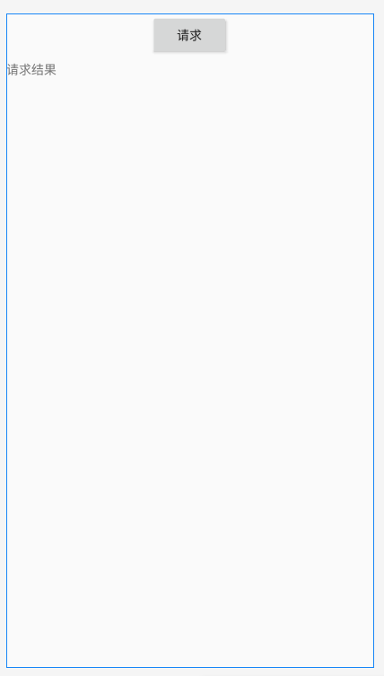
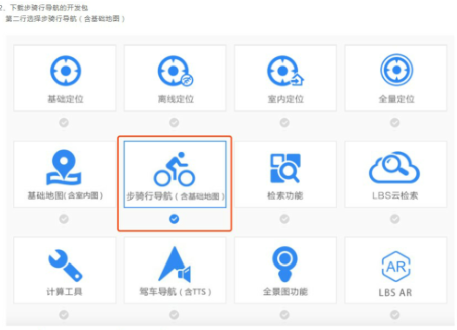

# 地图导航

## 1、地图事件交互

本节对地图各类监听事件做介绍:

- key验证时间监听
- 广播监听
- 地图事件监听(地图状态改变、各种手势、截屏)

### key验证事件监听

#### 1Manifest.xml

```xml
<application>
    android:name="baidumapsdk.demo.DemoApplication"  
    <meta-data  
        android:name="com.baidu.lbsapi.API_KEY"  
        android:value="开发密钥" />  
</application>
```

#### 2定义广播监听器类

```java
public class SDKReceiver extends BroadcastReceiver {
    @Override
    public void onReceive(Context context, Intent intent) {
        String action = intent.getAction();
        if (action.equals(SDKInitializer.SDK_BROADTCAST_ACTION_STRING_PERMISSION_CHECK_ERROR)) {
            //key验证失败，做相应处理
        } else if (action.equals(SDKInitializer.SDK_BROADTCAST_ACTION_STRING_PERMISSION_CHECK_OK)) {
            //key验证成功，做相应处理
        }
    }
}
```

#### 3注册广播

```java
IntentFilter iFilter = new IntentFilter();
iFilter.addAction(SDKInitializer.SDK_BROADTCAST_ACTION_STRING_PERMISSION_CHECK_ERROR);
iFilter.addAction(SDKInitializer.SDK_BROADTCAST_ACTION_STRING_PERMISSION_CHECK_OK);
mReceiver = new SDKReceiver();
registerReceiver(mReceiver, iFilter);
```

#### 4取消注册

```java
unregisterReceiver(mReceiver);
```


### 地图事件监听


SDK定义了各种地图相关事件的监听，提供相应的事件监听方法，包括地图状态的改变、手势事件、地图渲染、地图截屏事件等。如下所示：

**地图状态改变接口：**

```
OnMapStatusChangeListener listener = new OnMapStatusChangeListener() {  
   BaiduMap.OnMapStatusChangeListener listener = new BaiduMap.OnMapStatusChangeListener() {
    /**
     * 手势操作地图，设置地图状态等操作导致地图状态开始改变。
     *
     * @param status 地图状态改变开始时的地图状态
     */
    @Override
    public void onMapStatusChangeStart(MapStatus status) {

    }
    /**
     * 手势操作地图，设置地图状态等操作导致地图状态开始改变。
     *
     * @param status 地图状态改变开始时的地图状态
     *
     * @param reason 地图状态改变的原因
     */

     //用户手势触发导致的地图状态改变,比如双击、拖拽、滑动底图
     //int REASON_GESTURE = 1;
     //SDK导致的地图状态改变, 比如点击缩放控件、指南针图标
     //int REASON_API_ANIMATION = 2;
     //开发者调用,导致的地图状态改变
     //int REASON_DEVELOPER_ANIMATION = 3;
    @Override
    public void onMapStatusChangeStart(MapStatus status, int reason) {
        
    }

    /**
     * 地图状态变化中
     *
     * @param status 当前地图状态
     */
    @Override
    public void onMapStatusChange(MapStatus status) {

    }

    /**
     * 地图状态改变结束
     *
     * @param status 地图状态改变结束后的地图状态
     */
    @Override
    public void onMapStatusChangeFinish(MapStatus status) {

    }
};
//设置地图状态监听
mBaiduMap.setOnMapStatusChangeListener(listener);
```

**地图单击事件监听接口：**

```
BaiduMap.OnMapClickListener listener = new BaiduMap.OnMapClickListener() {
    /**
     * 地图单击事件回调函数
     *
     * @param point 点击的地理坐标
     */
    @Override
    public void onMapClick(LatLng point) {

    }

    /**
     * 地图内 Poi 单击事件回调函数
     *
     * @param mapPoi 点击的 poi 信息
     */
    @Override
    public void onMapPoiClick(MapPoi mapPoi) {

    }
};
//设置地图单击事件监听
mBaiduMap.setOnMapClickListener(listener);
```

**地图双击事件监听接口：**

```
BaiduMap.OnMapDoubleClickListener listener = new BaiduMap.OnMapDoubleClickListener() {
    /**
     * 地图双击事件监听回调函数
     *
     * @param point 双击的地理坐标
     */
    @Override
    public void onMapDoubleClick(LatLng point) {

    }
};

//设置地图双击事件监听
mBaiduMap.setOnMapDoubleClickListener(listener);
```

**地图长按事件监听接口：**

```
BaiduMap.OnMapLongClickListener listener = new BaiduMap.OnMapLongClickListener() {
    /**
     * 地图长按事件监听回调函数
     *
     * @param point 长按的地理坐标
     */
    @Override
    public void onMapLongClick(LatLng point) {

    }
};
//设置地图长按事件监听
mBaiduMap.setOnMapLongClickListener(listener);
```

**地图 Marker 覆盖物点击事件监听接口：**

```
OnMarkerClickListener listener = new OnMarkerClickListener() {  
    /** 
    * 地图 Marker 覆盖物点击事件监听函数 
    * @param marker 被点击的 marker 
    */  
    public boolean onMarkerClick(Marker marker){  
    }  
};
```

**触摸地图回调接口：**

```
BaiduMap.OnMapTouchListener listener = new BaiduMap.OnMapTouchListener() {

    /**
     * 当用户触摸地图时回调函数
     *
     * @param motionEvent 触摸事件
     */
    @Override
    public void onTouch(MotionEvent motionEvent) {

    }
};
//设置触摸地图事件监听者
mBaiduMap.setOnMapTouchListener(listener);
```

**地图加载完成回调接口：**

```
BaiduMap.OnMapLoadedCallback callback = new BaiduMap.OnMapLoadedCallback() {
    /**
     * 地图加载完成回调函数
     */
    @Override
    public void onMapLoaded() {

    }
};
//设置地图加载完成回调
mBaiduMap.setOnMapLoadedCallback(callback);
```

**地图渲染完成回调接口：**

自4.1.0起，增加地图渲染完成的监听接口onMapRenderFinished(),每次对地图有操作时，绘制完成时调用。

```
BaiduMap.OnMapRenderCallback callback = new BaiduMap.OnMapRenderCallback() {
    /**
     * 地图渲染完成回调函数
     */
    @Override
    public void onMapRenderFinished() {

    }
};
//设置地图渲染完成回调
mBaiduMap.setOnMapRenderCallbadk(callback);
```

**地图截屏回调接口：**

```
BaiduMap.SnapshotReadyCallback callback = new BaiduMap.SnapshotReadyCallback() {

    /**
     * 地图截屏回调接口
     *
     * @param snapshot 截屏返回的 bitmap 数据
     */
    @Override
    public void onSnapshotReady(Bitmap snapshot) {

    }
};

/**
 * 发起截图请求
 *
 * @param callback 截图完成后的回调
 */
mBaiduMap.snapshot(callback);
```

**地图定位图标点击事件监听接口：**
注意：确保开启定位图层

```
BaiduMap.OnMyLocationClickListener listener = new BaiduMap.OnMyLocationClickListener() {
    /**
     * 地图定位图标点击事件监听函数
     */
    @Override
    public boolean onMyLocationClick() {
        return false;
    }
};
//设置定位图标点击事件监听
mBaiduMap.setOnMyLocationClickListener(listener);
```

对线和标注引入事件分发机制

自V4.1.0起，加入事件处理机制，对于Polyline和Marker的点击事件，开发者可以通过相关回调接口捕获处理。示例如下：

**Marker点击事件接口:**

```
BaiduMap.OnMarkerClickListener listener = new BaiduMap.OnMarkerClickListener() {
    /**
     * 地图 Marker 覆盖物点击事件监听函数
     * @param marker 被点击的 marker
     */
    @Override
    public boolean onMarkerClick(Marker marker) {
        return false;//是否捕获点击事件
    }
};

// 设置地图 Marker 覆盖物点击事件监听者,自3.4.0版本起可设置多个监听对象，停止监听时调用removeMarkerClickListener移除监听对象
mBaiduMap.setOnMarkerClickListener(listener);
//停止监听时移除监听对象
mBaiduMap.removeMarkerClickListener(listener);
```

**Polyline点击事件接口:**

```
BaiduMap.OnPolylineClickListener listener = new BaiduMap.OnPolylineClickListener() {
    /**
     * 地图 Polyline 覆盖物点击事件监听函数
     *
     * @param polyline 被点击的 polyline
     */
    @Override
    public boolean onPolylineClick(Polyline polyline) {
        return false;//是否捕获点击事件
    }
};
//设置地图 Polyline 覆盖物点击事件监听
mBaiduMap.setOnPolylineClickListener(listener);
```

当开发者对上述点击不处理时，向下传递，等同于地图点击事件，可由OnMapClickListener捕获。


### MVP模式案列

实现网络请求的回调：




#### activity_main.xml

```xml
<?xml version="1.0" encoding="utf-8"?>
<androidx.constraintlayout.widget.ConstraintLayout xmlns:android="http://schemas.android.com/apk/res/android"
    xmlns:app="http://schemas.android.com/apk/res-auto"
    xmlns:tools="http://schemas.android.com/tools"
    android:layout_width="match_parent"
    android:layout_height="match_parent"
    tools:context=".MainActivity">

    <Button
        android:id="@+id/button"
        android:layout_width="wrap_content"
        android:layout_height="wrap_content"
        android:text="请求"
        android:onClick="onLogIn"
        app:layout_constraintEnd_toEndOf="parent"
        app:layout_constraintStart_toStartOf="parent"
        app:layout_constraintTop_toTopOf="parent" />

    <TextView
        android:id="@+id/textView"
        android:layout_width="wrap_content"
        android:layout_height="wrap_content"
        android:layout_marginTop="53dp"
        android:text="请求结果"
        app:layout_constraintStart_toStartOf="parent"
        app:layout_constraintTop_toTopOf="@+id/button" />
</androidx.constraintlayout.widget.ConstraintLayout>
```


#### HttpSendUtil

```java
package icu.shaoyayu.android.mvpcase.util;

import java.io.BufferedReader;
import java.io.InputStreamReader;
import java.net.HttpURLConnection;
import java.net.URL;

/**
 * @author shaoyayu
 * 模拟http请求
 */
public class HttpSendUtil   {


    /**
     * 发送http请求，
     * @param address 请求网址
     * @param listener
     *
     * */
    /*
     * 网络请求属于耗时操作，如果该方法中没有开启线程，那么主线程就会被组塞住
     * 如果在该方法中开启一个子线程，子线程获取到的数据将无法返回，
     * sendHttpRequest()会在服务器还没来的及响应的时候就执行结束了。这个时候用到java的回调机制
     * */
    public static void sendHttpRequest(final String address, final HttpCallbackListener listener) {

        new Thread(new Runnable() {
            @Override
            public void run() {
                HttpURLConnection connection;
                try {
                    URL url = new URL(address);
                    connection = (HttpURLConnection) url.openConnection();
                    connection.setRequestMethod("GET");
                    connection.setConnectTimeout(8000);
                    connection.setReadTimeout(8000);
                    connection.setDoInput(true);
                    connection.setDoOutput(true);
                    BufferedReader reader = new BufferedReader(new InputStreamReader(connection.getInputStream(),"GB18030"));
                    StringBuilder response = new StringBuilder();
                    String line;

                    while ((line = reader.readLine()) != null) {
                        response.append(line);
                    }
                    if (listener != null) {
                        listener.onFinish(response.toString());
                    }
                } catch (Exception e) {
                    if (listener != null) {
                        listener.onError(e);
                    }

                }
            }
        }).start();

    }

    public interface HttpCallbackListener {
        /**
         *请求成功后的处理
         * @param response 服务器返回值
         * */
        void onFinish(String response);

        /**
         * 请求异常的处理
         * @param e Exception
         * */
        void onError(Exception e);
    }

}

```
#### MainActivity_4

```java
package icu.shaoyayu.android.mvpcase;

import android.os.Bundle;
import android.os.Handler;
import android.os.Message;
import android.view.View;
import android.widget.TextView;

import androidx.appcompat.app.AppCompatActivity;

import icu.shaoyayu.android.mvpcase.simple4.QueryPhoneAddressPresenter_4;
import icu.shaoyayu.android.mvpcase.simple4.QueryView_4;

public class MainActivity_4 extends AppCompatActivity implements QueryView_4 {

    private TextView textView;

    Handler mHandler = new Handler(){
        @Override
        public void handleMessage(Message msg) {
            switch (msg.what){
                case 1:
                    textView.setText((String)msg.obj);
                    break;
                case 2:
                    // ...
                    break;
                default:
                    break;
            }
        }
    };
    public void updateUi(String result){
        Message message = mHandler.obtainMessage();
        message.what = 1;
        message.obj = result;
        mHandler.sendMessage(message);
        System.out.println(result);
    }

    QueryPhoneAddressPresenter_4 queryPhoneAddressPresenter;

    @Override
    protected void onCreate(Bundle savedInstanceState) {
        super.onCreate(savedInstanceState);
        setContentView(R.layout.activity_main);
        textView = findViewById(R.id.textView);
    }

    public void onLogIn(View view){
        queryPhoneAddressPresenter = new QueryPhoneAddressPresenter_4();
        queryPhoneAddressPresenter.attachView(this);
        queryPhoneAddressPresenter.login("18627295253");
    }

    @Override
    public void onLogInResult(String result) {
       updateUi(result);
    }

    @Override
    protected void onDestroy() {
        super.onDestroy();
        if (queryPhoneAddressPresenter!=null){
            queryPhoneAddressPresenter.detachView();
        }
    }
}

```


#### BasePresenter_5

```java
package icu.shaoyayu.android.mvpcase.simple5.base;

/**
 * @author shaoyayu
 */
public abstract class BasePresenter_5<V extends BaseView_5> {

    private V view;

    public void attachView(V view){
        this.view = view;
    }

    public V getQueryView() {
        return view;
    }

    public void detachView(){
        if (view !=null){
            this.view = null;
        }
    }

}

```

#### BaseView_5

```java
package icu.shaoyayu.android.mvpcase.simple5.base;

/**
 * @author shaoyayu
 */
public interface BaseView_5 {
}
```


#### QueryPhoneAddressModel_5

```java
package icu.shaoyayu.android.mvpcase.simple5;

import icu.shaoyayu.android.mvpcase.util.HttpSendUtil;

/**
 * @author shaoyayu
 */
public  class QueryPhoneAddressModel_5 {

    /**
     * 百度地图贵阳迁徙数据
     */
    String url = "https://sp0.baidu.com/8aQDcjqpAAV3otqbppnN2DJv/api.php?resource_name=guishudi&query=";

    public void login(String phoneNumber, final HttpSendUtil.HttpCallbackListener https){
        HttpSendUtil.sendHttpRequest(url+phoneNumber,https);
    }

}

```

#### QueryPhoneAddressPresenter_5

```java
package icu.shaoyayu.android.mvpcase.simple5;

import icu.shaoyayu.android.mvpcase.simple5.base.BasePresenter_5;
import icu.shaoyayu.android.mvpcase.util.HttpSendUtil;

/**
 * @author shaoyayu
 * 持有M层的引用
 * 持有V层的引用
 * 对M层和V层进行绑定
 */
public class QueryPhoneAddressPresenter_5 extends BasePresenter_5<QueryView_5> {

    private QueryPhoneAddressModel_5 queryPhoneAddressModel;

    public QueryPhoneAddressPresenter_5(){
        this.queryPhoneAddressModel = new QueryPhoneAddressModel_5();
    }

    public QueryPhoneAddressModel_5 getQueryPhoneAddressModel() {
        return queryPhoneAddressModel;
    }

    public void login(String phoneNumber){
        queryPhoneAddressModel.login(phoneNumber, new HttpSendUtil.HttpCallbackListener() {
            @Override
            public void onFinish(String response) {
                if (getQueryView()!=null){
                    getQueryView().onLogInResult(response);
                }
            }

            @Override
            public void onError(Exception e) {
                System.out.println("请求异常");
                e.printStackTrace();
            }
        });
    }

}

```

#### QueryView_5

```java
package icu.shaoyayu.android.mvpcase.simple5;

import icu.shaoyayu.android.mvpcase.simple5.base.BaseView_5;

/**
 * @author shaoyayu
 * ui层的数据
 */
public interface QueryView_5 extends BaseView_5 {

    void onLogInResult(String result);

}

```


## 2、骑行导航

自v4.2.0起，新增普通骑行导航功能，支持骑行导航、偏航纠正等功能。

自v4.4.0起，新增电动车骑行导航，即BaiduMapsSDK同时支持普通自行车骑行导航（简称：普通骑行导航）和电动车骑行导航BaiduMapAndroidSDK默认为普通骑行导航，旧版用户不受影响。

自v5.0.0起，支持全球200多个国家和地区的骑行导航，无需单独申请即可直接使用。

重要提示：自v4.4.0起，将骑行导航参数类的类名BikeNaviLauchParam修改为BikeNaviLaunchParam

### 下载SDK




### 骑行导航模式

骑行导航骑包括普通骑行导航和电动车骑行导航两种导航模式，默认为普通骑行导航，旧版用户不受影响。

**电动车骑行导航与普通骑行导航的区别：**

1、电动车规避电动车禁行路段，避免罚款；普通骑行更适用于自行车。

2、电动车路线规划倾向于走大路，方便寻路，适于快速通行。

3、电动车语音播报返回的文字，针对电动车场景进行优化。

**通过设置BikeNaviLaunchParam对象中的vehicle的值区分：**

vehicle ：0:普通骑行导航 ； 1:电动车骑行导航。

不设置vehicle的值时，默认为0 普通骑行导航。两种骑行导航模式切换时，除了vehicle参数设置以外，其余骑行导航逻辑均不需要改变。


### 配置AndroidManifest.xml文件

加入如下权限使用声明

```
<!-- 这个权限用于访问GPS定位 -->
<uses-permission android:name="android.permission.ACCESS_FINE_LOCATION"/>
<!-- 获取访问手机振动器权限，用于导航过程中的震动提示 -->
<uses-permission android:name="android.permission.VIBRATE"/>
```

### 引擎初始化

在使用骑行导航功能前，需要对骑行引擎进行初始化。在初始化成功的回调中调用发起算路的逻辑。

2.在Application标签中声明定位的service组件

```
<service android:name="com.baidu.location.f"
    android:enabled="true"
    android:process=":remote"/>
```

示例代码如下：

```
// 获取导航控制类
// 引擎初始化
BikeNavigateHelper.getInstance().initNaviEngine(this, new IBEngineInitListener() {
    @Override
    public void engineInitSuccess() {
        //骑行导航初始化成功之后的回调
        routePlanWithParam();
    }

    @Override
    public void engineInitFail() {
        //骑行导航初始化失败之后的回调
    }
});
```

### 发起算路

1构造BikeNaviLaunchParam

```
//起终点位置
startPt = new LatLng(40.047416,116.312143);
endPt = new LatLng(40.048424, 116.313513);
//构造BikeNaviLaunchParam
//.vehicle(0)默认的普通骑行导航
param = new BikeNaviLaunchParam().stPt(startPt).endPt(endPt).vehicle(0);
```

2发起算路

在算路成功的回调中跳转至诱导界面，示例代码如下

```
//发起算路
BikeNavigateHelper.getInstance().routePlanWithParams(param, new IBRoutePlanListener() {
    @Override
    public void onRoutePlanStart() {
        //执行算路开始的逻辑
    }

    @Override
    public void onRoutePlanSuccess() {
        //算路成功
        //跳转至诱导页面
        Intent intent = new Intent(BNaviMainActivity.this, BNaviGuideActivity.class);
        startActivity(intent);
    }

    @Override
    public void onRoutePlanFail(BikeRoutePlanError bikeRoutePlanError) {
        //执行算路失败的逻辑
    }
});
```

### 开始导航

1新建诱导Activity，创建诱导View，开始导航

示例代码如下：

```
//获取BikeNavigateHelper示例
mNaviHelper = BikeNavigateHelper.getInstance();
// 获取诱导页面地图展示View
View view = mNaviHelper.onCreate(BNaviGuideActivity.this);

if (view != null) {
    setContentView(view);
}

// 开始导航
mNaviHelper.startBikeNavi(BNaviGuideActivity.this);
```

2正确管理BikeNavigateHelper的生命周期：

```
@Override
protected void onResume() {
    super.onResume();
    mNaviHelper.resume();
}

@Override
protected void onPause() {
    super.onPause();
    mNaviHelper.pause();
}

@Override
protected void onDestroy() {
    super.onDestroy();
    mNaviHelper.quit();
}
```

完成以上步骤，即可在您的应用实现骑行导航。

### 导航状态信息

通过IBRouteGuidanceListener接口各种回调方法开发者可以对导航状态进行相应处理，主要包括导航开始、到达目的地，导航过程中偏航、偏航规划，诱

导信息（诱导图标、诱导信息、诱导类型、剩余时间、剩余距离、震动等）

示例代码如下：

```
// 设置诱导监听, 具体诱导信息请参考javadoc类参考
// com.baidu.mapapi.bikenavi.adapter -> IBRouteGuidanceListener
mNaviHelper.setRouteGuidanceListener(this, new IBRouteGuidanceListener() {
    @Override
    public void onRouteGuideIconUpdate(Drawable icon) {
        //诱导图标更新
    }

    @Override
    public void onRouteGuideKind(RouteGuideKind routeGuideKind) {
        //诱导类型枚举
    }

    @Override
    public void onRoadGuideTextUpdate(CharSequence charSequence, CharSequence charSequence1) {
        //诱导信息
    }

    @Override
    public void onRemainDistanceUpdate(CharSequence charSequence) {
        //总的剩余距离
    }

    @Override
    public void onRemainTimeUpdate(CharSequence charSequence) {
        //总的剩余时间
    }

    @Override
    public void onGpsStatusChange(CharSequence charSequence, Drawable drawable) {
        //GPS状态发生变化，来自诱导引擎的消息
    }

    @Override
    public void onRouteFarAway(CharSequence charSequence, Drawable drawable) {
        //已经开始偏航
    }

    @Override
    public void onRoutePlanYawing(CharSequence charSequence, Drawable drawable) {
        //偏航规划中
    }

    @Override
    public void onReRouteComplete() {
        //重新算路成功
    }

    @Override
    public void onArriveDest() {
        //到达目的地
    }

    @Override
    public void onVibrate() {
        //震动
    }

    @Override
    public void onGetRouteDetailInfo(BikeRouteDetailInfo bikeRouteDetailInfo) {
        //获取骑行导航路线详细信息类
    }
});
```

获取语音播报文本

SDK只提供导航过程中的文本输出，不包含语音播报功能，需要自行传入对应的语音回调，形成播报功能。建议使用百度语音识别服务SDK。

下载地址： [百度语音识别服务](http://yuyin.baidu.com/asr/download)

设置播报监听，使用语音回调播报。

注意：该接口需要在startBikeNavi方法之前调用。

示例代码如下：

```
mNaviHelper.setTTsPlayer(new IBTTSPlayer() {
    /**
     * 获取导航过程中语音,进行播报
     * @param s 播报语音文本
     * @param b 是否抢占播报
     */
    @Override
    public int playTTSText(String s, boolean b) {
        //调用语音识别SDK的语音回调进行播报
        return 0;
    }
});
```


## 3、步行导航

自v4.4.0起，新增步行导航功能，支持普通步行导航、步行AR导航、偏航纠正等导航功能。

自v5.0.0起，支持全球200多个国家和地区的步行导航，无需单独申请即可直接使用。

下载开发包并配置开发环境
开发包的下载

注意:

1. 步骑行导航的开发包与普通地图服务的开发包下载时区别。
2. 将解压后的开发包中 assets 目录下的 png 文件拷贝到您的项目的 assets 目录下。


### 配置AndroidManifest.xml文件

加入如下权限使用声明

```
<!-- 这个权限用于访问GPS定位 -->
<uses-permission android:name="android.permission.ACCESS_FINE_LOCATION"/>
<!-- 获取访问手机振动器权限，用于导航过程中的震动提示 -->
<uses-permission android:name="android.permission.VIBRATE"/>
<!-- 获取摄像头权限，用于AR步行导航 -->
<uses-permission android:name="android.permission.CAMERA" />
```

### 引擎初始化

使用步行导航前需要对步行导航引擎初始化。

示例代码如下:

```
// 获取导航控制类
// 引擎初始化
WalkNavigateHelper.getInstance().initNaviEngine(this, new IWEngineInitListener() {

    @Override
    public void engineInitSuccess() {
        //引擎初始化成功的回调
        routeWalkPlanWithParam();
    }

    @Override
    public void engineInitFail() {
        //引擎初始化失败的回调
    }
});
```

### 发起算路

#### 1构造WalkNaviLaunchParam

示例代码如下：

```
//起终点位置
startPt = new LatLng(40.047416,116.312143);
endPt = new LatLng(40.048424, 116.313513);
//构造WalkNaviLaunchParam
mParam = new WalkNaviLaunchParam().stPt(startPt).endPt(endPt);
```

#### 2发起算路

```
//发起算路
WalkNavigateHelper.getInstance().routePlanWithParams(mParam, new IWRoutePlanListener() {
    @Override
    public void onRoutePlanStart() {
        //开始算路的回调
    }

    @Override
    public void onRoutePlanSuccess() {
        //算路成功
        //跳转至诱导页面
        Intent intent = new Intent(BNaviMainActivity.this, WNaviGuideActivity.class);
        startActivity(intent);
    }

    @Override
    public void onRoutePlanFail(WalkRoutePlanError walkRoutePlanError) {
        //算路失败的回调
    }
});
```

### 开始导航

#### 1新建诱导Activity，创建诱导View，发起导航

示例代码如下：

```
//获取WalkNavigateHelper实例
mNaviHelper = WalkNavigateHelper.getInstance();
//获取诱导页面地图展示View
View view = mNaviHelper.onCreate(WNaviGuideActivity.this);
if (view != null) {
    setContentView(view);
}
mNaviHelper.startWalkNavi(WNaviGuideActivity.this);
```

#### 2正确管理WalkNavigateHelper对象生命周期。

代码如下：

```
@Override
protected void onResume() {
    super.onResume();
    mNaviHelper.resume();
}

@Override
protected void onPause() {
    super.onPause();
    mNaviHelper.pause();
}

@Override
protected void onDestroy() {
    super.onDestroy();
    mNaviHelper.quit();
}
```

### 步行AR导航

#### 1配置和申请Camera权限

**AndroidManifest配置**

使用AR步行导航，需要在AndroidManifest中配置Camera权限：<uses-permission android:name="android.permission.CAMERA" />

**申请Camera权限**

使用AR步行导航，需要在步行诱导页面的Activity中添加Camera权限申请的回调函数

```
@Override
public void onRequestPermissionsResult(int requestCode, String[] permissions, int[] grantResults) {
    super.onRequestPermissionsResult(requestCode, permissions, grantResults);
    if (requestCode == ArCameraView.WALK_AR_PERMISSION) {
        if (grantResults.length > 0 && grantResults[0] == PackageManager.PERMISSION_GRANTED) {
            mNaviHelper.startCameraAndSetMapView(WNaviGuideActivity.this);
        } else if (grantResults.length > 0 && grantResults[0] == PackageManager.PERMISSION_DENIED) {
            Toast.makeText(this, "需要开启相机使用权限", Toast.LENGTH_SHORT).show();
        }
    }
}
```

#### 2导航状态变化的回调

要实现普通导航与AR导航的切换，需要在onWalkNaviModeChange回调函数中调用mNaviHelper.switchWalkNaviMode方法。

示例代码如下：

```
mNaviHelper.setWalkNaviStatusListener(new IWNaviStatusListener() {
    /**
     * 普通步行导航模式和步行AR导航模式的切换
     * @param i 导航模式
     * @param walkNaviModeSwitchListener 步行导航模式切换的监听器
     */
    @Override
    public void onWalkNaviModeChange(int mode, WalkNaviModeSwitchListener walkNaviModeSwitchListener) {
        mNaviHelper.switchWalkNaviMode(WNaviGuideActivity.this, mode, walkNaviModeSwitchListener);
    }

    @Override
    public void onNaviExit() {

    }
});
```

### 导航状态信息

通过IWRouteGuidanceListener接口各种回调方法开发者可以对导航状态进行相应处理，主要包括导航开始、结束，导航过程中偏航、偏航结束，

诱导信息（诱导图标、诱导信息、诱导类型、剩余时间、剩余距离、震动等）

示例代码如下：

```
mNaviHelper.setRouteGuidanceListener(this, new IWRouteGuidanceListener() {
//诱导图标更新
@Override
public void onRouteGuideIconUpdate(Drawable drawable) {

}

//诱导类型枚举
@Override
public void onRouteGuideKind(RouteGuideKind routeGuideKind) {

}

/**
 * 诱导信息
 * @param charSequence 第一行显示的信息，如“沿当前道路”
 * @param charSequence1  第二行显示的信息，比如“向东出发”，第二行信息也可能为空
 */
@Override
public void onRoadGuideTextUpdate(CharSequence charSequence, CharSequence charSequence1) {

}

//总的剩余距离
@Override
public void onRemainDistanceUpdate(CharSequence charSequence) {

}

//总的剩余时间
@Override
public void onRemainTimeUpdate(CharSequence charSequence) {

}

//GPS状态发生变化，来自诱导引擎的消息
@Override
public void onGpsStatusChange(CharSequence charSequence, Drawable drawable) {

}

//已经开始偏航
@Override
public void onRouteFarAway(CharSequence charSequence, Drawable drawable) {

}

//偏航规划中
@Override
public void onRoutePlanYawing(CharSequence charSequence, Drawable drawable) {

}

//重新算路成功
@Override
public void onReRouteComplete() {

}

//抵达目的地
@Override
public void onArriveDest() {

}

//震动
@Override
public void onVibrate() {

}
```

### 获取语音播报文本

SDK只提供导航过程中的文本输出，不包含语音播报功能，需要自行传入对应的语音回调，形成播报功能。建议使用百度语音识别服务SDK。

下载地址： [百度语音识别服务](http://yuyin.baidu.com/asr/download)

设置播报监听，使用语音回调播报。

注意：该接口需要在startWikeNavi方法之前调用。

示例代码如下：

```
mNaviHelper.setTTsPlayer(new IWTTSPlayer() {
    /**
     * 诱导文本回调
     * @param s 诱导文本
     * @param b 是否抢先播报
     * @return
     */
    @Override
    public int playTTSText(String s, boolean b) {
        return 0;
    }
});
```