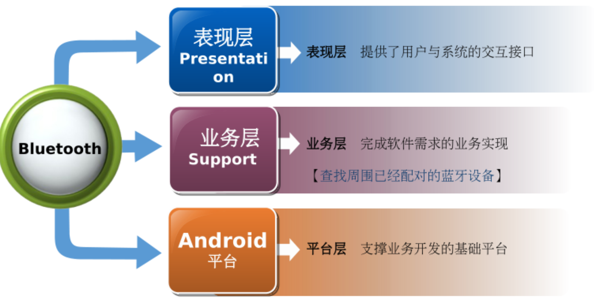
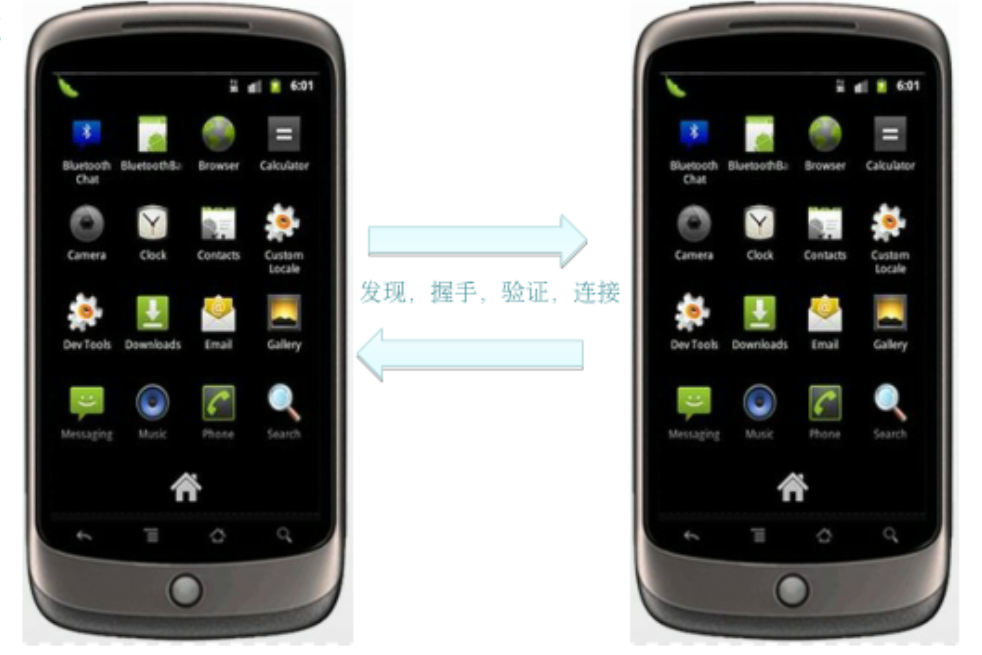
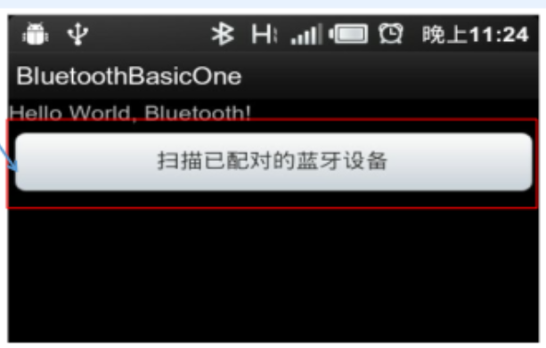
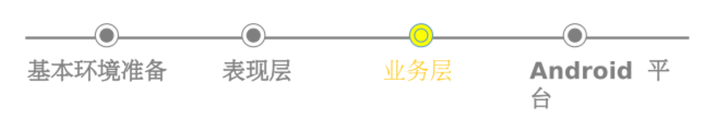
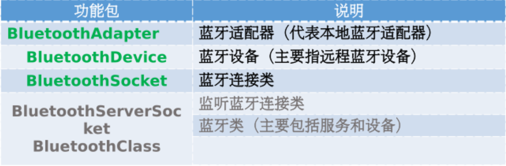
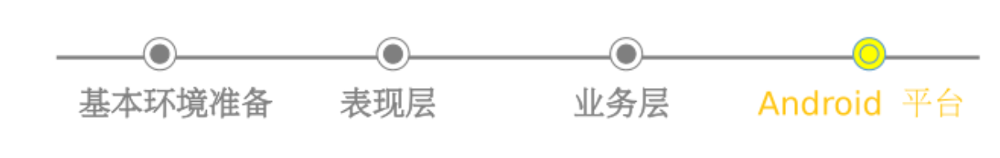

# 物联网综合案例

## 1蓝牙

蓝牙与外置GPS模块如果手机没有内置的GPS模块，或者需要高精度的外置GPS模块，就需要安装外置的GPS导航模块了，这个配件就是使用蓝牙功能和手机相互连接，让这个设备接收到GPS的数据，之后用蓝牙的方式，来传输给手机，来完成外置GPS模块的使用，

### 什么是蓝牙（Bluetooth )

1、蓝牙是目前使用最广泛的无线通信协议之一
2、主要针对短距离设备通讯( 10m )
3、常用于连接耳机，鼠标和移动通信设备等。
4、蓝牙不仅仅是- -项简技术,而是一种概念

蓝牙是一项短途无线电连接系统，它可以将不同的电子器材连系起来。

### 功能分析设计与实现

总体认识蓝牙组件与应用程序开发的关系




### 支撑开发的环境配置与测试

①Android手机的配置
②开发机器的配置
③蓝牙之间的数据传输


蓝牙通讯的基本结构

监才使用过程
1)启动蓝牙。
2) (A)搜索到另外-方(B),并发出链接请求，设置一个临时密钥,例如1234。
3) B收到请求信息,输入临时密钥,1234。
4)链接成功。




### 表现层UI设计

```xml
<?xm1 version="1.0" encoding= "utf-8"2>
<LinearLayout xmlns:android= "http://schemas. android. com/apk/res/andro1d"
    android:orientation= "vertical" android:layout_ width="fill parent ”
    android: layout_ height="fill parent">
    <TextView android:layout_ width= "fill_ pa rent"
    	android: layout_ height= "wrap_ content" android : text= "@string/he11o" />
    <Button android:id= "@+id/scanButtonId" android: layout width="fill parent ”
    	android:layout_ height= "wrap content" android: text=”扫描己配对的监牙设备" />
</LinearLayout>

```




### 业务层-扫描已配对的蓝牙设备

业务层编码主要是调用平台的API

①获得BluetoothAdapter 对象。
②判断当前设备中是否拥有蓝牙设备。
③判断当前设备中蓝牙是否打开。
④得到已经配对的蓝牙设备对象。



### Android平台与蓝牙相关的API

有关蓝牙的类与接口位于android.bluetooth 包中。






#### 定义蓝牙通信Bluetooth的权限

```xml
<uses-permission android: name= "android. permission. BLUETOOTH"/>
<uses' -permi ssion android: name= "android. permission. BLUETOOTH ADMIN"/ >
```

#### Android蓝牙通信Bluetooth处理流程

第一步: Android Framework设置蓝牙通信

第二步:Android Framework发现蓝牙设备

第三步:Android Framework连接蓝牙设备

第四步:Android Framework管理蓝牙连接


使用B1uetoothAdapter 类 ,获得B1uetoothAdapter 对象与启动蓝牙通信。

1、取得 BluetoothAdapter类

```
//取得BluetoothAdapter类
BluetoothAdapter mBluetoothAdapter = BluetoothAdapter . getDefaul tAdapter() ;
if (mBluetoothAdapter == null) {
	//没有蓝牙设备
}
......
//启动蓝牙通信
if (!mBluetoothAdapter. isEnabled()) {
    Intent enableBtIntent = new Intent (BluetoothAdapter . ACTION REQUEST ENABLE)
    startActivity (enableBt Intent) ;
}

```

目前Android OS 提供的蓝牙通讯API要求建立RFCOMM协议管道前，两个蓝牙设备必须已配对成功。

2、查询配对连接

```java
Set<BluetoothDevice> pai redDevices = mBluetoothAdapter
.getBondedDevices() ;
// If there are paired devices
if (pairedDevices.size() > 0) {
    // Loop through paired devices
    for (BluetoothDevice device : pairedDevices) {
        / / Add the name and address to an array adapter to show in a ListView
        mArrayAdapter . add (device.getName() + "\. + device.getAddress()) ;
    }
}

```

3、连接蓝牙设备

为了要在两个蓝牙设备之间建立一条应用程序连接，必须建立-一个服务端和-一个客户端的机制，服务端要打开蓝牙套接字( Socket)接口，客户端使用服务端的MAC地址来启动一-条连接。

1. 服务端连接
2. 客户端连接


4、管理蓝牙连接

当成功连接-一个或多个蓝牙设备时，每-一个蓝牙设备都有一条连 接B1uetoothSocket,此时蓝牙设备彼此间可以传递数据。

1) 调用Android 平台getInputStream() 和getOutputStream() API 获得Socket的InputStream 和OutputStream。
2)调用read(byte[1) and write(byte[]) API完成数据传 递。

注意:
管理蓝牙连接需要具备java io基本知识，Android 官 方ManagingAConnection _有核心步骤的代码参考


### 蓝牙应用领域

1、在手机上的应用
2、在掌上电脑上的应用
3、其它数字设备上的应用
4、在传统家电中的应用
5、构成的电子钱包和电子锁

### 小结

①蓝牙基本概念
②与蓝牙相关的AndroidAPI。
③基于Android平台，代码实.现查找周围已经配对的蓝牙设备


## 2物联网介绍

### 1物联网简介

物联网(Internet of things) 的概念最早是由MIT Auto-ID Center在1999年提出，它最初的定义为:即把所有物品通过射频识别等信息传感设备与互联网连接起来，实现智能化管理。通过它可以获取无处不在的信息实现物与物、 物与人之间的信息交互、智能化识别和管理，实现信息基础设施与物理基础设施的全面融合，并最终形成统一-的智能基础设施。

### 2物联网体系框架及应用协议

物联网研究分为10个层面，分别为:
1 )感知，ID发布机制与识别;
2)物联网宏观架构;
3)通讯( OSI物理与链路层) ;
4)组网( OSI网络层)
5)软件平台、中间件;
6)硬件;
7 )情报提炼;
8)搜索引擎;
9 )能源管理;
10)安全。

物联网体系结构分为三个层次，分别为感知层、网络层和应用层

物联网的体系框架泛化为5层，分别依次为:

1. 感知层

2. 接入层

3. 网络层

4. 支撑层.

5. 应用层


其中接入层主要完成各类设备的网络接入，该层重点强调各类接入方式

### 3物联网操作系统与移动互联网

关于物联网操作系统有许多定义，有把它定义为运行感知层终端上的最重要的系统软件，也有定义其为内核、辅助外围模块、集成开发环境等组成。

但其最基本是实现思想是:实现了应用软件和硬件的分离;硬件驱动程序与操作系统内核的分离。

目前，物联网操作系统并没有统- -版本，其主要的有Android、He11oX (国内) 、 mbed 
OS ( ARM )、Windows Compact 、Windows Embedded OS等

上述He1 1oX物联网操作系统架构与Android移动操作系统相同之处有:

1 )通过定义标准的硬件驱动程序接口，实现操作系统内核与硬件驱动程序的分离。
2)通过引入Java虚拟机，并定义基于C语言的标准API接口，实现应用程序与硬件的分离。

不同之处有:

1 )物联网操作系统的整体映像尺寸，必须是能够高度伸缩的，以适应硬件资源受限的应用场景。既能够适应手环等硬件资源相对丰富的应用场景，也能够适应环境监测器等不是非常智能的应用。

目前结合物联网的Android操作系统已经成形并应用。物联网应用过程中涉及到物联网终端、操作系统、远程服务器，其应用模式主要有:

1、物联网终端、操作系统、应用APP交互模式:物联网终端(汽车、冰箱、门锁、追踪卡等).上运行物联网操作系统， 应用( APP)运行在物联网操作系统上。

2、物联网终端、应用APP、智能手机交互模式:智能手机通过本地连接通道(蓝牙、WiFi、Zigbee等)连接到物联终端， 控制终端上的APP的安装和卸载，以及M2M终端的相关配置(安全信息等) ;

3、APP应用程序运行于物联网终端，是基于Client-Server模式(如智能手机的微信APP)，则物联网终端需要跟APP的“应用程序后台”进行交互，实现业务逻辑。

4、物联网终端跟“终端管理后台” (通常物联网终端制造厂商建立并维护)建立持久的通信连接，用于实时更新物联网操作系统内核版本、实时更新物联网终端的硬件驱动程序等。

5、物联网终端与终端直接通信，物联网终端之间通过本地通信连接通道(蓝牙、WiFi、Zigbee等)直接进行通信，无需借助后台。.

### 4物联网设备

1物联网终端

-根据不同的划分标准，物联网终端设备划分不同: 

1)从行业应用上可以分为工业设备检测终端、设施农业检测终端、物流RFID识别终端、电力系统检测终端、安防视频监测终端等c
2)从使用场所可以分为固定终端，移动终端和手持终端。
3)从传输方式可以分为以太网终端、WIFI终端、4G终端等
4)从使用扩展性分为单一功能终端和通用智能终端两种，单- -终端一般外部接口较少，设计简单，仅满足单- -应用或单一应用的部分扩展。
5)从传输通路可以分为数据透传终端和非数据透传终端。

2物联网网关

-从广义的角度来看，物联网网关设备是感知接入层、数据处理层和传输应用层三层涉及的所有硬件设备和软件的总称，从狭义的角度来看，其仅仅是基于ZigBee技术的物联网数据采集模块或数据处理模块。

-按照不同的标准可以将网关分成不同的类型，按连接网络划分:

( 1 )局域网/主机网关。局域网/主机网关主要在大型计算机系统和个人计算机之间提供连接服务
(2)局域网/局域网网关。这种类型的网关与局域网/主机网关很类似，不同的是这种网关主要用于连接多个使用不同通信协议或数据传输格式的局域网。目前大多数网关都是属于这类网关。
(3)因特网/局域网网关。这种网关主要用于局域网和因特网间的访问和连接控制。

-按产品功能划分:

(1)数据网关。数据网关通常在多个使用不同协议及数据格式的网络间提供数据转换功能。
(2)应用网关。应用网关是在使用不同数据格式的环境中，进行数据翻译功能的专用系统。
(3)安全网关、安全网关是各种提供系统(或者网络)安全保障的硬件设备或软件的统称，它是各种技术的有机结合，保护范围从低层次的协议数据包到高层次的具体应用


### 5Android 硬件传感器

目前安装Android系统的设备大多已经内置了传感器，它们上述讲解的物联网终端设备不同之处是:内置传感器的设备对外界数据的采集、传输不需要串口线、协调器等中间设备，直接通过Android系统中的传感器管理器(软件模块)来进行管理，而在物联网中使用物联网终端设备对外界数据的采集、传输需要串口线、协调器等中间设备，然后再通过网络(Http协议)把数据以JSON格式传输到Android平台服务器进行解析和处理。

Android 系统平台支持的传感器有三类，分别为:运动传感器、环境传感
器、位置传感器。


## 3 Android传感器

## 4 GPS物联网案例