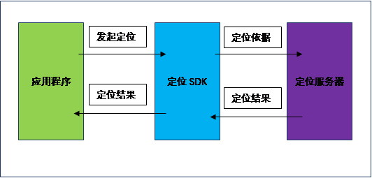
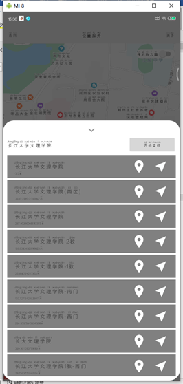

# GPS技术与移动开发应用

> 源码地址：[https://github.com/shaoyayu/baidumapDome/tree/master/%E4%BD%9C%E4%B8%9A%E6%BA%90%E7%A0%81](https://github.com/shaoyayu/baidumapDome/tree/master/作业源码)

作业：地图定位 

目的： 搭建Android & GPS 开发环境

利用GPS在地图上进行本地地理位置的定位

环境： Android手机带GPS功能，安装有JDK、eclipse集成的Android开发环境的电脑。

 

## 1.内容和原理

### 1）内容

注册成为百度的开发者，下载地图SDK开发包，利用定位到使用Map、location、model

 

### 2）原理

GPS技术与百度地图开发包结合使用原理：

使用百度Android定位SDK必须注册GPS和网络使用权限。定位SDK采用GPS、基站、Wi-Fi信号进行定位。当应用程序向定位SDK发起定位请求时，定位SDK会根据应用的定位因素（GPS、基站、Wi-Fi信号）的实际情况（如是否开启GPS、是否连接网络、是否有信号等）来生成相应定位依据进行定位。

用户可以设置满足自身需求的定位依据：



若用户设置GPS优先，则优先使用GPS进行定位，如果GPS定位未打开或者没有可用位置信息，且网络连接正常，定位SDK则会返回网络定位（即Wi-Fi与基站）的最优结果。为了使获得的网络定位结果更加精确，请打开手机的Wi-Fi开关。

 

## 2.需求分析





 

 

## 3.操作方法和步骤

### (1) 申请AK（API Key）

1、登录注册百度地图开发者：http://lbsyun.baidu.com/apiconsole/key

 

2、点击创建应用：


 

3、最好写你的当前开发的应用程序名称，记者应用类型一定选择Android SDK

选择自己所需要的SDK服务模块，我建议全选。

 

4、怎么获取SHA1呢。开发版的获取方法：

进入控制台：进入目录 用户目录/.android

keytool -list -v -keystore debug.keystore > sha1.txt

我的建议是输出到文件里面，方便查看，这是开发版的，开发版和发布版的SHA1可以写一样的。

【如果你有自己的签名，你也可以配置一个发布版的sha1，没有签名的后面可省略配置发布版的SHA1】

进入你的签名文件目录：在控制台输入：

keytool -list -v -keystore > sha1.txt

 

5、填写你的应用程序的包名，一定跟你的AndroidManifest.xml中的包名是一致的，

 

6、点击提交即可；

 

 

### (2) 下载SDK开发包

  下载地址：[SDK下载](http://lbsyun.baidu.com/index.php?title=sdk/download&action#selected=mapsdk_basicmap,mapsdk_searchfunction,mapsdk_lbscloudsearch,mapsdk_calculationtool,mapsdk_radar)

  

点击下载开发包即可：

 

 

### (3) 在android项目中引用百度SDK

1、添加jar文件

打开解压后的开发包文件夹，找到BaiduLBS_Android.jar文件将其拷贝至工程的app/libs目录下

 

2、添加so文件

 有两种方法可以往项目中添加so文件。 方法一： 在下载的开发包中拷贝需要的CPU架构对应的so文件文件夹到app/libs目录下，

 

在app目录下的build.gradle文件中android块中配置sourceSets标签，如果没有使用该标签则新增，详细配置代码如下：

  sourceSets  {        main {          jniLibs.srcDir 'libs'        }    }     

 

注意：Jar文件和so文件的版本号必须一致，并且保证Jar文件与so文件是同一版本包取出的。

 

方法二： 在src/main/目录下新建jniLibs目录（如果您的项目中已经包含该目录不用重复创建），在下载的开发包中拷贝项目中需要的CPU架构对应的so文件文件夹到jniLibs目录。

 

3、往工程中添加jar文件

在工程配置中需要将前面添加的jar文件集成到我们的工程中。 

方法一： 在libs目录下，选中每一个jar文件（此处只有一BaiduLbs_Android.jar）右键，选择Add As Library…，

此时会发现在app目录的build.gradle的dependencies块中生成了工程所依赖的jar文件的对应说明

 

注意:最新版本的Android Studio中compile被替换为implementation，具体的写法与您的Android Studio版本有关。

 

 

### (4)、你自己添加的功能

下载百度开发的实例代码：[百度地图案例下载](http://mapopen-pub-androidsdk.cdn.bcebos.com/map/sample/BaiduLBS_AndroidSDK_Sample.zip)

1、 拷贝案例中的assets文件下面的文件到自己项目中的assets目录下面，

2、 拷贝百度地图的导航路线覆盖物类到自己的程序中，在导航路线覆盖物使用的时候直接使用。重要的有：

`DrivingRouteOverlay.java`

`OverlayManager.java`

`PoiOverlay.java`

`TransitRouterOverlay.java`

`WalkingRouteOverlay.java`


## 4、记录与处理

#### 主程序代码如下：

##### LocationServiceActivity

```java
package icu.shaoyayu.android.iearnit.activity.service;

/**
 * @author shaoyayu
 * 导航和定位部分，设计位置签到等功能
 * Activity和Fragment之间的实时交互
 */
public class LocationServiceActivity extends ModuleActivity {

    protected BroadcastReceiver receiver = null;
    //当前Activity涉及的权限
    private String[] purview = {Manifest.permission.ACCESS_NETWORK_STATE
            , Manifest.permission.READ_EXTERNAL_STORAGE
            , Manifest.permission.WRITE_EXTERNAL_STORAGE
            , Manifest.permission.ACCESS_COARSE_LOCATION
            , Manifest.permission.ACCESS_FINE_LOCATION
            , Manifest.permission.ACCESS_WIFI_STATE
            , Manifest.permission.CHANGE_WIFI_STATE
    };

    private BDLocation mLocation = null;
    private PoiInfo mPoiInfo = null;
    private double latitude = 0;
    private double longitude = 0;
    private LocationClient locationClient;
    private MapView mMapView;
    private BaiduMap mBaiduMap;
    private FloatingActionButton mMapRouteDialog,mMapSearchDialog,mMapShareDialog;
    private Switch mHeatMap;
    private BottomDialog dialog = null;
    private NavigationMap navigationMap =  new NavigationMap();

    private static final String TAG = "LocationServiceActivity";

    private SimpleMenu mSimpleMenu ;

    @Override
    protected void initWindows() {
        //初始化服务
        registerSDKCheckReceiver();
    }

    @Override
    protected int getInterfaceResourceId() {
        return R.layout.activity_location_service;
    }

    @Override
    public void onPointerCaptureChanged(boolean hasCapture) {

    }

    @Override
    protected void initTheControl() {
        super.initTheControl();
        locationClient = new LocationClient(getApplicationContext());
        //初始化位置权限
        mSimpleMenu = findViewById(R.id.menu_location_service);
        mMapView = findViewById(R.id.mp_location_service);
        mMapRouteDialog = findViewById(R.id.fab_map_route);
        mMapSearchDialog = findViewById(R.id.fab_map_search);
        mMapShareDialog = findViewById(R.id.fab_map_share);
        mHeatMap = findViewById(R.id.sc_open_heat_map);
        mBaiduMap = mMapView.getMap();
        Log.d(TAG,"初始化控件");
        //要放在后面执行
        PermissionsUtils.getInstance().checkPermissions(this,
                purview,
                new PermissionsUtils.IPermissionsResult() {
                    @Override
                    public void passPermissions() {
                        initData();
                    }

                    @Override
                    public void forbidPermissions() {
                        //弹出解释框，确定后前往设置见面
                    }
                });
    }


    @Override
    protected void initData() {
        super.initData();
        Log.d(TAG,"初始化数据");
        mSimpleMenu.setTvMenuThemeText("位置服务");
        mMapView.showZoomControls(false);
        //获取地图的最大最小缩放
        Log.i(TAG,"最大缩放："+mBaiduMap.getMaxZoomLevel()+",最小缩放："+mBaiduMap.getMinZoomLevel());
        //设置地图的中心,通过工厂进行创建,注意经纬度是反的,
        MapStatusUpdate centerPoint = MapStatusUpdateFactory.newLatLng(new LatLng(26.62587,106.680831));
        mBaiduMap.setMapStatus(centerPoint);
        //设置一个默认的缩放
        MapStatusUpdate defaultZoom = MapStatusUpdateFactory.zoomTo(18);
        mBaiduMap.setMapStatus(defaultZoom);

        initLocationOption();
    }

    @Override
    protected void initControlBindingEvents() {
        super.initControlBindingEvents();

        mHeatMap.setOnCheckedChangeListener(new CompoundButton.OnCheckedChangeListener() {
            @Override
            public void onCheckedChanged(CompoundButton buttonView, boolean isChecked) {
            if (isChecked){
                //开启热力图
mBaiduMap.setBaiduHeatMapEnabled(true);
            }else {
                //显示正常地图
mBaiduMap.setBaiduHeatMapEnabled(false);
            }
            }
        });

        mMapSearchDialog.setOnClickListener(new View.OnClickListener() {
            @Override
            public void onClick(View v) {
                if(dialog!=null &&  dialog.getDialog()!=null
                        && dialog.getDialog().isShowing()) {
                    //dialog is showing so do something
                    dialog.onStart();
                    dialog = new MapSearchDialog(mLocation,new ImplementCallback());
                    dialog.show(getSupportFragmentManager(),"搜索");
                } else {
                    //dialog is not showing
                    dialog = new MapSearchDialog(mLocation,new ImplementCallback());
                    dialog.show(getSupportFragmentManager(),"搜索");
                }

            }
        });

        mMapRouteDialog.setOnClickListener(new View.OnClickListener() {
            @Override
            public void onClick(View v) {
                if(dialog!=null &&  dialog.getDialog()!=null
                        && dialog.getDialog().isShowing()) {
                    //dialog is showing so do something
                    dialog.onStart();
                    dialog = new MapRouteDialog(mPoiInfo,mLocation,navigationMap);
                    dialog.show(getSupportFragmentManager(),"路线");
                } else {
                    //dialog is not showing
                    dialog = new MapRouteDialog(mPoiInfo,mLocation,navigationMap);
                    dialog.show(getSupportFragmentManager(),"路线");
                }

            }
        });


        mMapShareDialog.setOnClickListener(new View.OnClickListener() {
            @Override
            public void onClick(View v) {
                if(dialog!=null &&  dialog.getDialog()!=null
                        && dialog.getDialog().isShowing()) {
                    //dialog is showing so do something
                    dialog.onStart();
                    dialog = new MapShareDialog(mLocation);
                    dialog.show(getSupportFragmentManager(),"分享");
                } else {
                    //dialog is not showing
                    dialog = new MapShareDialog(mLocation);
                    dialog.show(getSupportFragmentManager(),"分享");
                }

                //从新定位
                initLocationOption();
            }
        });
    }

    @Override
    protected void onResume() {
        super.onResume();
        //在activity执行onResume时执行mMapView. onResume ()，实现地图生命周期管理
        mMapView.onResume();
    }
    @Override
    protected void onPause() {
        super.onPause();
        //在activity执行onPause时执行mMapView. onPause ()，实现地图生命周期管理
        mMapView.onPause();
    }
    @Override
    protected void onDestroy() {
        super.onDestroy();
        //在activity执行onDestroy时执行mMapView.onDestroy()，实现地图生命周期管理
        mMapView.onDestroy();
        unregisterReceiver(receiver);
    }

    /**
     * 初始化地图服务
     */
    protected void registerSDKCheckReceiver(){
        receiver = new BroadcastReceiver() {
            @Override
            public void onReceive(Context context, Intent intent) {
                String action = intent.getAction();
                if (SDKInitializer.SDK_BROADCAST_ACTION_STRING_NETWORK_ERROR.equals(action)){
                    Toast.makeText(context, "网络错误", Toast.LENGTH_SHORT).show();
                    Log.w(TAG,"网络无法连接");
                }else if (SDKInitializer.SDK_BROADTCAST_ACTION_STRING_PERMISSION_CHECK_ERROR.equals(action)){
                    Toast.makeText(context, "Key验证失败", Toast.LENGTH_SHORT).show();
                    Log.w(TAG,"key验证失败");
                }
            }
        };

        IntentFilter filter = new IntentFilter();
        //监听网络错误
        filter.addAction(SDKInitializer.SDK_BROADCAST_ACTION_STRING_NETWORK_ERROR);
        //监听百度地图的sdk的可以时不时正确
        filter.addAction(SDKInitializer.SDK_BROADTCAST_ACTION_STRING_PERMISSION_CHECK_ERROR);

        registerReceiver(receiver,filter);

    }

    /**
     * 权限申请
     * @param requestCode
     * @param permissions
     * @param grantResults
     */
    @Override
    public void onRequestPermissionsResult(int requestCode, @NonNull String[] permissions, @NonNull int[] grantResults) {
        super.onRequestPermissionsResult(requestCode, permissions, grantResults);
        PermissionsUtils.getInstance().onRequestPermissionsResult(this,requestCode,permissions,grantResults);
    }

    /**
     * 初始化定位参数配置
     */
    private void initLocationOption() {
        LocationClientOption locationOption = new LocationClientOption();
        MyLocationListener myLocationListener = new MyLocationListener();
        locationClient.registerLocationListener(myLocationListener);
        locationOption.setLocationMode(LocationClientOption.LocationMode.Hight_Accuracy);
        locationOption.setCoorType("bd09ll");
        locationOption.setScanSpan(0);
        locationOption.setIsNeedAddress(true);
        locationOption.setIsNeedLocationDescribe(true);
        locationOption.setNeedDeviceDirect(false);
        locationOption.setLocationNotify(true);
        locationOption.setIgnoreKillProcess(true);
        locationOption.setIsNeedLocationDescribe(true);
        locationOption.setIsNeedLocationPoiList(true);
        locationOption.SetIgnoreCacheException(false);
        locationOption.setOpenGps(true);
        locationOption.setIsNeedAltitude(false);
        locationOption.setOpenAutoNotifyMode();
        locationOption.setOpenAutoNotifyMode(3000,1, LocationClientOption.LOC_SENSITIVITY_HIGHT);
        locationClient.setLocOption(locationOption);
        locationClient.start();
    }

    /**
     * 实现定位回调
     */
    public class MyLocationListener extends BDAbstractLocationListener {
        @Override
        public void onReceiveLocation(BDLocation location){
            //测试使用 112.193069,30.355534
/*            location.setLongitude(112.193069);
            location.setLatitude(30.355534);*/
            if (mLocation==null){
                mLocation = location;
            }
            if (latitude==0){
                latitude = location.getLatitude();
            }
            if (longitude==0){
                longitude = location.getLongitude();
            }
            Log.d(TAG,"latitude:"+latitude+",longitude:"+longitude);
            //初始化位置信息
            MapStatusUpdate centerPoint = MapStatusUpdateFactory.newLatLng(new LatLng(latitude,longitude));
            mBaiduMap.setMapStatus(centerPoint);
            //标记
            //构建Marker图标
            MarkerOptions markerOptions = new MarkerOptions();
            BitmapDescriptor bitmapDescriptor4 = BitmapDescriptorFactory.fromResource(R.mipmap.maps_easyicon);
            markerOptions.position(new LatLng(latitude,longitude))
                    //添加图标
                    .icon(bitmapDescriptor4);
            mBaiduMap.addOverlay(markerOptions);
            //---------------------详细信息获取方法---------------------///
            locationClient.stop();
        }
    }


    //清除标记物
    public void clearMarker(){
        LatLng latLng1 = new LatLng(0,0);
        LatLng latLng2 = new LatLng(9999,9999);
        List<LatLng> latLngs = new ArrayList<>();
        //指定搜索范围
        LatLngBounds bounds = new LatLngBounds.Builder()
                //设置内容
                .include(latLng1)
                .include(latLng2)
                .build();
        List<Marker> markersInBounds = mBaiduMap.getMarkersInBounds(bounds);
        for (Marker markersInBound : markersInBounds) {
            markersInBound.remove();
        }
    }

    /**
     * poi搜索过后描述位置信息的回调
     */
    public class ImplementCallback implements MapSearchDialog.POICallback {

        /**
         * 回调显示所有poi检索结果
         * 绑定点击事件
         * @param poiInfos
         */
        @Override
        public void showSearchResults(List<PoiInfo> poiInfos) {

        }

        /**
         * 搜索到的内容回调到
         * @param view
         * @param poiInfo
         */
        @Override
        public void callbackForDetails(View view, PoiInfo poiInfo) {
            mPoiInfo = poiInfo;
            Log.d(TAG,"POI详情回调"+poiInfo.name);
            clearMarker();
            //构建Marker图标
            //初始化位置信息
            MapStatusUpdate centerPoint = MapStatusUpdateFactory.newLatLng(poiInfo.location);
            mBaiduMap.setMapStatus(centerPoint);
            MarkerOptions markerOptions = new MarkerOptions();
            BitmapDescriptor bitmapDescriptor4 = BitmapDescriptorFactory.fromResource(R.mipmap.maps_easyicon);
            markerOptions.position(poiInfo.location)
                    //添加图标
                    .icon(bitmapDescriptor4);
            mBaiduMap.addOverlay(markerOptions);
        }

        @Override
        public void navigationPositionCallback(View view, PoiInfo poiInfo) {
            mPoiInfo = poiInfo;
            Log.d(TAG,"POI导航回调"+poiInfo.name);
            if(dialog!=null &&  dialog.getDialog()!=null
                    && dialog.getDialog().isShowing()) {
                //dialog is showing so do something
                dialog.onStart();
                dialog = new MapRouteDialog(mPoiInfo,mLocation,navigationMap);
                dialog.show(getSupportFragmentManager(),"路线");
            } else {
                //dialog is not showing
                dialog = new MapRouteDialog(mPoiInfo,mLocation,navigationMap);
                dialog.show(getSupportFragmentManager(),"路线");
            }
        }
    }

    /**
     * 绘制导航路线
     */
    public class NavigationMap implements MapRouteDialog.RouteSelectionCallback {
        /**
         * 不行路线导航回调
         * @param walkingRouteLine
         */
        @Override
        public void walkingRoute(WalkingRouteLine walkingRouteLine) {
            clearMarker();
            WalkingRouteOverlay overlay = new WalkingRouteOverlay(mBaiduMap);
            mBaiduMap.setOnMarkerClickListener(overlay);
            overlay.setData(walkingRouteLine);
            //把搜索结果添加到百度地图里面
            overlay.addToMap();
            //把搜索结果显示在同一个屏幕
            overlay.zoomToSpan();
        }

        /**
         * 公交路线导航回调
         * @param transitRouteLine
         */
        @Override
        public void busRoutes(TransitRouteLine transitRouteLine) {
            clearMarker();
            TransitRouteOverlay overlay = new TransitRouteOverlay(mBaiduMap);
            mBaiduMap.setOnMarkerClickListener(overlay);
            //取出查询出来的所有路线，选择第一条
            overlay.setData(transitRouteLine);
            //把搜索结果添加到百度地图里面
            overlay.addToMap();
            //把搜索结果显示在同一个屏幕
            overlay.zoomToSpan();
        }

        /**
         * 行车路线导航
         * @param drivingRouteLine
         */
        @Override
        public void drivingDirections(DrivingRouteLine drivingRouteLine) {
            clearMarker();
            DrivingRouteOverlay overlay = new DrivingRouteOverlay(mBaiduMap);
            mBaiduMap.setOnMarkerClickListener(overlay);
            overlay.setData(drivingRouteLine);
            //把搜索结果添加到百度地图里面
            overlay.addToMap();
            //把搜索结果显示在同一个屏幕
            overlay.zoomToSpan();
        }
    }

    //创建一个热力图服务回调的函数
}

```


##### MapSearchDialog

```java
package icu.shaoyayu.android.iearnit.dialog.map;


/**
 * @author shaoyayu
 * avatar dialog box pops up dialog
 */
public class MapSearchDialog extends BottomDialog {

    private static final String  TAG = "MapSearchDialog";
    PoiSearch mPoiSearch = PoiSearch.newInstance();
    //当前的我一个位置
    private RecyclerView mShowSearchResults;
    private BDLocation location;
    private EditText mEnterLocation;
    private ImageView mCloseSession;
    private Button mFindALocation;
    //
    private POICallback poiCallback;

    public MapSearchDialog(BDLocation location,POICallback poiCallback){
        this.location = location;
        this.poiCallback = poiCallback;
    }

    @Override
    protected View createView(LayoutInflater inflater, ViewGroup container) {
        View view = inflater.inflate(R.layout.dialog_map_search,container,false);
        mEnterLocation = view.findViewById(R.id.et_map_location_search);
        mCloseSession = view.findViewById(R.id.iv_map_search_dog_close);
        mFindALocation = view.findViewById(R.id.bt_find_location);
        mShowSearchResults = view.findViewById(R.id.rv_map_search_results);

        mCloseSession.setOnClickListener(new View.OnClickListener() {
            @Override
            public void onClick(View v) {
                onStop();
            }
        });
        mFindALocation.setOnClickListener(new View.OnClickListener() {
            @Override
            public void onClick(View v) {
                //移除输入的焦点
                mEnterLocation.clearFocus();//取消焦点
                InputMethodManager imm = (InputMethodManager)getActivity().getSystemService(INPUT_METHOD_SERVICE);
                imm.hideSoftInputFromWindow(mEnterLocation.getWindowToken(), 0);
                String findContent = mEnterLocation.getText().toString().trim();
                Log.d(TAG,"搜索内容："+findContent);
                mPoiSearch.setOnGetPoiSearchResultListener(SearchMonitor);
//                Log.d(TAG,"当前城市："+location.getCity());
                PoiCitySearchOption citySearchOption = new PoiCitySearchOption();
//                citySearchOption.city(location.getCity());
                //测试使用
                citySearchOption.city("荆州");
                citySearchOption.keyword(findContent);
                citySearchOption.pageCapacity(100);
                citySearchOption.pageNum(0);
                mPoiSearch.searchInCity(citySearchOption);
            }
        });
        return view;
    }

    @Override
    public void onStop() {
        //回收资源，适配器等
        super.onStop();
        //关闭的时候释放资源
        mPoiSearch.destroy();
    }

    public interface SearchResultCallback{
        void showChooseALocation();
        void showReachLocation();
    }

    /**
     * 搜索回调的监听函数
     */
    OnGetPoiSearchResultListener SearchMonitor = new OnGetPoiSearchResultListener() {
        @Override
        public void onGetPoiResult(PoiResult poiResult) {
            if (poiResult == null
                    || poiResult.error == SearchResult.ERRORNO.RESULT_NOT_FOUND) {// 没有找到检索结果
                Log.d(TAG,"为能找到搜索结果");
                Toast.makeText(getContext(), "没有搜索结果", Toast.LENGTH_SHORT).show();
                return;
            }
            if (poiResult.error == SearchResult.ERRORNO.NO_ERROR) {// 检索结果正常返回
                List<PoiInfo> allPoi = poiResult.getAllPoi();
                for (PoiInfo poiInfo : allPoi) {
                    Log.d(TAG,poiInfo.name);
                }
                //Sequence
                mShowSearchResults.setAdapter(new ShowSearchDataAdapter(allPoi,poiCallback));
                FullyLinearLayoutManager mLinearLayoutManager = new FullyLinearLayoutManager(getContext());
                mShowSearchResults.setLayoutManager(mLinearLayoutManager);
            }
            //调用初始化参数显示
        }
        @Override
        public void onGetPoiDetailResult(PoiDetailSearchResult poiDetailSearchResult) {

        }
        @Override
        public void onGetPoiIndoorResult(PoiIndoorResult poiIndoorResult) {

        }
        //废弃
        @Override
        public void onGetPoiDetailResult(PoiDetailResult poiDetailResult) {

        }
    };


    //适配器

    class ShowSearchDataAdapter extends RecyclerView.Adapter<MyPolicyInfo>{

        List<PoiInfo> policyInfos;
        POICallback mPoiCallback;
        public ShowSearchDataAdapter(List<PoiInfo> policyInfos,POICallback poiCallback){
            this.policyInfos = policyInfos;
            this.mPoiCallback = poiCallback;
        }

        @Override
        public int getItemViewType(int position) {
            return position;
        }

        @NonNull
        @Override
        public MyPolicyInfo onCreateViewHolder(@NonNull ViewGroup parent, int viewType) {
            LayoutInflater inflater = LayoutInflater.from(getContext());
            View view = inflater.inflate(R.layout.view_search_results_item,parent,false);
            return new MyPolicyInfo(view);
        }

        @Override
        public void onBindViewHolder(@NonNull MyPolicyInfo holder, final int position) {
            holder.poiName.setText( policyInfos.get(position).name);
            LatLng current = new LatLng(location.getLatitude(),location.getLongitude());
            final LatLng poiPlace = policyInfos.get(position).getLocation();
            holder.poiDistance.setText(DistanceUtil.getDistance(current,poiPlace)+"米");
            holder.poiDetail.setOnClickListener(new View.OnClickListener() {
                @Override
                public void onClick(View v) {
                    //设置一个新的位置，然后关闭当前的弹窗
                    onStop();
                    mPoiCallback.callbackForDetails(v,policyInfos.get(position));
                }
            });
            holder.poiNavigate.setOnClickListener(new View.OnClickListener() {
                @Override
                public void onClick(View v) {
                    //导航
                    onStop();
                    mPoiCallback.navigationPositionCallback(v,policyInfos.get(position));
                }
            });
        }
        @Override
        public int getItemCount() {
            return policyInfos.size();
        }
    }
    class MyPolicyInfo extends RecyclerView.ViewHolder {
        //四个控件
        TextView poiName;
        TextView poiDistance;
        Button poiDetail;
        Button poiNavigate;
        public MyPolicyInfo(@NonNull View itemView) {
            super(itemView);
            //实例化参数
            poiName = itemView.findViewById(R.id.tv_poi_name);
            poiDistance = itemView.findViewById(R.id.tv_poi_distance);
            poiDetail = itemView.findViewById(R.id.bt_poi_detail);
            poiNavigate = itemView.findViewById(R.id.bt_poi_navigate);
            //注册一个点击事件
        }
    }


    public interface POICallback {

        /**
         * 显示搜索结果
         * @param poiInfos
         */
        void showSearchResults(List<PoiInfo> poiInfos);

        /**
         * 详情位置回调
         * @param view
         * @param poiInfo
         */
        void callbackForDetails(View view, PoiInfo poiInfo);


        /**
         * 导航位置回调
         * @param view
         * @param poiInfo
         */
        void navigationPositionCallback(View view, PoiInfo poiInfo);

    }

}

```


##### MapRouteDialog

```java
package icu.shaoyayu.android.iearnit.dialog.map;

/**
 * @author shaoyayu
 * 路线规划类
 * 驾车
 */
public class MapRouteDialog extends BottomDialog {

    private static final String TAG = "MapRouteDialog";
    private ImageView mCloseNavigation;
    private PoiInfo poiInfo;
    private BDLocation location;
    private RoutePlanSearch routePlanSearch;
    private RecyclerView mRecyclerView;
    private RouteSelectionCallback routeSelectionCallback;
    //保存三个搜索结果
    private List<WalkingRouteLine> walkingRouteLines = null; //步行 walk
    private List<TransitRouteLine> transitRouteLines = null; //公交 bus
    private List<DrivingRouteLine> drivingRouteLines = null; //自驾 self_driving
    //三个都是继承 navigation_route

    public MapRouteDialog(PoiInfo poiInfo,BDLocation location,RouteSelectionCallback routeSelectionCallback){
        this.poiInfo = poiInfo;
        this.location = location;
        this.routeSelectionCallback = routeSelectionCallback;
    }

    @Override
    protected View createView(LayoutInflater inflater, ViewGroup container) {
        if (poiInfo!=null&&location!=null){
            //自驾导航
            routePlanSearch = RoutePlanSearch.newInstance();
            routePlanSearch.setOnGetRoutePlanResultListener(new PathOnGetRoutePlanResultListener());
            routePlanSearch.drivingSearch(getDrivingRoutePlanOption());
            routePlanSearch.transitSearch(getTransitRoutePlanOption());
            routePlanSearch.walkingSearch(getWalkingRoutePlanOption());
        }
        View view = inflater.inflate(R.layout.dialog_map_route,container,false);
        mCloseNavigation = view.findViewById(R.id.iv_map_navigation_dog_close);
        mRecyclerView = view.findViewById(R.id.rv_navigation_type);
        mCloseNavigation.setOnClickListener(new View.OnClickListener() {
            @Override
            public void onClick(View v) {
                onStop();
            }
        });
        //给ViewPage注册适配器
        return view;
    }

    @Override
    public void onStop() {
        super.onStop();
    }

    private void initRecyclerViewAdapter(){
        if (walkingRouteLines!=null && transitRouteLines!=null && drivingRouteLines!=null){
            mRecyclerView.setAdapter(new NavigationAdapter());
            FullyLinearLayoutManager mLinearLayoutManager = new FullyLinearLayoutManager(getContext());
            mRecyclerView.setLayoutManager(mLinearLayoutManager);
            //更新适配器
//            mRecyclerView.swapAdapter();
        }
    }

    /**
     * 驾车导航
     * @return
     */
    private DrivingRoutePlanOption getDrivingRoutePlanOption() {
        DrivingRoutePlanOption drivingRoutePlanOption = new DrivingRoutePlanOption();
        drivingRoutePlanOption.from(PlanNode.withLocation(new LatLng(location.getLatitude(),location.getLongitude())));
        drivingRoutePlanOption.to(PlanNode.withLocation(poiInfo.location));
        return drivingRoutePlanOption;
    }

    /**
     * 公交导航
     * @return
     */
    private TransitRoutePlanOption getTransitRoutePlanOption() {
        TransitRoutePlanOption transitRoutePlanOption = new TransitRoutePlanOption();
//        transitRoutePlanOption.city(location.getCity());
        transitRoutePlanOption.city("荆州");
        transitRoutePlanOption.from(PlanNode.withLocation(new LatLng(location.getLatitude(),location.getLongitude())));
        transitRoutePlanOption.to(PlanNode.withLocation(poiInfo.location));
        //路线选型
        /*
        EBUS_NO_SUBWAY
            公交检索策略常量：不含地铁
            EBUS_TIME_FIRST
            公交检索策略常量：时间优先
            EBUS_TRANSFER_FIRST
            公交检索策略常量：最少换乘
            EBUS_WALK_FIRST
            公交检索策略常量：最少步行距离
         */
        transitRoutePlanOption.policy(TransitRoutePlanOption.TransitPolicy.EBUS_WALK_FIRST);
        return transitRoutePlanOption;
    }

    /**
     * 步行导航
     * @return
     */
    private WalkingRoutePlanOption getWalkingRoutePlanOption() {
        WalkingRoutePlanOption walkingRoutePlanOption = new WalkingRoutePlanOption();
        walkingRoutePlanOption.from(PlanNode.withLocation(new LatLng(location.getLatitude(),location.getLongitude())));
        walkingRoutePlanOption.to(PlanNode.withLocation(poiInfo.location));
        return walkingRoutePlanOption;
    }

    //规划路线回调
    class PathOnGetRoutePlanResultListener implements OnGetRoutePlanResultListener{

        /**
         * 不行路线回调
         * @param walkingRouteResult
         */
        @Override
        public void onGetWalkingRouteResult(WalkingRouteResult walkingRouteResult) {
//            mParcelableRouteLines.add(walkingRouteResult.getRouteLines());
            walkingRouteLines = walkingRouteResult.getRouteLines();
            for (int i = 0; i < walkingRouteLines.size(); i++) {
                Log.d(TAG,i+"步行路线耗时："+walkingRouteLines.get(i).getDuration()/60+"分钟");
                List<WalkingRouteLine.WalkingStep> allStep = walkingRouteLines.get(i).getAllStep();
                for (int j = 0; j < allStep.size(); j++) {
                    Log.d(TAG,i+","+j+",步行路线:"+allStep.get(j).getInstructions());
                }
            }
            initRecyclerViewAdapter();
        }

        @Override
        public void onGetTransitRouteResult(TransitRouteResult transitRouteResult) {
            transitRouteLines = transitRouteResult.getRouteLines();
            for (int i = 0; i < transitRouteLines.size(); i++) {
                Log.d(TAG,i+"公交路线："+transitRouteLines.get(i).getDuration()/60+"分钟");
                List<TransitRouteLine.TransitStep> allStep = transitRouteLines.get(i).getAllStep();
                for (int j = 0; j < allStep.size(); j++) {
                    Log.d(TAG,i+","+j+",公交路线:"+allStep.get(j).getInstructions());
                }
            }
            initRecyclerViewAdapter();
        }

        @Override
        public void onGetMassTransitRouteResult(MassTransitRouteResult massTransitRouteResult) {

        }

        @Override
        public void onGetDrivingRouteResult(DrivingRouteResult drivingRouteResult) {
            //所有选择方案
            drivingRouteLines = drivingRouteResult.getRouteLines();
            for (int i = 0; i < drivingRouteLines.size(); i++) {
                Log.d(TAG,i+"自驾："+drivingRouteLines.get(i).getDuration()/60+"分钟");
                DrivingRouteLine drivingRouteLine = drivingRouteLines.get(i);
                List<DrivingRouteLine.DrivingStep> allStep = drivingRouteLine.getAllStep();
                for (int j = 0; j < allStep.size(); j++) {
                    Log.d(TAG,i+","+j+",自驾:"+allStep.get(j).getInstructions());
                }
            }
            initRecyclerViewAdapter();
        }

        @Override
        public void onGetIndoorRouteResult(IndoorRouteResult indoorRouteResult) {

        }

        @Override
        public void onGetBikingRouteResult(BikingRouteResult bikingRouteResult) {

        }
    }


    /**
     * 适配器，需要在填充的时候填写数据
     */
    class NavigationAdapter extends RecyclerView.Adapter<MyRouteDetails>{

        @Override
        public int getItemViewType(int position) {
            return position;
        }

        @NonNull
        @Override
        public MyRouteDetails onCreateViewHolder(@NonNull ViewGroup parent, int viewType) {
            LayoutInflater inflater = LayoutInflater.from(getContext());
            View view = inflater.inflate(R.layout.view_navigation_route,parent,false);
            return new MyRouteDetails(view);
        }

        @Override
        public void onBindViewHolder(@NonNull MyRouteDetails holder, int position) {
            if (position<walkingRouteLines.size()){
                holder.routeType.setText("步行路线："+(position+1));
                holder.timeConsumingRoute.setText("耗时："+walkingRouteLines.get(position).getDuration()/60+" Minute");
                holder.startNavigation.setImageResource(R.drawable.ic_walk_foreground);
                String content = "";
                List<WalkingRouteLine.WalkingStep> allStep = walkingRouteLines.get(position).getAllStep();
                for (int j = 0; j < allStep.size(); j++) {
                    content = content + allStep.get(j).getInstructions()+"\n";
                }
                holder.routeDetails.setText(content);
                //设置一个点击事件，回调
                final int finalPosition = position;
                holder.startNavigation.setOnClickListener(new View.OnClickListener() {
                    @Override
                    public void onClick(View v) {
                        onStop();
                        routeSelectionCallback.walkingRoute(walkingRouteLines.get(finalPosition));
                    }
                });
            }else if (walkingRouteLines.size()<=position && position<(walkingRouteLines.size()+transitRouteLines.size())){
                position = position - walkingRouteLines.size();
                holder.routeType.setText("公交路线："+(position+1));
                holder.timeConsumingRoute.setText("耗时："+transitRouteLines.get(position).getDuration()/60+" Minute");
                holder.startNavigation.setImageResource(R.drawable.ic_bus_foreground);
                String content = "";
                List<TransitRouteLine.TransitStep> allStep = transitRouteLines.get(position).getAllStep();
                for (int j = 0; j < allStep.size(); j++) {
                    content = content + allStep.get(j).getInstructions()+"\n";
                }
                holder.routeDetails.setText(content);
                final int finalPosition = position;
                holder.startNavigation.setOnClickListener(new View.OnClickListener() {
                    @Override
                    public void onClick(View v) {
                        onStop();
                        routeSelectionCallback.busRoutes(transitRouteLines.get(finalPosition));
                    }
                });
            }else{
                position = position - (walkingRouteLines.size()+transitRouteLines.size());
                holder.routeType.setText("驾车路线："+(position+1));
                holder.timeConsumingRoute.setText("耗时："+drivingRouteLines.get(position).getDuration()/60+" Minute");
                holder.startNavigation.setImageResource(R.drawable.ic_self_driving_foreground);
                String content = "";
                DrivingRouteLine drivingRouteLine = drivingRouteLines.get(position);
                List<DrivingRouteLine.DrivingStep> allStep = drivingRouteLine.getAllStep();
                for (int j = 0; j < allStep.size(); j++) {
                    content = content + allStep.get(j).getInstructions()+"\n";
                }
                holder.routeDetails.setText(content);
                final int finalPosition = position;
                holder.startNavigation.setOnClickListener(new View.OnClickListener() {
                    @Override
                    public void onClick(View v) {
                        onStop();
                        routeSelectionCallback.drivingDirections(drivingRouteLines.get(finalPosition));
                    }
                });
            }
        }

        @Override
        public int getItemCount() {
            int size = 0;
            if (walkingRouteLines!=null && walkingRouteLines.size()!=0){
                size = size +walkingRouteLines.size();
            }
            if (transitRouteLines!=null && transitRouteLines.size()!=0){
                size = size + transitRouteLines.size();
            }
            if (drivingRouteLines!=null && drivingRouteLines.size()!=0){
                size = size +drivingRouteLines.size();
            }
            return size;
        }
    }

    class MyRouteDetails extends RecyclerView.ViewHolder {
        //四个控件
        TextView routeType,timeConsumingRoute,routeDetails;
        ImageView startNavigation;
        public MyRouteDetails(@NonNull View itemView) {
            super(itemView);
            routeType = itemView.findViewById(R.id.tv_route_type);
            timeConsumingRoute = itemView.findViewById(R.id.tv_time_consuming_route);
            routeDetails = itemView.findViewById(R.id.tv_details);
            startNavigation = itemView.findViewById(R.id.iv_start_navigation);
        }
    }

    public interface RouteSelectionCallback{
        //步行路线规划
        void walkingRoute(WalkingRouteLine walkingRouteLine);
        //换车路线规划
        void busRoutes(TransitRouteLine transitRouteLine );
        //驾车路线规划
        void drivingDirections(DrivingRouteLine drivingRouteLine);
    }

}

```


##### MapShareDialog

```java
package icu.shaoyayu.android.iearnit.dialog.map; 

/**
 * @author shaoyayu
 * 位置共享解决方案
 */
public class MapShareDialog extends BottomDialog {

    private ImageView mStopDialog;
    private Switch locationSharing,trackSharing,recordTrack;
    private Intent positioningService;
    private TextView mLocationInfo;
    private BDLocation mLocation;

    public MapShareDialog(BDLocation location){
        this.mLocation = location;
    }

    @Override
    protected View createView(LayoutInflater inflater, ViewGroup container) {
        View view = inflater.inflate(R.layout.dialog_map_share,container,false);
        initTheControl(view);
        initData();
        return view;
    }


    //初始化控件
    private void initTheControl(View view){
        positioningService = new Intent(getContext(), LocationSharingService.class);
        mStopDialog = view.findViewById(R.id.iv_map_share_dog_close);
        //监控关闭弹窗
        mStopDialog.setOnClickListener(new View.OnClickListener() {
            @Override
            public void onClick(View v) {
                onStop();
            }
        });
        //位置共享控件
        locationSharing = view.findViewById(R.id.sc_location_sharing);
        //判断当前的服务是不是正在执行
        if (isServiceRunning("icu.shaoyayu.android.iearnit.service.LocationSharingService")){
            //设置为执行状态
            locationSharing.setChecked(true);
        }
        //开关事假
        locationSharing.setOnCheckedChangeListener(new CompoundButton.OnCheckedChangeListener() {
            @Override
            public void onCheckedChanged(CompoundButton buttonView, boolean isChecked) {
                if (isChecked){
                    //开启
                    showTips("已经为你开启位置共享");
                    getActivity().startService(positioningService);
                }else {
                    //关闭
                    showTips("已经为你关闭位置共享");
                    getActivity().stopService(positioningService);
                }
            }
        });
        //轨迹共享
        trackSharing = view.findViewById(R.id.sc_track_sharing);
        trackSharing.setOnCheckedChangeListener(new CompoundButton.OnCheckedChangeListener() {
            @Override
            public void onCheckedChanged(CompoundButton buttonView, boolean isChecked) {
                if (isChecked){
                    //开启
                    showTips("已经为你开启轨迹共享");
                }else {
                    //关闭
                    showTips("已经为你关闭轨迹共享");
                }
            }
        });
        //轨迹录制
        recordTrack = view.findViewById(R.id.sc_track_record);
        recordTrack.setOnCheckedChangeListener(new CompoundButton.OnCheckedChangeListener() {
            @Override
            public void onCheckedChanged(CompoundButton buttonView, boolean isChecked) {
                if (isChecked){
                    //开启
                    showTips("已经为你开启轨迹录制");
                }else {
                    //关闭
                    showTips("已经为你关闭轨迹录制");
                }
            }
        });
        mLocationInfo = view.findViewById(R.id.tv_location_info);

    }

    //初始化数据
    private void initData(){
        if (mLocation==null){
            mLocationInfo.setText("Positioning failed");
        }else {
            String province = mLocation.getProvince();    //获取省份
            String city = mLocation.getCity();           //获取城市
            String district = mLocation.getDistrict();    //获取区县
            String street = mLocation.getStreet();       //获取街道信息
            String town = mLocation.getTown();           //获取乡镇信息
            String desc = mLocation.getLocationDescribe(); //详细信息
            String locationInfo = province + city + district + street + town +"\n"+ desc;
            mLocationInfo.setText(locationInfo);
        }
    }

    //显示一个对话框提示共享开始，
    private void showTips(String str){
        Toast.makeText(getContext(), str, Toast.LENGTH_SHORT).show();
    }

    @Override
    public void onStop() {
        super.onStop();
    }

    /**
     * 根据服务的名称判断当前的服务是不是正在执行
     * @param serviceName
     * @return
     */
    private boolean isServiceRunning(String serviceName) {
        ActivityManager manager = (ActivityManager) getActivity().getSystemService(ACTIVITY_SERVICE);
        for (ActivityManager.RunningServiceInfo service : manager.getRunningServices(Integer.MAX_VALUE)) {
            if (serviceName.equals(service.service.getClassName())) {
                return true;
            }
        }
        return false;
    }
}

```


##### LocationSharingService

```java
package icu.shaoyayu.android.iearnit.service; 

/**
 * @author shaoyayu
 * 实现位置实时共享的一个服务
 */
public class LocationSharingService extends Service implements PositioningService.ContinuousPositioningCallback {

    private LocationSharingNetService netService = new LocationSharingNetService();

    private static final String TAG = "LocationSharingService";

    private PositioningService positioningService;
    public LocationSharingService() {

    }

    @Override
    public void onCreate() {
        super.onCreate();
        positioningService = new PositioningService(getApplicationContext(),this,1500);
    }

    @Override
    public IBinder onBind(Intent intent) {
        // TODO: Return the communication channel to the service.
        throw new UnsupportedOperationException("Not yet implemented");
    }

    @Override
    public int onStartCommand(Intent intent, int flags, int startId) {
        positioningService.startPositioning();
        return super.onStartCommand(intent, flags, startId);
    }

    @Override
    public void onDestroy() {
        super.onDestroy();
        positioningService.stopPositioning();
    }

    //定位后的回调方法
    @Override
    public void getLocation(BDLocation bdLocation, long timestamp) {
        Log.d(TAG,"后台定位："+timestamp+","+bdLocation.getLatitude()+","+bdLocation.getLongitude());
        //没一秒上传一次记录到云端，如果上传失败，整合下次一起上传到云端，删除数据。
        String country = bdLocation.getCountry();    //获取国家
        String province = bdLocation.getProvince();    //获取省份
        String city = bdLocation.getCity();           //获取城市
        String district = bdLocation.getDistrict();    //获取区县
        String street = bdLocation.getStreet();       //获取街道信息
        String adcode = bdLocation.getAdCode();        //获取adcode
        String town = bdLocation.getTown();           //获取乡镇信息
        String desc = bdLocation.getLocationDescribe(); //详细信息
        String locationInfo = timestamp+","+bdLocation.getLatitude()+","+bdLocation.getLongitude()+","+System.currentTimeMillis()+","+country+","+province+","+city+","+district+","+street+","+adcode+","+town+","+desc;
        netService.locationSharing("soxswmddl4546dsf45dsf，"+locationInfo);
        //直接上传到Redis数据库，LocationSharingService
        //写入文件系统里面去存储
    }
}

```


##### PositioningService

```java
package icu.shaoyayu.android.iearnit.service;
/**
 * @author shaoyayu
 */
public class PositioningService {

    private Context context;
    private ContinuousPositioningCallback callback;
    private int spacing = 0;
    LocationClient locationClient;

    public PositioningService(Context context,final ContinuousPositioningCallback callback,int spacing){
        this.context = context;
        this.callback = callback;
        this.spacing = spacing;
        locationClient = new LocationClient(context);
        initLocationOption();
    }

    /**
     * 联系位置定位在后台
     */
    public void initLocationOption() {
        //声明LocationClient类实例并配置定位参数
        LocationClientOption locationOption = new LocationClientOption();
        LocationSharingLocationListener myLocationListener = new LocationSharingLocationListener();
        //注册监听函数
        locationClient.registerLocationListener(myLocationListener);
        //可选，默认高精度，设置定位模式，高精度，低功耗，仅设备
        locationOption.setLocationMode(LocationClientOption.LocationMode.Hight_Accuracy);
        //可选，默认gcj02，设置返回的定位结果坐标系，如果配合百度地图使用，建议设置为bd09ll;
        locationOption.setCoorType("bd09ll");
        //可选，默认0，即仅定位一次，设置发起连续定位请求的间隔需要大于等于1000ms才是有效的
        locationOption.setScanSpan(this.spacing);
        //可选，设置是否需要地址信息，默认不需要
        locationOption.setIsNeedAddress(true);
        //可选，设置是否需要地址描述
        locationOption.setIsNeedLocationDescribe(true);
        //可选，设置是否需要设备方向结果
        locationOption.setNeedDeviceDirect(false);
        //可选，默认false，设置是否当gps有效时按照1S1次频率输出GPS结果
        locationOption.setLocationNotify(true);
        //可选，默认true，定位SDK内部是一个SERVICE，并放到了独立进程，设置是否在stop的时候杀死这个进程，默认不杀死
        locationOption.setIgnoreKillProcess(true);
        //可选，默认false，设置是否需要位置语义化结果，可以在BDLocation.getLocationDescribe里得到，结果类似于“在北京天安门附近”
        locationOption.setIsNeedLocationDescribe(true);
        //可选，默认false，设置是否需要POI结果，可以在BDLocation.getPoiList里得到
        locationOption.setIsNeedLocationPoiList(true);
        //可选，默认false，设置是否收集CRASH信息，默认收集
        locationOption.SetIgnoreCacheException(false);
        //可选，默认false，设置是否开启Gps定位
        locationOption.setOpenGps(true);
        //可选，默认false，设置定位时是否需要海拔信息，默认不需要，除基础定位版本都可用
        locationOption.setIsNeedAltitude(false);
        //设置打开自动回调位置模式，该开关打开后，期间只要定位SDK检测到位置变化就会主动回调给开发者，该模式下开发者无需再关心定位间隔是多少，定位SDK本身发现位置变化就会及时回调给开发者
        locationOption.setOpenAutoNotifyMode();
        //设置打开自动回调位置模式，该开关打开后，期间只要定位SDK检测到位置变化就会主动回调给开发者
        locationOption.setOpenAutoNotifyMode(3000,1, LocationClientOption.LOC_SENSITIVITY_HIGHT);
        //需将配置好的LocationClientOption对象，通过setLocOption方法传递给LocationClient对象使用
        locationClient.setLocOption(locationOption);
        //核心实现代码如下，详细代码请参考官网Demo。
        //开启前台定位服务：
        Notification.Builder builder = new Notification.Builder (context);
        //获取一个Notification构造器
        Intent nfIntent = new Intent(context, LocationServiceActivity.class);
        builder.setContentIntent(PendingIntent.getActivity(context, 0, nfIntent, 0)) // 设置PendingIntent
                .setContentTitle("正在进行后台定位") // 设置下拉列表里的标题
                .setSmallIcon(R.mipmap.ic_launcher) // 设置状态栏内的小图标
                .setContentText("后台定位通知") // 设置上下文内容
                .setAutoCancel(true)
                .setWhen(System.currentTimeMillis()); // 设置该通知发生的时间
        Notification notification = null;
        notification = builder.build();
        notification.defaults = Notification.DEFAULT_SOUND; //设置为默认的声音
        locationClient.enableLocInForeground(1001, notification);// 调起前台定位
        //停止前台定位服务：
        locationClient.disableLocInForeground(true);// 关闭前台定位，同时移除通知栏


    }

    /**
     * 开始定位
     */
    public void startPositioning(){
        locationClient.start();
    }

    /**
     * 停止定位
     */
    public void stopPositioning(){
        locationClient.stop();
    }


    /**
     *
     * 实现定位回调
     */
    public class LocationSharingLocationListener extends BDAbstractLocationListener {
        @Override
        public void onReceiveLocation(BDLocation location){
            callback.getLocation(location,System.currentTimeMillis());
        }
    }

    public interface ContinuousPositioningCallback{
        void getLocation(BDLocation bdLocation,long timestamp);
    }


}

```


添加的权限如下：

```xml
<!-- 开启访问网络的权限 -->
<!-- 访问网络，进行地图相关业务数据请求，包括地图数据，路线规划，POI检索等 -->
<uses-permission android:name="android.permission.INTERNET" /> <!-- 日历权限 -->
<uses-permission android:name="android.permission.READ_CALENDAR" />
<uses-permission android:name="android.permission.WRITE_CALENDAR" />
<!-- 获取网络状态，根据网络状态切换进行数据请求网络转换 -->
<uses-permission android:name="android.permission.ACCESS_NETWORK_STATE" />
<!-- 读取外置存储。如果开发者使用了so动态加载功能并且把so文件放在了外置存储区域，则需要申请该权限，否则不需要 -->
<uses-permission android:name="android.permission.READ_EXTERNAL_STORAGE" />
<!-- 写外置存储。如果开发者使用了离线地图，并且数据写在外置存储区域，则需要申请该权限 -->
<uses-permission android:name="android.permission.WRITE_EXTERNAL_STORAGE" />
<!-- 这个权限用于进行网络定位 -->
<uses-permission android:name="android.permission.ACCESS_COARSE_LOCATION" />
<!-- 这个权限用于访问GPS定位 -->
<uses-permission android:name="android.permission.ACCESS_FINE_LOCATION" />
<!-- 用于访问wifi网络信息，wifi信息会用于进行网络定位 -->
<uses-permission android:name="android.permission.ACCESS_WIFI_STATE" />
<!-- 这个权限用于获取wifi的获取权限，wifi信息会用来进行网络定位 -->
<uses-permission android:name="android.permission.CHANGE_WIFI_STATE" />

```

 

##### 界面代码：

```xml
<?xml version="1.0" encoding="utf-8"?>
<LinearLayout xmlns:android="http://schemas.android.com/apk/res/android"
    xmlns:app="http://schemas.android.com/apk/res-auto"
    xmlns:tools="http://schemas.android.com/tools"
    android:layout_width="match_parent"
    android:layout_height="match_parent"
    android:orientation="vertical"
    tools:context=".activity.service.LocationServiceActivity">
    <!--自定义状态栏-->
    <icu.shaoyayu.android.iearnit.view.SimpleMenu
        android:id="@+id/menu_location_service"
        android:layout_width="match_parent"
        android:layout_height="wrap_content"
        app:layout_constraintStart_toStartOf="parent" />

    <androidx.constraintlayout.widget.ConstraintLayout
        android:layout_width="match_parent"
        android:layout_height="match_parent">
        <com.baidu.mapapi.map.MapView
            android:id="@+id/mp_location_service"
            android:layout_width="match_parent"
            android:layout_height="match_parent"
            android:clickable="true">

        </com.baidu.mapapi.map.MapView>

        <com.google.android.material.floatingactionbutton.FloatingActionButton
            android:id="@+id/fab_map_search"
            android:layout_width="wrap_content"
            android:layout_height="wrap_content"
            android:layout_marginEnd="10dp"
            android:layout_marginBottom="240dp"
            android:clickable="true"
            app:layout_constraintBottom_toBottomOf="parent"
            app:layout_constraintEnd_toEndOf="parent"
            app:srcCompat="@android:drawable/ic_menu_search" />

        <com.google.android.material.floatingactionbutton.FloatingActionButton
            android:id="@+id/fab_map_route"
            android:layout_width="wrap_content"
            android:layout_height="wrap_content"
            android:layout_marginEnd="10dp"
            android:layout_marginBottom="160dp"
            android:clickable="true"
            app:layout_constraintBottom_toBottomOf="parent"
            app:layout_constraintEnd_toEndOf="parent"
            app:srcCompat="@android:drawable/ic_menu_send" />

        <com.google.android.material.floatingactionbutton.FloatingActionButton
            android:id="@+id/fab_map_share"
            android:layout_width="wrap_content"
            android:layout_height="wrap_content"
            android:layout_marginEnd="10dp"
            android:layout_marginBottom="80dp"
            android:clickable="true"
            app:layout_constraintBottom_toBottomOf="parent"
            app:layout_constraintEnd_toEndOf="parent"
            app:srcCompat="@android:drawable/ic_menu_myplaces" />

        <Switch
            android:background="@drawable/recommended_album_popup"
            android:id="@+id/sc_open_heat_map"
            android:layout_width="wrap_content"
            android:layout_height="wrap_content"
            android:layout_marginTop="15dp"
            android:layout_marginEnd="15dp"
            android:text="开启热力图"
            app:layout_constraintEnd_toEndOf="parent"
            app:layout_constraintTop_toTopOf="parent" />

    </androidx.constraintlayout.widget.ConstraintLayout>

</LinearLayout>

```

```xml
<?xml version="1.0" encoding="utf-8"?>
<LinearLayout xmlns:android="http://schemas.android.com/apk/res/android"
    xmlns:app="http://schemas.android.com/apk/res-auto"
    android:layout_width="match_parent"
    android:layout_height="720dp"
    android:orientation="vertical">
    <LinearLayout
        android:padding="12dp"
        android:background="@drawable/recommended_album_popup"
        android:layout_width="match_parent"
        android:layout_height="720dp"
        android:orientation="vertical">
        <LinearLayout
            android:layout_width="match_parent"
            android:layout_height="30dp"
            android:gravity="center"
            android:orientation="vertical">
            <ImageView
                android:id="@+id/iv_map_search_dog_close"
                android:layout_width="wrap_content"
                android:layout_height="wrap_content"
                android:src="@drawable/ic_down_foreground"/>
        </LinearLayout>

        <LinearLayout
            android:layout_width="match_parent"
            android:layout_height="wrap_content"
            android:orientation="horizontal">

            <EditText
                android:id="@+id/et_map_location_search"
                android:layout_width="wrap_content"
                android:layout_height="match_parent"
                android:background="@null"
                android:layout_weight="5"
                android:hint="请输入"/>

            <Button
                android:id="@+id/bt_find_location"
                android:layout_width="wrap_content"
                android:layout_height="wrap_content"
                android:layout_weight="1"
                android:text="开始查找" />
        </LinearLayout>
        <androidx.recyclerview.widget.RecyclerView
            android:id="@+id/rv_map_search_results"
            android:layout_width="match_parent"
            android:layout_height="match_parent"/>
    </LinearLayout>
</LinearLayout>

```

```xml
<?xml version="1.0" encoding="utf-8"?>
<LinearLayout xmlns:android="http://schemas.android.com/apk/res/android"
    android:layout_width="match_parent"
    android:layout_height="720dp"
    android:background="@drawable/recommended_album_popup"
    android:orientation="vertical">
    <LinearLayout
        android:layout_width="match_parent"
        android:layout_height="30dp"
        android:gravity="center"
        android:orientation="vertical">
        <ImageView
            android:id="@+id/iv_map_navigation_dog_close"
            android:layout_width="wrap_content"
            android:layout_height="wrap_content"
            android:src="@drawable/ic_down_foreground"/>
    </LinearLayout>

    <LinearLayout
        android:padding="12dp"
        android:layout_width="match_parent"
        android:layout_height="690dp"
        android:orientation="vertical">
        <RadioGroup
            android:layout_width="match_parent"
            android:layout_height="wrap_content"
            android:orientation="horizontal">
            <RadioButton
                android:gravity="center"
                android:layout_width="wrap_content"
                android:layout_weight="1"
                android:button="@null"
                android:layout_height="wrap_content"
                android:text="驾车导航"/>
            <RadioButton
                android:gravity="center"
                android:layout_weight="1"
                android:button="@null"
                android:layout_width="wrap_content"
                android:layout_height="wrap_content"
                android:text="驾车导航"/>
            <RadioButton
                android:gravity="center"
                android:layout_weight="1"
                android:button="@null"
                android:layout_width="wrap_content"
                android:layout_height="wrap_content"
                android:text="驾车导航"/>
        </RadioGroup>
        <androidx.recyclerview.widget.RecyclerView
            android:id="@+id/rv_navigation_type"
            android:layout_width="match_parent"
            android:layout_height="match_parent"/>
    </LinearLayout>
</LinearLayout>

```


```xml
<?xml version="1.0" encoding="utf-8"?>
<LinearLayout xmlns:android="http://schemas.android.com/apk/res/android"
    android:layout_width="match_parent"
    android:layout_height="720dp"
    android:background="@drawable/recommended_album_popup"
    android:orientation="vertical">
    <!--设置一个滚动滚动条-->

    <LinearLayout
        android:layout_width="match_parent"
        android:layout_height="30dp"
        android:gravity="center"
        android:orientation="vertical">
        <ImageView
            android:id="@+id/iv_map_share_dog_close"
            android:layout_width="wrap_content"
            android:layout_height="wrap_content"
            android:src="@drawable/ic_down_foreground"/>
    </LinearLayout>
    <LinearLayout
        android:padding="15dp"
        android:layout_width="match_parent"
        android:layout_height="720dp"
        android:orientation="vertical">
        <TextView
            android:padding="5dp"
            android:textStyle="bold"
            android:textSize="22sp"
            android:id="@+id/tv_location_info"
            android:layout_width="match_parent"
            android:layout_height="wrap_content"
            android:text="location information" />

        <Switch
            android:layout_margin="5dp"
            android:id="@+id/sc_location_sharing"
            android:textSize="20sp"
            android:layout_width="match_parent"
            android:layout_height="wrap_content"
            android:text="位置共享" />

        <Switch
            android:layout_margin="5dp"
            android:id="@+id/sc_track_sharing"
            android:textSize="20sp"
            android:layout_width="match_parent"
            android:layout_height="wrap_content"
            android:text="轨迹共享" />

        <Switch
            android:layout_margin="5dp"
            android:id="@+id/sc_track_record"
            android:textSize="20sp"
            android:layout_width="match_parent"
            android:layout_height="wrap_content"
            android:text="轨迹录制" />
        <TextView
            android:layout_margin="5dp"
            android:layout_width="match_parent"
            android:layout_height="wrap_content"
            android:textStyle="bold"
            android:text="记录"
            android:textSize="20sp"/>
        <androidx.recyclerview.widget.RecyclerView
            android:id="@+id/rv_location_history"
            android:layout_margin="5dp"
            android:layout_width="match_parent"
            android:layout_height="wrap_content"/>
    </LinearLayout>
</LinearLayout>

```


## 5、结果及分析

手机实验的验证过程：

我们采用测试数据，把位置替换成长江大学文理学院，把城市替换成荆州。

1、 今天activity见面，就可以实现当前位置的定位，在右下角有三个图标，

2、 点击第一个搜索图标，弹出一个弹窗，弹窗上面的按钮可以退出弹窗，输入搜索内容，就会在当前城市搜索出50个以下的搜索结构出现，可滑动选择。

3、 点击搜索结果的定位按钮，就可以直接定位到搜索结果的地方，

4、 点击搜索结果的导航按钮，就会弹出一个导航的弹窗，在导航弹窗里面，我们提供你三种导航方案，步行导航，换成导航和驾车导航三种导航方式，每种导航方式都有不同的导航方案，在每一个导航的方案右侧有个导航标识。

5、 点击导航标识，就可以退出导航窗口，在地图上面看到一条导航的路线绘制出来。

6、 点击activity的右下角最后一个图标，就可以弹出定位相关的位置信息显示出来，在位置信息下面还有“位置共享”，“轨迹共享”和“轨迹录制”三种功能，

7、 开启位置共享功能，程序会启动一个后台的服务，后台服务会两秒钟地位一次位置，讲定位到的位置信息即时的通过UDP协议发送给服务器。同时还会通过文件的形式写入本地，形成一次位置记录信息。

8、 共享轨迹功能。会开启一个后台服务，不停的位置用户定位，但是不会即时发送用户的信息到服务器端，会先写入本地保存，间隔一定的时间后会上传运动轨迹到服务器，可以降低用户的流量消耗和手机电量消耗。

9、 录制轨迹功能，会开启一个后台的服务，监控用户的位置信息，讲用户的位置信息写入本地文件中，不会上传到服务器上，用户可以选择是否上传。上传后会生成一个共享连接。

手机屏幕截图如下：


 

  