# Android GPS 课程

> 作者：shaoyayu
>
> [课设地址](https://github.com/shaoyayu/baidumapDome/blob/master/013-%E8%AF%BE%E7%A8%8B%E8%AE%BE%E8%AE%A1.md)

## 简介

大三下学期Android GPS开发课程，为期12周的，12节课学习

## 课程

## 第1章、GPS概述与基本开发环境

#### [1.1、GPS概述](https://github.com/shaoyayu/baidumapDome/blob/master/001-第一节.md)

#### [1.2、Android开发系统](https://github.com/shaoyayu/baidumapDome/blob/master/002-第二节.md)

## 第二章、GPS原理开发

#### [2.1、GPS原理](https://github.com/shaoyayu/baidumapDome/blob/master/003-第三节.md)

#### [2.2、Android GPS架构和分类](https://github.com/shaoyayu/baidumapDome/blob/master/004-第四节.md)

#### [2.3、Android定位类分析](https://github.com/shaoyayu/baidumapDome/blob/master/005-第五节.md)

#### [2.4、位置追踪与预警](https://github.com/shaoyayu/baidumapDome/blob/master/006-第六节.md)

## 第三章、GPS地图开发应用

#### [3.1、地图开发平台与百度地图](https://github.com/shaoyayu/baidumapDome/blob/master/007-第七节.md)

#### [3.2、地图切换与地图标注](https://github.com/shaoyayu/baidumapDome/blob/master/008-第八节.md)

#### [3.3、地图覆盖物与地理编码](https://github.com/shaoyayu/baidumapDome/blob/master/009-第九节.md)

#### [3.4、地图检索与路线规划](https://github.com/shaoyayu/baidumapDome/blob/master/010-第十节.md)

#### [3.5、地图导航](https://github.com/shaoyayu/baidumapDome/blob/master/011-第十一节.md)

## 第四章、GPS物联网

#### [3.1、GPS物联网综合应用](https://github.com/shaoyayu/baidumapDome/blob/master/012-第十二节.md)

## 最终案例效果

### BaiDuMapBaseActivity

[源代码](app/src/main/java/icu/shaoyayu/android/baidumap/activity/BaiDuMapBaseActivity.java)

### 主见面

[源代码](app/src/main/java/icu/shaoyayu/android/baidumap/activity/DemoListActivity.java)

### 简单定位
[源代码](/app/src/main/java/icu/shaoyayu/android/baidumap/activity/LocateActivity.java)

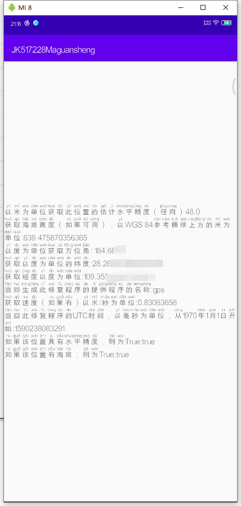

### 显示地图

[源代码](/app/src/main/java/icu/shaoyayu/android/baidumap/activity/MainActivity.java)

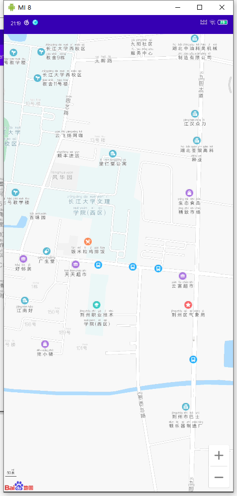

### 地图类型
[源代码](app/src/main/java/icu/shaoyayu/android/baidumap/activity/MapLayerActivity.java)

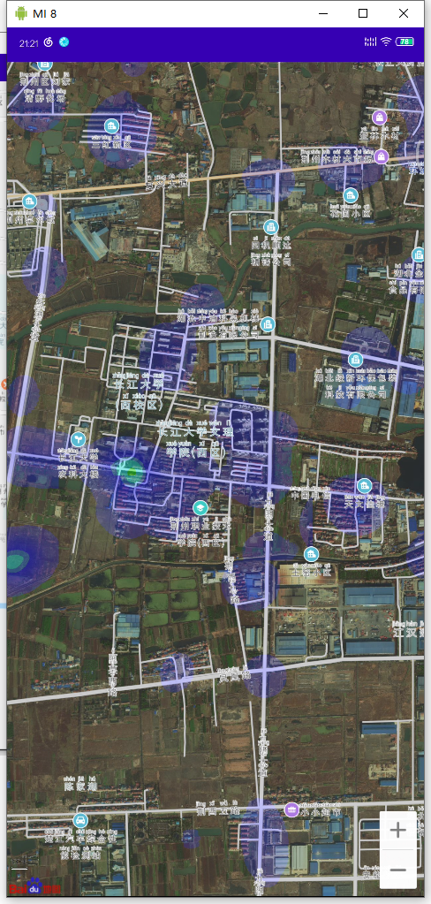

### 圆形覆盖物

[源代码](app/src/main/java/icu/shaoyayu/android/baidumap/activity/CircelOverlayActivity.java)

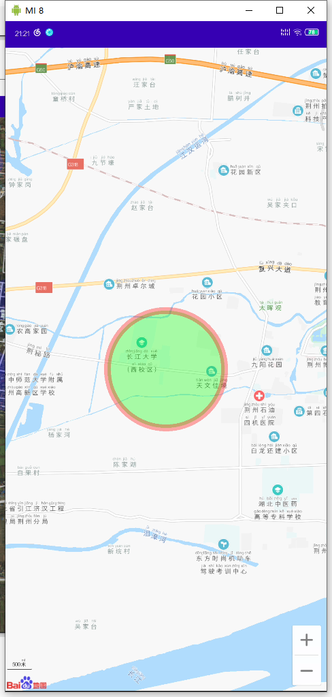

### 文本覆盖物

[源代码](app/src/main/java/icu/shaoyayu/android/baidumap/activity/TextOverlayActivity.java)

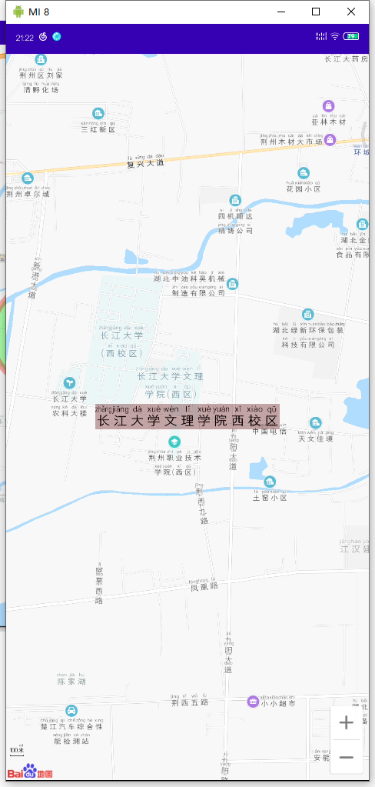

### Marker覆盖物

[源代码](app/src/main/java/icu/shaoyayu/android/baidumap/activity/MarkerOverlayActivity.java)

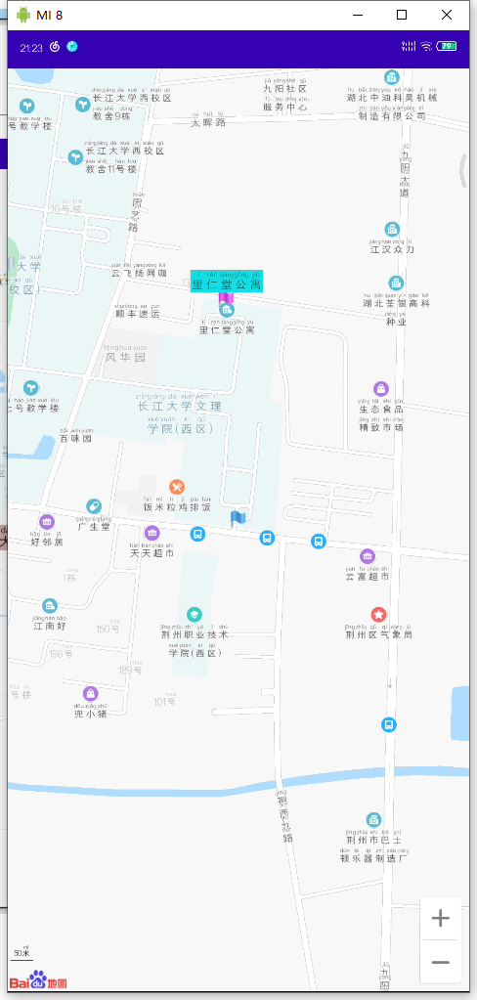

### 范围搜索

[源代码](app/src/main/java/icu/shaoyayu/android/baidumap/activity/SearchInBoundActivity.java)

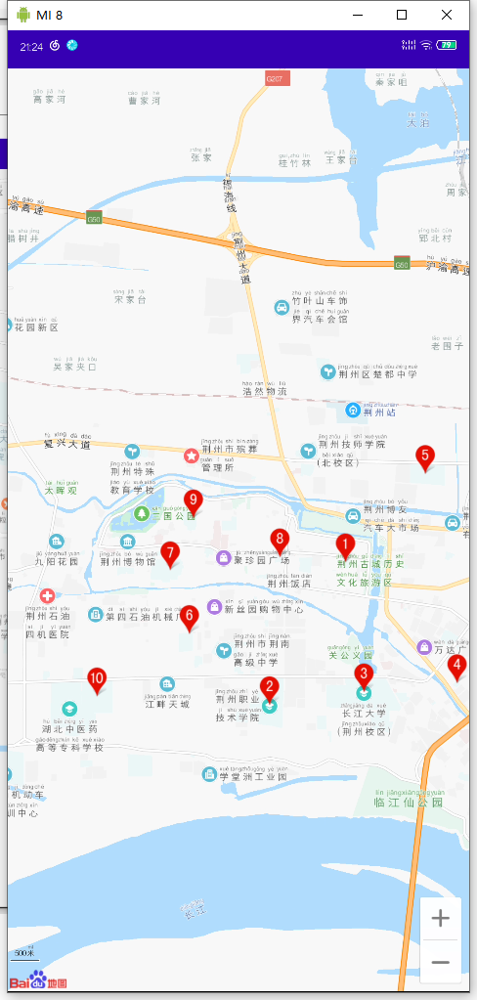

### 城市搜索

[源代码](app/src/main/java/icu/shaoyayu/android/baidumap/activity/SearchInCityActivity.java)

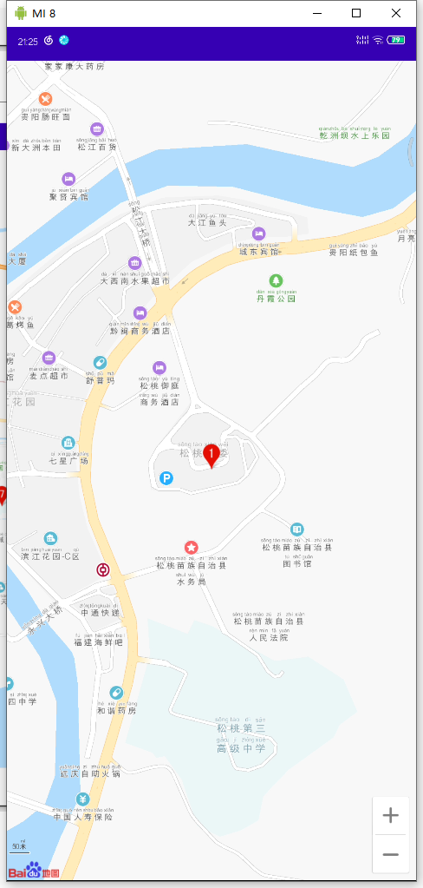

[源代码](app/src/main/java/icu/shaoyayu/android/baidumap/activity/SearchInNearbyActivity.java)

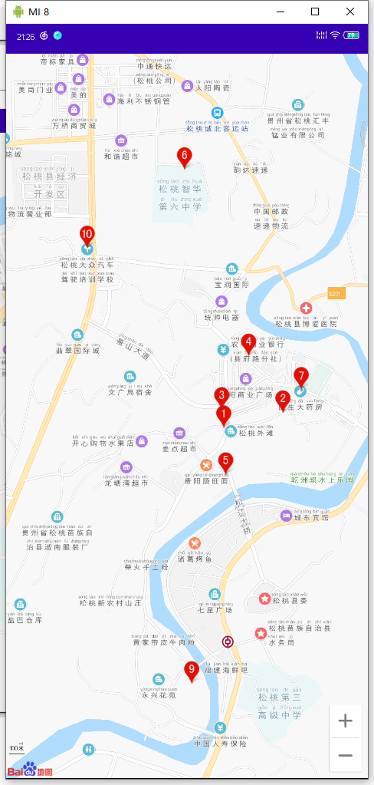

### 驾车规划路线

[源代码](app/src/main/java/icu/shaoyayu/android/baidumap/activity/DrivingSearchActivity.java)

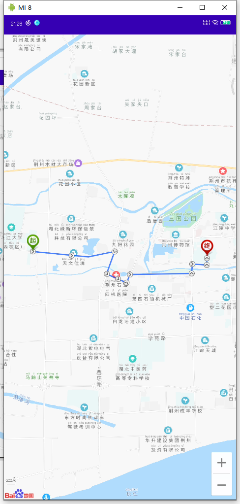

### 换成规划

[源代码](app/src/main/java/icu/shaoyayu/android/baidumap/activity/TransitSearchActivity.java)

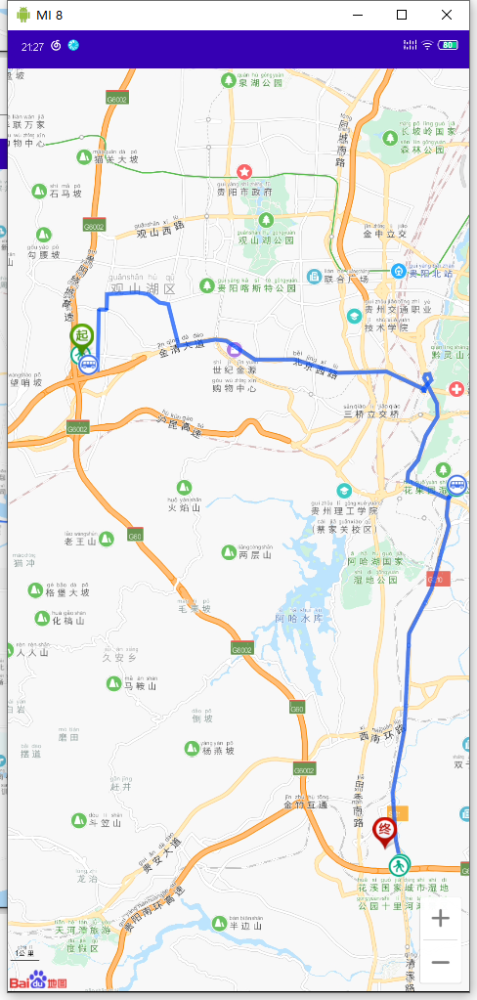

### 步行规划

[源代码](app/src/main/java/icu/shaoyayu/android/baidumap/activity/WalkingSearchActivity.java)

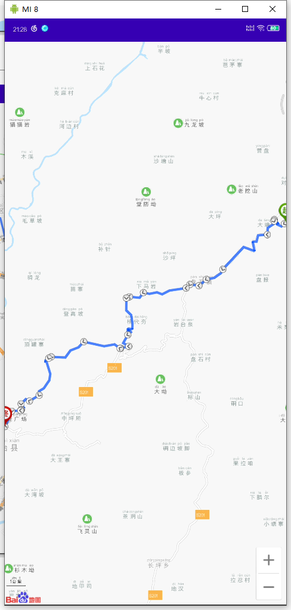

### 百度定位

[源代码](app/src/main/java/icu/shaoyayu/android/baidumap/activity/LocationDomeActivity.java)

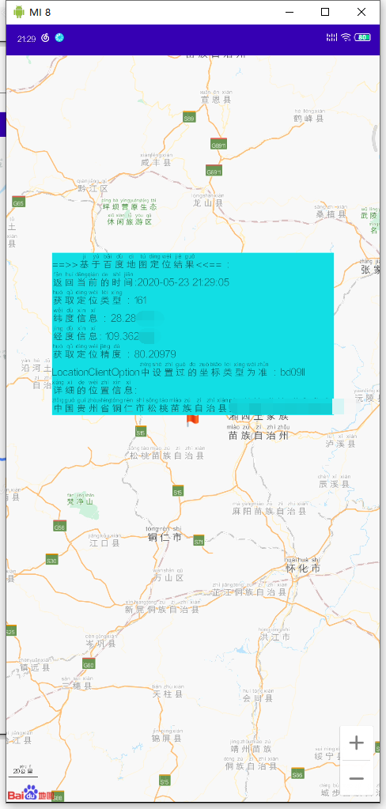
