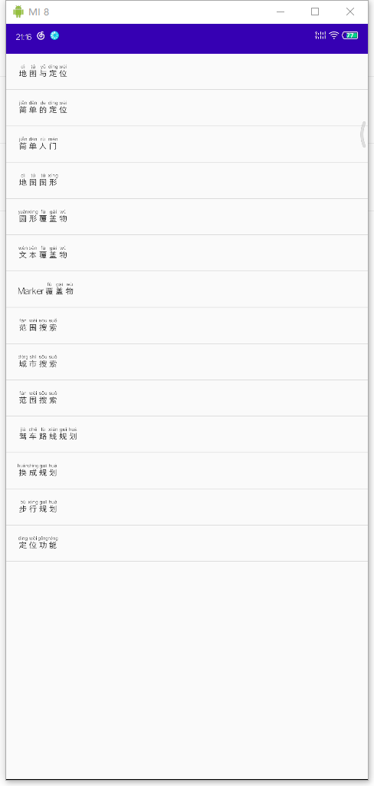

# Android GPS 课程

> 作者：shaoyayu

## 简介

大三下学期Android GPS开发课程，为期12周的，12节课学习

## 课程

### 第1章、GPS概述与基本开发环境

#### [1.1、GPS概述](https://github.com/shaoyayu/baidumapDome/blob/master/001-第一节.md)

#### [1.2、Android开发系统](https://github.com/shaoyayu/baidumapDome/blob/master/001-第二节.md)

## 第二章、GPS原理开发

#### [2.1、GPS原理](https://github.com/shaoyayu/baidumapDome/blob/master/001-第三节.md)

#### [2.2、Android GPS架构和分类](https://github.com/shaoyayu/baidumapDome/blob/master/001-第四节.md)

#### [2.3、Android定位类分析](https://github.com/shaoyayu/baidumapDome/blob/master/001-第五节.md)

#### [2.4、位置追踪与预警](https://github.com/shaoyayu/baidumapDome/blob/master/001-第六节.md)

## 最终案例效果

### 主见面

[代码：DemoListActivity.java](app/src/main/java/icu/shaoyayu/android/baidumap/activity/DemoListActivity.java)

### 简单定位
[代码：LocateActivity.java](/app/src/main/java/icu/shaoyayu/android/baidumap/activity/LocateActivity.java)

### 显示地图

[代码：MainActivity.java](/app/src/main/java/icu/shaoyayu/android/baidumap/activity/MainActivity.java)

### 地图类型
[代码：MapLayerActivity.java](app/src/main/java/icu/shaoyayu/android/baidumap/activity/MapLayerActivity.java)

### 圆形覆盖物

[代码连接](app/src/main/java/icu/shaoyayu/android/baidumap/activity/CircelOverlayActivity.java)

### 文本覆盖物

[代码连接](app/src/main/java/icu/shaoyayu/android/baidumap/activity/TextOverlayActivity.java)

### Marker覆盖物

[代码连接](app/src/main/java/icu/shaoyayu/android/baidumap/activity/MarkerOverlayActivity.java)

### 范围搜索

[代码连接](app/src/main/java/icu/shaoyayu/android/baidumap/activity/SearchInBoundActivity.java)

### 城市搜索

[代码连接](app/src/main/java/icu/shaoyayu/android/baidumap/activity/SearchInCityActivity.java)

[代码连接](app/src/main/java/icu/shaoyayu/android/baidumap/activity/SearchInNearbyActivity.java)

### 驾车规划路线

[代码连接](app/src/main/java/icu/shaoyayu/android/baidumap/activity/DrivingSearchActivity.java)

### 换成规划

[代码连接](app/src/main/java/icu/shaoyayu/android/baidumap/activity/TransitSearchActivity.java)

### 步行规划

[代码连接](app/src/main/java/icu/shaoyayu/android/baidumap/activity/WalkingSearchActivity.java)

### 百度定位

[代码连接](app/src/main/java/icu/shaoyayu/android/baidumap/activity/LocationDomeActivity.java)

